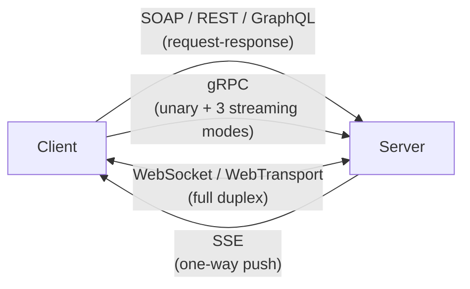
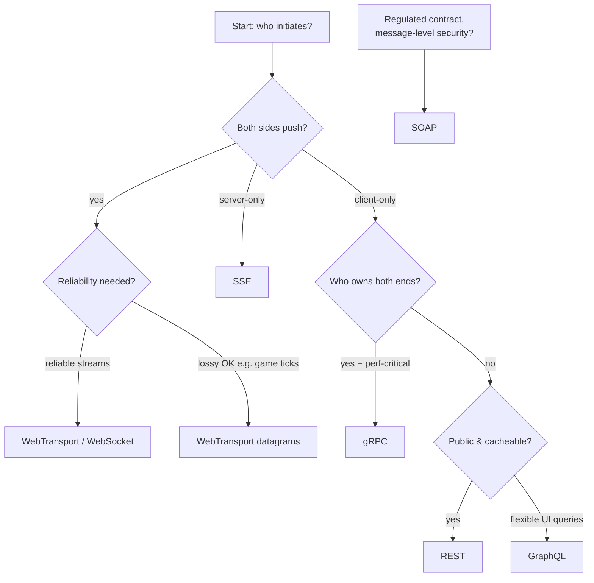

# One Endpoint Doesn't Fit All: A Field Guide to Integration Protocols

Your bank settles a payment with SOAP. Your phone syncs your feed over gRPC. The chat app streams an LLM's answer token-by-token over Server-Sent Events, your multiplayer game talks WebSocket (or now WebTransport), and the dashboard that started all of this fetched a GraphQL document. Six protocols, one afternoon. None of them is "the best" — each one made a different bet about what integration actually costs: bytes, latency, coupling, tooling, or trust.

This post is a field guide to those bets. For each protocol you'll get the official story, where it genuinely wins, the compatibility picture for web and mobile — plus a few deep cuts from the spec trenches that rarely make it into tutorials.

---

## SOAP: The Contract Lawyer

SOAP (originally *Simple* Object Access Protocol — the W3C dropped the acronym in SOAP 1.2 because it was neither simple nor object-oriented anymore) is XML messaging with a formal envelope: header for metadata, body for payload, all described by a WSDL contract so strict that client stubs can be generated mechanically.

Its superpower is the **WS-\*** stack, most notably WS-Security (an OASIS standard). Here's the deep cut that explains why banks still love it: WS-Security provides **message-level** security — the message itself is signed and encrypted, not just the connection. TLS dies at the load balancer; a WS-Security signature travels with the payload through every intermediary. Add WS-ReliableMessaging (guaranteed delivery) and WS-AtomicTransaction (distributed ACID), and you have guarantees no JSON API offers out of the box.

**Deep cut:** SOAP was never HTTP-only. Official bindings exist for SMTP and JMS (a full W3C Recommendation since 2012), which is why enterprise queues still carry SOAP envelopes today.

**Where it wins:** banking (ISO 20022 payment messaging), insurance, healthcare, telecom, government — anywhere contracts are legal documents and intermediaries must verify messages.
**Limitations:** verbose XML, heavyweight tooling, essentially unusable from browsers, painful on mobile bandwidth.

---

## REST: The Style That Isn't a Protocol

REST isn't a protocol — it's an architectural style Roy Fielding described in Chapter 5 of his 2000 PhD dissertation, distilled into constraints: statelessness, caching, layered systems, and a uniform interface. It won because it *is* the web: URLs, verbs, status codes, and caches you already have.

Now the uncomfortable part. The least-adopted constraint is **HATEOAS** — hypermedia as the engine of application state — and Fielding himself has been blunt about it: *"If the engine of application state (and hence the API) is not being driven by hypertext, then it cannot be RESTful and cannot be a REST API. Period."* By his definition, almost every "REST API" in production sits at Level 2 of the Richardson Maturity Model (resources + HTTP verbs) but never reaches Level 3 (hypermedia controls). The industry even named the phenomenon — see the essay *"How Did REST Come To Mean The Opposite of REST?"*

**Deep cut:** the reason OpenAPI/Swagger exists is precisely that real APIs ship out-of-band documentation instead of hypermedia. Tooling won the argument; purity lost.

**Where it wins:** public APIs, CRUD services, anything that benefits from HTTP caching (`ETag`/`If-None-Match` conditional GETs are free battery-savers on mobile).
**Limitations:** overfetching/underfetching (fixed only by adding endpoints or GraphQL), multiple round trips to assemble related data, no streaming story beyond long polling hacks.

---

## gRPC: The Speed Demon Inside the Datacenter

gRPC descends from Google's internal Stubby system and rides on HTTP/2: binary protobuf payloads multiplexed over one connection, four call shapes (unary, server-streaming, client-streaming, bidirectional), and generated stubs in a dozen languages.

Three deep cuts explain why it feels so fast:

- **Protobuf field numbers are economics.** Fields numbered 1–15 encode their tag in one byte on the wire; 16–2047 take two. That's why every protobuf style guide begs you to put hot fields first — and why field numbers must *never* be reused once shipped (you `reserve` them forever).
- **Deadlines propagate as timeouts, not timestamps.** When your RPC deadline crosses service boundaries, gRPC converts the remaining time into a relative timeout header — deliberately immune to clock skew between machines.
- **Retries are a distributed-systems feature, not a loop.** The service config (delivered via DNS) can define retry policies with exponential backoff and ±20% jitter, retry-throttling token buckets to protect servers, and *hedging* policies that fire duplicate RPCs in parallel to kill tail latency.

**The browser problem (the best deep cut of all):** gRPC reports its final status in HTTP/2 **trailers** — headers sent after the response body. Browsers cannot read trailers; `fetch()`'s `response.trailers` property has been specced for years and is still implemented by no major browser. Hence **gRPC-Web**: a proxy (typically Envoy) re-encodes trailers as a flagged final frame inside the body — and client-streaming/bidi simply don't work from browsers. If someone tells you gRPC is great for web frontends, this table is why:

| Call type | Native gRPC | gRPC-Web (browser) |
|---|---|---|
| Unary | ✅ | ✅ |
| Server streaming | ✅ | ✅ |
| Client streaming | ✅ | ❌ |
| Bidirectional | ✅ | ❌ |

**Where it wins:** internal microservice meshes, mobile-to-backend (first-class iOS/Android SDKs; compact frames save cellular battery), latency-sensitive paths.
**Limitations:** browser story needs gRPC-Web or Connect-style proxies; binary payloads resist curl-and-eyeballs debugging; schema evolution requires discipline (never renumber fields).

---

## GraphQL: Let the Client Draw the Map

Born inside Facebook in 2012 — specifically for a struggling mobile News Feed drowning in underfetching — GraphQL flipped control: the *client* declares exactly which fields it needs, the server resolves them against one typed schema, one endpoint, one round trip. Facebook open-sourced it in 2015; it moved to the Linux Foundation's GraphQL Foundation in 2018. The specification still evolves: the **September 2025 edition is its newest release**, finally promoting `@defer` and `@stream` — incremental delivery that Facebook has run internally since 2017 — letting servers send partial responses as slow fields resolve.

**Deep cuts:**

- Queries can travel as **GET requests**, making them cacheable at CDNs — if you shrink the query first. That's what **persisted queries** are for: clients send only a hash, the server looks up the whitelisted document. Distinguish *trusted documents* (authored, reviewed, safe) from *automatic persisted queries* (a network optimization anyone can hit) — the official security docs insist on the difference.
- GraphQL's flexibility is also its attack surface: depth limiting, breadth limiting, and cost analysis exist because a cyclic query can otherwise become an accidental denial of service. Disabling introspection alone is explicitly called insufficient.
- Its N+1 resolver problem has a canonical fix (batching via DataLoader-style utilities), and subscriptions don't ride HTTP at all — they borrow **WebSocket** (graphql-ws protocol) or SSE underneath.

**Where it wins:** UIs composed from many data sources, mobile apps on high-latency networks (one round trip instead of five), aggregating microservices behind a single facade.
**Limitations:** server-side complexity, harder HTTP caching (normalized client caches like Apollo compensate), file uploads feel bolted-on, cost-control machinery is mandatory, optional.

---

## SSE: The One-Way Pipe That Won by Accident

Server-Sent Events are the quietest spec in the room: a plain HTTP response with `Content-Type: text/event-stream`, kept open, parsed line-by-line by the browser's `EventSource`. That's the entire transport. No upgrade dance, no new protocol.

But its little-known details are remarkably well-designed:

- **Reconnection is built into the browser.** On disconnect, `EventSource` waits (default ~3 seconds, implementation-defined) and reconnects automatically, sending the last seen event ID in the `Last-Event-ID` header. Your server implements resumable streams with one header check.
- **The server steers the retry timer.** A `retry:` line updates the browser's reconnection delay permanently — and since the browser does *not* do exponential backoff for you, updating `retry:` mid-stream is how you implement backoff.
- **An empty `id:` line resets the cursor** ("forget everything"), useful after a full resync. Lines starting with `:` are comments — the idiomatic keepalive heartbeat.
- Behind nginx you'll need `X-Accel-Buffering: no`, or your events arrive in bursts when the proxy buffer flushes.

And the modern twist: **LLM token streaming made SSE cool again.** When ChatGPT prints word-by-word, that's typically a `text/event-stream` response. HTTP/2 multiplexing also quietly fixed SSE's old weakness (HTTP/1.1's six-connections-per-origin cap).

**Where it wins:** feeds, notifications, progress bars, AI token streams — any server→client flow.
**Limitations:** unidirectional and UTF-8 text only (no binary); client→server traffic needs separate fetches; never supported in Internet Explorer (irrelevant now, fatal then).

---

## WebSocket: The Open Line (and Why It Wears a Mask)

WebSocket (RFC 6455, 2011) starts life as an HTTP `GET` with `Upgrade: websocket`, then hijacks the TCP connection into a raw, full-duplex socket with tiny 2-byte frame overheads.

**The best deep cut in this whole post is its mask.** Every client→server frame must be XOR-masked with a random 32-bit key. This is *not encryption*. It exists because researchers showed in 2011 (*"Talking to Yourself for Fun and Profit"*) that malicious scripts could craft frames that transparent proxies would misread as ordinary HTTP traffic and **poison their caches** — Firefox and Opera disabled early WebSocket until masking landed. And the threat is not academic history: **CVE-2025-10148**, disclosed in 2025, hit curl's WebSocket code for *reusing* a mask across frames instead of generating a fresh one per frame — reopening exactly that cache-poisoning door. A 2011 security decision, still enforced in 2026.

More deep cuts:

- **Ping/pong control frames** live below your application layer — ideal heartbeats, invisible to your code.
- There is **no built-in reconnection**; every library's "WebSocket wrapper" is reinventing what SSE got for free.
- RFC 8441 lets WebSockets ride *inside* HTTP/2 streams (extended CONNECT), and RFC 9220 does the same for HTTP/3 — no more one-TCP-connection-per-socket.
- On **mobile**, the physics bite: NAT tables drop idle mappings within tens of seconds, so keepalives burn battery, and iOS/Android suspend apps and kill sockets in the background anyway.

**The newcomer: WebTransport.** Standardized as a W3C Candidate Recommendation (July 2026) and baseline-across-browsers since March 2026, it runs over HTTP/3/QUIC and offers multiple bidirectional and unidirectional streams *plus* unreliable UDP-like datagrams — with no TCP head-of-line blocking. Games and media pipelines that outgrew WebSocket finally have a standards-track home.

**Where they win:** multiplayer games, collaborative editing, trading dashboards, chat — true simultaneous two-way flows.
**Limitations:** sticky sessions/LB awareness required, custom auth (browser JS can't set handshake headers beyond cookies), DIY reliability on top.

---

## The Comparison Matrix

| | SOAP | REST | GraphQL | gRPC | SSE | WebSocket |
|---|---|---|---|---|---|---|
| **Style** | Protocol + contract | Architectural style | Query language | RPC framework | Streaming MIME | Transport |
| **Payload** | XML | Usually JSON | JSON | Protobuf (binary) | UTF-8 text | Any |
| **Direction** | Req/res | Req/res | Req/res (+subs via WS/SSE) | All four | Server→client | Full duplex |
| **Browser support** | Poor | Excellent | Excellent | Via proxy only (no client-stream) | Excellent | Excellent |
| **Mobile fit** | Heavy | Great (caching) | Great (1 round trip) | Great (compact, deadlines) | Good | Battery-hungry |
| **Caching** | No | Native HTTP | GET+persisted queries only | No | No | No |
| **Contract** | WSDL (strict) | OpenAPI (optional) | Schema (typed) | .proto (strict) | None | None |
| **Sweet spot** | Regulated enterprise | Public APIs | Client-driven UIs | Internal meshes | Push updates | Realtime |

## Choosing Without Regret

Rules of thumb worth keeping:

1. **Default to REST** until a concrete constraint says otherwise — its tooling, caching, and debuggability are unmatched.
2. **Reach for gRPC inside your perimeter**, not outside it — and remember the browser tax before promising it to frontend teams.
3. **GraphQL when the client knows better than the server** what data it needs; budget for depth limits and persisted queries on day one.
4. **SSE before WebSocket** whenever the flow is really one-directional — free reconnection is worth more than symmetric sockets.
5. **Keep SOAP only where signatures must outlive TLS** — then it's not legacy, it's compliance.
6. **Watch WebTransport**: it's the first post-WebSocket transport to reach baseline browser support, and it absorbs several of these jobs over time.

## Takeaway

These six protocols aren't competitors so much as answers to six different questions: *Who initiates? Who pays for verbosity? Where must trust live? How flaky is the network?* REST answered the web's question, SOAP answered banking's, gRPC answered the datacenter's, GraphQL answered the mobile client's, SSE answered the push problem nobody wanted to over-engineer, and WebSockets answered realtime — with WebTransport now redrawing that last answer over QUIC. Learn the trade-off each one embodies and you'll stop asking "which is best" and start asking "best for which seam of my system."

That question has exactly one right answer per seam — and one endpoint doesn't fit all.

## References

- [W3C: SOAP Version 1.2 Part 1: Messaging Framework](https://www.w3.org/TR/soap12-part1/) — the official spec (and the de-acronymization)
- [OASIS: Web Services Security (WS-Security) 1.1.1](https://docs.oasis-open.org/wss-m/wss/v1.1.1/os/wss-SOAPMessageSecurity-v1.1.1-os.html) — message-level integrity & confidentiality
- [W3C: SOAP over Java Message Service 1.0](https://www.w3.org/TR/soapjms/) — proof SOAP outlives HTTP
- [Roy Fielding: Architectural Styles and the Design of Network-based Software Architectures (2000)](https://ics.uci.edu/~fielding/pubs/dissertation/rest_arch_style.htm) — the dissertation, Chapter 5
- [Roy Fielding: REST APIs must be hypertext-driven (2008)](https://roy.gbiv.com/untangled/2008/rest-apis-must-be-hypertext-driven)
- [Martin Fowler: Richardson Maturity Model](https://martinfowler.com/articles/richardsonMaturityModel.html)
- [HTMX: How Did REST Come To Mean The Opposite of REST?](https://htmx.org/essays/how-did-rest-come-to-mean-the-opposite-of-rest/)
- [GraphQL Specification Versions](https://spec.graphql.org/) — September 2025 latest release
- [GraphQL.org: Security](https://graphql.org/learn/security/) and [Performance](https://graphql.org/learn/performance/) — trusted documents, depth limiting, GET caching
- [gRPC: Deadlines](https://grpc.io/docs/guides/deadlines/) and [Retry](https://grpc.io/docs/guides/retry/) — propagation, hedging, throttling
- [gRPC Blog: The State of gRPC in the Browser](https://grpc.io/blog/state-of-grpc-web/) and [PROTOCOL-WEB.md](https://github.com/grpc/grpc/blob/master/doc/PROTOCOL-WEB.md)
- [protobuf.dev: Language Guide (proto3)](https://protobuf.dev/programming-guides/proto3/) — field number economics and reserved numbers
- [WHATWG HTML Living Standard §9.2: Server-sent events](https://html.spec.whatwg.org/multipage/server-sent-events.html)
- [MDN: Using server-sent events](https://developer.mozilla.org/en-US/docs/Web/API/Server-sent_events/Using_server-sent_events)
- [RFC 6455: The WebSocket Protocol](https://www.rfc-editor.org/info/rfc6455) — masking rules in §5.3, threat model in §10.3
- [Huang et al.: Talking to Yourself for Fun and Profit (W2SP 2011)](https://www.ieee-security.org/TC/W2SP/2011/papers/websocket.pdf) — the cache-poisoning research behind masking
- [curl CVE-2025-10148](https://curl.se/docs/CVE-2025-10148.html) — predictable WebSocket mask, 2025
- [RFC 8441: Bootstrapping WebSockets with HTTP/2](https://www.rfc-editor.org/info/rfc8441) · [RFC 9220: …with HTTP/3](https://httpwg.org/specs/rfc9220.html)
- [W3C: WebTransport](https://www.w3.org/TR/webtransport/) (Candidate Recommendation, 2026) · [MDN: WebTransport API](https://developer.mozilla.org/en-US/docs/Web/API/WebTransport_API)
