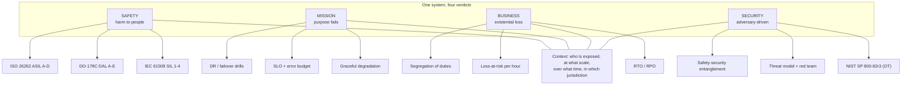

# What Critical Actually Costs

Four words. Every engineer in industry uses them, almost interchangeably, in the same meetings. And the interchangeability is a bug — not a stylistic one, but the kind that produces unmitigated risk.

A 737 MAX had redundant, safety-certified flight control computers. It still went down twice, because the system was designed so that the angle-of-attack input it depended on existed in *one* place. A safety notification database — paperwork about obstacles and runway closures — went dark for two days in January 2023, and thousands of aircraft were told to check with controllers by voice because they could not read a database that no regulator had ever classified as safety critical. A security update shipped in July 2024, contained no traditional bug, and stopped 5,500 flights: the failure was in a *content file* that nobody thought to test. And in 2010, a software artefact reportedly entered an air-gapped network in Iran and drove centrifuges to spin far above their rated speed.

Every one of those is a "critical system." None of them is critical in the same way. This post is the argument that they are not the same — and then the engineering.

---

## 1. "Critical" Is a Claim About Consequences

Here is the reframe that makes the rest of the post mechanical.

> Criticality is not a property of code. It is a property of *a system, in a context, failing, at a scale, with a consequence*.

Read the sentence from the inside out. The **consequence** determines everything else. The *context* determines who is exposed — a control loop in a factory and the same control loop in a video game have the same bit patterns and different criticality. The *scale* determines blast radius: one bad record versus every record. The *failure mode* determines whether the system stops, degrades, lies, or attacks.

This is why "is this service critical?" is a much better question than "is this service important?" and a much worse question than "critical *in what way, for whom, at what scale, and with what consequence?*"

Practically, a system is critical along one or more of four axes. Each axis has a different boss, a different budget, a different evidence standard, and — critically — a different adversary.

---

## 2. The Four Axes

| Axis | Failure means | Who judges it | Typical evidence | Canonical example |
|---|---|---|---|---|
| **Safety critical** | People are killed or permanently harmed | Regulator + independent assessor | Safety case, DAL/SIL rating, DO-178C evidence | Airbag ECU, train signalling, radiotherapy |
| **Mission critical** | The organisation cannot perform its *purpose* | Operator + domain users | Uptime SLO, DR test results, degradation playbooks | Air traffic flow, payment clearing, spacecraft TT&C |
| **Business critical** | The organisation goes bankrupt, or a legal/contractual regime fails | Board, CFO, auditor | Loss-at-risk in currency/hour, RTO/RPO tests | Order management, ledger, identity provider |
| **Security critical** | A *deliberate* adversary achieves confidentiality, integrity, or availability loss that matters more than the outage | Threat model owner, national regulator | Adversarial testing, red-team, SBOM, IR playbook | Payment card processing, OT control, national infrastructure |

The axes are not a hierarchy. Security critical is not "more" than safety critical; it is a *different* property, because it is the only axis with an intelligent opponent. Business critical is not less important than safety critical; it is the axis that usually decides who gets to fix things.



The single most useful thing about this diagram is the bottom-right box. Safety and security are not parallel; in cyber-physical systems they are *entangled*, which is where a large fraction of modern critical-system engineering actually lives. We return to it in §7.

---

## 3. Safety Critical: The Axis With a Body Count

### 3.1 What makes a system safety critical

Safety criticality is a function of four things, and only one of them is technical:

- **Severity of consequence.** Death is a category, not a continuum. Sterility failure, a transfusion error, a mis-machined turbine blade, and a bounced HTTP request live on the same codebase ladder at different rungs.
- **Likelihood of failure.** A 10⁻⁹ per-flight-hour event over 10⁶ hours/year becomes a per-year event. This is the whole reason probabilistic methods exist.
- **Exposure.** How many humans or assets are downstream of the failure, and can they see it coming? Air traffic control failure is instantly visible and controllers can fall back to voice; a settlement engine that fails quietly is worse.
- **Detectability and diagnosability.** Can the system *know* it is wrong? A system that halts loudly on an inconsistent state is dramatically safer than one that continues plausibly. This is under-appreciated and free.

### 3.2 The actual numbers: SIL and DAL

Two dominant frameworks rate integrity. **IEC 61508** (functional safety, general industry) uses *Safety Integrity Levels* SIL 1–4. **DO-178C** (aviation) uses *Design Assurance Levels* DAL A–E, where **A is the most stringent** and E is effectively no additional requirements. Note the inversion — DAL A is the *hardest*, SIL 4 is the *hardest* — a reliable source of confusion in conversation.

The continuous-quantity half of this is the **probability of dangerous undetected failure (PFH)**, averaged over the mission time:

```
PFHavg = (λ_DU × T) / ( ... )
```

concretely, for a single-channel low-demand mode of operation:

```
PFH ≈ PFDavg × λ_DU
```

and `PFDavg` for a redundant voting architecture with diagnostic coverage `DC` and proof test interval `PTI` is a beta-model quantity. Rather than misquote coefficients, here is the shape of the calculation, which is the part that matters:

```python
from dataclasses import dataclass

@dataclass(frozen=True)
class Channel:
    lambda_du: float   # dangerous undetected failure rate, per hour
    proof_test_h: float
    beta: float        # fraction of dangerous faults that the diagnostic test reveals

def pfdavg(ch: Channel, duty: float) -> float:
    pfd = ch.lambda_du * ch.proof_test_h
    return pfd / (2.0 - pfd) * ch.beta + (1.0 - ch.beta) * pfd * 0.5

def pf_h_single(ch: Channel, mission_h: float) -> float:
    pfd = pfdavg(ch, 1.0)
    return pfd * ch.lambda_du * mission_h
```

Three engineering facts fall out of this that people consistently get wrong:

1. **Proof-test interval dominates.** `PFDavg` scales roughly linearly with the interval between tests. Doubling test frequency halves the unavailability of the diagnostic path. This is why "we test on every release" is a quantitative safety argument, not a hygiene argument.
2. **Diagnostics are cheaper than redundancy.** `beta < 1` converts a dangerous undetected failure into a detected one, at a fraction of the cost of a second channel. The highest-leverage safety work is often *observability*, not architecture.
3. **A safe average is not a safe system.** If one channel fails dangerously once every 30 years and the other fails dangerously once every 30 years and they are correlated — shared power, shared software, shared operator, shared supplier — the combined rate is not 1/15 years. Correlation is where the beta model stops being conservative enough, and where the actual conversation should be about *diversity*, not redundancy.

### 3.3 Case study: Ariane 5, June 4, 1996

The canonical safety-critical software failure, and still the best teaching example in the field.

The inertial reference subsystem of Ariane 5 was inherited almost unchanged from Ariane 4, where the vehicle was launched **aligned and in a stable attitude**. Ariane 5 flew a different trajectory profile, and shortly after liftoff the gyroscopes produced a large, perfectly valid but out-of-range value: 3,700, roughly 100× the representable value in a 16-bit signed word. The conversion produced an overflow, and therefore garbage. That garbage was interpreted as a very large but numerically valid rotation rate, which the guidance software used to compute a commanded attitude.

The vehicle was destroyed 37 seconds after liftoff. The flight was lost. The Ariane 5 development team's investigation found:

- The **overflow exception was raised** — and in a variant of the flight mode where a hard failure occurs, the code protected against the *exception*, not against the *out-of-range value*. The exception was caught, logged, and ignored. That guidance function returned a garbage value while reporting success.
- The **backup Inertial Reference System was executing the identical conversion at that moment**, so the redundancy was perfectly correlated. Two channels, one bug, no diversity.
- The **differential backup** — the "monotone backup" that existed precisely to catch a garbled primary — was identical code, so it also produced the same garbage. The check that should have caught the problem agreed with the problem.
- The unit choice was the real defect: a 16-bit conversion to 16 bits where the *input* had no range check. Fixed by widening to 32 bits, adding explicit range validation, and reverting the backup units to the Ariane 4 standard.

The transferable lessons: range-check your inputs *and* your units; make redundancy *diverse* rather than duplicated; make a detected failure actually *stop* something; and remember that a function which swallows an exception is a function that has declared itself trustworthy without evidence.

### 3.4 Case study: Therac-25

A radiotherapy machine at the Massachusetts General Hospital, and the most cited case in the history of medical software failure. Between 1985 and 1987, six patients overdosed; two died.

Therac-25 had **redundancy**: two independent processors, each running the same treatment software, cross-checking each other's dose and geometry. The redundancy was defeated by two defects working in concert:

- A **race condition** in the electromechanical hardware — a beam-on transition that a software "interlock" flag was meant to detect — meant the software could not tell the difference between the machine being in a safe state and the machine being in a state it hadn't yet computed for. The interlock flag was set in one task before the relevant physical change had actually happened.
- A **diagnostic** program that ran once a day, and only if the machine was not being used, could not detect the data-memory corruption. The machine could therefore complete a "self-test" while holding state that would kill someone.

A reviewer asked the obvious question at the time — "is there any way to get the same dose in a single fault?" — and the answer was no. But no one asked about the *concurrency* of the interlock, and the redundancy was architectural rather than behavioural. Redundancy that shares a timing assumption is not redundancy.

### 3.5 Case study: 737 MAX and the anatomy of removing redundancy

The 737 MAX used a single angle-of-attack (AOA) sensor. Everything else about that flight control system was triple-redundant. So was, for a while, the *intent* of MCAS — the Maneuvering Characteristics Augmentation System — which was designed to mask a handling characteristic that a 737 pilot without simulator training might not be able to counter.

What happened instead, over years of design decisions and certification decisions:

- MCAS was expanded from a nuisance-protection function into an **automatic** nose-down command, without requiring pilot action. This is where the "safety" story broke: an augmentation that corrects a handling deficiency is a safety aid; one that overrides the pilot's own control inputs is a control decision.
- A **single AOA input** fed it. The two remaining AOA sources disagreed with the selected one during the Lion Air (October 2018) and Ethiopian Airlines (March 2019) flights, and there was no disagreeing-alert logic to inform the crew. Redundancy existed elsewhere in the system but was architecturally bypassed at exactly the input that mattered.
- The **AOA Disagree alert** was omitted from the final aircraft (it was behind an optional factory setting), so the crew was not told the source of their data was contested.
- The **MCAS authority was not disclosed** in the flight crew operations manual, so a trained crew did not know the system was capable of a large automatic input.
- Certification was **substantially delegated to Boeing itself** under the FAA's Organization Designation Authorization, with the FAA's role narrowed largely to confirming Boeing's own findings. The House Committee on Transportation and Infrastructure's investigation, the Joint Authorities Technical Review (JATR) of the multinational regulator group, and the NTSB's engineer's assessment all converge on the same structural point: the *process* had a single point of failure, and it was the regulator's own.

The engineering lesson is not about sensors. It is that **redundancy is a specific architectural claim**, and it is destroyed silently by any later change that introduces a shared single point — one sensor, one assumption, one undocumented authority. Nothing in the certification basis said "there will be one AOA source." It was simply always true, and nobody wrote it down.

### 3.6 Fail-safe versus fail-operational

Two phrases that are used interchangeably and should never be.

- **Fail-safe:** on failure, move to a state that is safe even if the mission fails. The engine cuts. The train brakes. The reactor scrams. The correct move is the *smallest* one.
- **Fail-operational:** on failure, keep performing the mission, possibly degraded. Redundant hydraulics. Flight essential buses. The correct move is the *bigger* one, and it costs redundancy, weight, and money.

Choosing between them is a *requirements* decision that must be explicit, because the same physical failure produces different "safe" states depending on the phase. On descent, a flight control system is fail-safe: a configuration that may not be flyable on approach is the safe one. On the ground, taxiing, it may be fail-operational, because the safe state is "stopped" and being stopped is not the end of the mission. Getting this wrong is how you design a system that is beautifully fail-safe in the lab and unrecoverable in reality.

---

## 4. Mission Critical: "The Reason the Organisation Exists"

Mission critical is the most under-specified word in engineering, because it is defined relative to a *purpose*, and purposes live one or two levels above the system.

A system is mission critical when its failure prevents the organisation from doing the thing it exists to do — for a bounded time, beyond its tolerance for degradation.

### 4.1 What mission critical looks like

| System | Organisation's mission | What failure looks like |
|---|---|---|
| Air traffic flow / flight plans | Move aircraft safely | Controllers work from voice and paperwork; capacity collapse, not total blackout |
| Payment card authorisation | Enable commerce | Retail authorisation degrades; transactions fail or are delayed |
| Satellite TT&C and constellation ops | Operate spacecraft | Telemetry blind; spacecraft kept in safe mode, mission clock running |
| Water/wastewater treatment | Deliver safe water | Plants continue on local setpoints; quality is unverified |
| Emergency dispatch / 911 | Respond to emergencies | Life-safety impact despite no physical failure |
| Grid dispatch and protection | Deliver and protect power | Protection relays are safety critical; dispatch is mission critical |
| Manufacturing line | Make a product | Line runs degraded or stops; throughput loss, no safety impact |
| Hospital EMR | Treat patients | Clinicians revert to paper; safety degrades indirectly |

The pattern: **mission-critical systems degrade more gracefully than safety-critical ones.** Air traffic control does not stop — it falls back to voice. A payment network does not stop — it queues and retries. A satellite does not stop — it holds a safe attitude and waits. If your "mission critical" system has no degraded mode, it is probably not mission critical, it is fragile.

### 4.2 Case study: the January 2023 NOTAM outage

On 11 January 2023, the FAA announced an outage of its primary **NOTAM** (Notice to Air Missions) database, which serves notices about airspace, runways, navigation aids, and hazards. Controllers fell back on a backup system that does not itself carry the full data set, and therefore had to work from individual NOTAMs retrieved through flight service stations. A substantial backlog of unprocessed NOTAM changes had to be worked through manually, and the FAA advised that the backlog would take days to clear; flights were delayed and rerouted, and airspace was closed as a precaution while data quality was re-established.

Two structural lessons:

1. **Nobody had classified NOTAM as safety critical.** It is a *publishing* system. Its failure is on paper a communications outage. But NOTAMs inform go/no-go and in-flight decision-making, which makes it safety-adjacent, which makes it mission critical, which makes it — after any of the classification failures below — effectively *all three* axes at once.
2. **A system with a working backup can still fail if the backup cannot hold the data.** Redundancy of the *service* is not redundancy of the *capacity*. The design question is "can the degraded mode carry the load, including the backlog that will exist after the primary returns?" — and a synchronising backlog is a queue that has been waiting, which is a different and more dangerous system than the original.

This is also a *mission* failure, not a safety failure. Nobody was harmed. The flight was cancelled, delayed, or flown more conservatively. Mission critical failures are measured in throughput, and the industry's blind spot is that they are usually rationalised away precisely because "no one got hurt."

### 4.3 Case study: 19 July 2024, and the failure that was not a bug

At 04:09 UTC on 19 July 2024, a content-configuration update to a widely deployed endpoint security sensor contained a logic error. The sensor crashed at the kernel level and entered a boot loop. Because the affected machines could not reach the operating system, they could not be remediated remotely; several were left unbootable until operators physically attended to them.

The consequences: tens of millions of Windows endpoints impaired, and grounded aviation, healthcare, retail and payments infrastructure across multiple continents. The triggering *code* was correct. There was no memory-safety defect, no off-by-one, no race. The defect was that a **declarative content update was shipped through a path that validated presence but not semantic effect** — an update can be syntactically perfect and logically catastrophic.

Now classify it, and notice that it is a different system on each axis:

- **Security critical:** the sensor is a security control; its unavailability is an attacker's opening. An adversary will always prefer "deny the endpoint agent" to "defeat the endpoint agent," because the former is cheaper and scale better.
- **Mission critical:** flight operations, care delivery, and point-of-sale stopped working. The organisation could not perform its purpose.
- **Business critical:** the direct cost of remediation, lost revenue, and contractual SLA credits dwarfed the cost of the development work that caused it.
- **Safety critical:** indirectly. Emergency care continued, but triage, imaging and laboratory systems were impaired. A system that was business critical became safety critical through *dependency*, not through its own design.

The engineering lesson is about **the change path, not the artefact**. A configuration push to a fleet of a million endpoints is, functionally, a software release of a safety-relevant system. It deserves the same evidence standard as a binary: staged rollout, canary, kill switch that works *before* the push, tested rollback, and a rollback path that does not depend on the thing you are rolling back.

### 4.4 The obscure, delightful one: earthquakes as mission-critical computing

In 2004, the magnitude-9.1 Sumatra–Andaman earthquake excited Earth's normal modes so strongly that the planet rang for far longer than any previously recorded event. Stoleriu and colleagues reported in *Nature* (2011) that the resulting sustained oscillation of the whole solid Earth measurably altered subsequent tsunami detection and warning. Because deep-ocean tsunami detection depends on buoys whose data feeds into inversion models sensitive to Earth resonances, a geophysical event became an input to a data-processing chain.

The practical effect reported was a longer window for warning, which is a mission-critical capability: the *purpose* of the system is to give people time, and the purpose was served by an unplanned, unmodelled coupling. This is a lovely example of a mission-critical dependency living several layers away from any engineer who would think to model it — and a reminder that **dependency analysis has to include physics, not just call graphs.**

---

## 5. Business Critical: The Axis That Pays for Everything

Business criticality is *quantified in currency per hour*, and that makes it the axis with the clearest optimisation target and the worst safety instincts.

Knight Capital lost roughly $460 million in 45 minutes in August 2012 because a feature-flag-driven reactivation of dead code ran on eight production servers instead of one (covered in detail in my [feature-toggle post](feature-toggles-feature-flags.md)). Maersk lost on the order of a quarter of a billion dollars from NotPetya in 2017, which cost a shipping company a shipping line. Colonial Pipeline paid a multi-million-dollar ransom in 2021 and, more expensively, lost days of throughput on the US East Coast. These are business critical failures, and they are *cheap* to prevent relative to their cost — which is precisely the problem: they are not prevented, because nothing in the organisation is graded on them.

### 5.1 Translate the system into money

The useful discipline is to convert every candidate system into a number before arguing about it:

```
loss_per_hour = revenue_at_risk_per_hour
              + contractual_penalty_per_hour
              + cost_of_manual_fallback_per_hour
              + expected_regulatory_penalty
```

Then: `expected_annual_loss = loss_per_hour × hours_of_exposure`, and the defensible *spend* on reliability is a fraction of that, not a fraction of the salary of whoever is asking. This is a boring and decisive calculation. Most "the database is not critical" arguments are the result of never having done it.

The two numbers that then govern the design are standard, and the industry's persistent error is treating them as IT trivia:

- **RTO — Recovery Time Objective:** how long may this be down before the consequence is unacceptable? This is a *business* decision with a *technical* consequence, and it sets redundancy topology. An RTO of 4 hours does not need synchronous replication across three regions; an RTO of 5 minutes does, and will cost accordingly.
- **RPO — Recovery Point Tolerance:** how much data may be lost? An RPO of 24 hours permits nightly backups. An RPO of zero forbids a single-point failure, permits only synchronous replication, and makes the backup strategy the *real* design.

### 5.2 The axis that is relative to you

The most useful property of business criticality is that it is *contextual*, and this is where well-meaning over-engineering lives. A payroll system is mission critical to the HR function — if it fails on pay day, people are not paid — and business critical to essentially nobody else in the company. A corporate intranet is business critical to nobody, and has been observed to host a great deal of criticality-adjacent content by accident.

The productive question is never "is this critical?" It is **"critical to which function, for how long, with what substitute, and who absorbs the failure if the substitute fails?"** Substitute availability is the real determinant of tolerable downtime, and it is almost never documented.

### 5.3 Legal and regulatory criticality

Some systems are business critical because a *regulator* says so, independent of any revenue calculation. Since 2025, the EU's Digital Operational Resilience Act has imposed concrete resilience obligations on financial entities, and the payment card ecosystem has driven PCI DSS forward with a set of future-dated requirements taking effect in 2025. These change the engineering conversation: a previously discretionary failover drill becomes a compliance obligation with evidence, and the evidence is the deliverable.

---

## 6. Security Critical: The Axis With an Opponent

Security criticality is the only axis where the threat is *intelligent, adaptive, and financially motivated*. Every other axis fails from physics, entropy, and human memory. This one fails from someone who read your postmortem and chose a mitigation for next time.

### 6.1 Why "critical" here means something different

Information security's classic triad is confidentiality, integrity, and availability. For critical infrastructure, the triad is necessary but not sufficient. A power plant can be fully confidential and fully available and still be safety critical, if its integrity is subtly wrong. The operative question in a critical system is not "was there a breach?" but "**can the system detect that it has been lied to?**"

That is the difference between information security and **security engineering for critical systems**, and it is captured operationally in NIST SP 800-82 Rev. 3, *Guide to Operational Technology (OT) Security*, which is the reference document for securing industrial control systems, and which makes the structural point that OT security cannot be IT security with different hardware: in OT, availability and safety outrank confidentiality, patching windows are measured in years or decades, and the system's own safety mechanisms are an attack surface.

### 6.2 Case study: Stuxnet, and the architecture of a nation-state attack

In 2010, a worm spread through Windows systems in an environment believed to be air-gapped, targeting Siemens SIMATIC S7 programmable logic controllers specifically, and specifically the frequency-converter drives that controlled the centrifuges at a uranium enrichment facility. The reported mechanism: the malware *reprogrammed the controllers* to spin centrifuges at damaging speeds and simultaneously *replayed recorded nominal values* to the monitoring system, so the facility's operators saw normal readings. The safety interlocks that would have stopped an overspeed condition were themselves part of what was bypassed.

Every axis is present in one artefact:

- **Safety critical:** centrifuges destroyed; the safety case for the process was void.
- **Mission critical:** the enrichment campaign's output fell far below plan.
- **Business critical:** multi-year replacement of process equipment.
- **Security critical:** the confidentiality of industrial process knowledge, and the integrity of a safety-relevant control system, both compromised — and the *monitoring* was compromised too, so the organisation's own assurance evidence was falsified.

The transferable lesson is not geopolitical. It is that **a safety system whose monitoring can be spoofed provides no safety assurance at all**, and that this must be treated as a design property: independent, differently-implemented verification of the *actuator's* behaviour, not just of the command log.

### 6.3 Case study: Colonial Pipeline

An apparently mundane initial-access intrusion on a legacy VPN account without multi-factor authentication, without a valid second factor, provided a foothold into a corporate IT environment. From there, ransomware encrypted the business IT estate, including the billing and operational planning systems that pipeline operations depend on. Colonial shut down the largest US refined-products pipeline for roughly six days and paid a ransom reported at approximately $4.4 million.

This is the canonical demonstration that the boundary between IT and OT is a *deployment* fact, not a *security* fact. The attackers did not need an OT exploit; they needed a compromised IT identity. The consequences were physical — queues, fuel shortages, transit and retail disruption on the East Coast — but the mechanism was entirely conventional IT compromise against a business critical asset.

### 6.4 The security critical toolbox, and what is different

The mechanics are standard; the *targets* are what change:

- **Attack surface is different.** In OT, the "endpoints" are physical processes with real inertia. A command that would be harmless in a web service — a setpoint, a speed, a valve position — becomes lethal.
- **Patching is a safety problem.** An unpatched controller is a device you may not be able to update without a shutdown window you do not have. This is the tension that makes OT security genuinely hard, and it is why asset inventory and compensating controls (monitoring, segmentation, allow-lists, application allow-listing) usually win over patch management.
- **Availability is the primary CIA property.** Monitoring that is too aggressive becomes a denial-of-service against yourself. The famously "obvious" answer — block all inbound — is frequently wrong in OT.
- **"Air-gapped" is a network property, not a guarantee.** Stuxnet, and the wider prevalence of USB-based removable media in industrial environments, both demonstrate that physical proximity plus a person is sufficient.

---

## 7. How the Axes Combine

Most real critical-system work is *combination* work. Here is the matrix, filled with the case studies above, which is a more honest picture than any single-axis story:

| | **Accidental** | **Adversarial** |
|---|---|---|
| **Harm to people** | Ariane 5 (guidance overflow), Therac-25 (interlock race), 737 MAX (single AOA), Bhopal (process), Fukushima (loss of DC power and instrumentation) | Stuxnet (centrifuge reprogramming, monitoring replay) |
| **Failure of organisational purpose** | 2023 NOTAM outage, 2024 endpoint-sensor boot loop, a bad release in a bank | NotPetya, ransomware on OT-adjacent IT, SolarWinds-style trusted-channel compromise |
| **Failure of organisational existence** | Knight Capital, an unrecoverable ledger error, unreconcilable data loss | Financial fraud at scale, a data-extraction breach triggering regulatory insolvency |

Two structural facts emerge from the table.

### 7.1 Safety and security are entangled, and the entanglement is directional

In a cyber-physical system, a **security** change is a **safety** change. Consider each of these as ordinary engineering changes:

- Adding a firewall rule that blocks a protocol a controller used for a legitimate safety function.
- Patching a safety PLC to close a vulnerability, thereby changing its timing.
- Adding authentication to a command path, thereby changing the timing of a control loop.
- Rolling back a version to fix a security finding, thereby re-introducing a safety defect.

Every one of these trades a security property for a safety property, or vice versa, and none of them appears in either standard's change-control checklist as a *safety* change. This is the single most under-managed problem in critical-system engineering, and the practical answer is structural: a **single change authority that sees both requirement sets**, and a rule that security patches in a safety-relevant path are reviewed as safety changes with a hazard analysis attached.

### 7.2 Criticality cascades, and it cascades over time

Fukushima Daiichi in March 2011 is the definitive case. The earthquake and tsunami exceeded the plant's design assumptions; the resulting loss of AC and DC power disabled cooling and, critically, degraded the instrumentation and control-room indication needed to diagnose what was happening. The nuclear island was not the primary failure — the *electrical distribution system* and the *human observability* were. The safety case had assumed the *other* subsystems would be available to help.

Three generalisable failure modes in the table above:

1. **Latent shared dependency.** A common-mode failure is invisible in a component-level review because it lives in the connection. Ariane 5's "redundant" channels shared code; Fukushima's reactor cooling shared power and instrumentation with the systems that report on it.
2. **Backlog after recovery.** Systems designed for steady state fail on the *recovery* transition. The NOTAM backlog is the clean example: the system had to carry an accumulated workload, which is a different and larger system than the one that was designed.
3. **Observability failure.** When the thing that tells you what is happening also fails, the organisation degrades to unaided inference, and the time-to-diagnose — not the time-to-fail — determines the outcome.

---

## 8. Why Critical Systems Fail Anyway

If critical systems are engineered with the highest rigour in the world, and they still fail, then something is wrong with our model. Three bodies of work between them explain almost all of it.

### 8.1 Richard Cook: "How Complex Systems Fail" (1998)

Cook's synthesis is the single most operationally useful paper in the field, and every claim in it is about *system* rather than *component* failure. Complex systems share four properties:

1. **There are no "bugs at large."** Failures arise from interactions among many components, each of which is behaving as designed. No single component is at fault; the interaction is.
2. **Unfixable errors always remain.** Complex systems are never bug-free, only bug-*managed*. Residual defects are a permanent condition, not a phase to be passed through.
3. **Cognitive complexity is the primary source of unreliability.** The decisive errors are in the decisions of people who understood the system correctly.
4. **Goal conflicts are inevitable.** Systems optimise multiple goals, and the conflicts are structural, not accidental.

Cook also draws the line between a *system accident* and a *present-day accident* — the former, older, caused by poor design; the latter, modern, caused by the interaction of a technically-sound design with a human organisation under time pressure. The 737 MAX and Fukushima are both present-day accidents in this sense, and the interesting engineering question is not "which component failed" but "which set of reasonable local decisions produced this."

### 8.2 James Reason: latent conditions and active failures

Reason's Swiss cheese model makes the same point from the human side: an accident is not a bad person doing a bad act, it is a *good* person performing a reasonable action inside a system whose defences all happened to be misaligned at that instant. The holes are *latent conditions* — the design, the maintenance schedule, the staffing level, the training, the tolerance for deviation — created long before and usually invisible. The *active failure* is the last slice, the one that is investigated.

The practical consequence for engineers is counter-intuitive: **optimising away active failures can increase total risk**, by removing the human's last line of defence while leaving the latent conditions untouched.

### 8.3 Phil Koopman: the bugs are in the boring code

The counterintuitive empirical result from automotive software: the crashes are not caused by the exotic control code. Koopman's analysis found that the large majority of crashes trace to a small set of *basic* software faults — often in infotainment and body electronics, not in the engine or brake controller — and that the control algorithms, which attract the scrutiny, are comparatively reliable.

A related NASA finding from the study of large software projects reported that a small fraction of code accounted for the large majority of observed defects, and that a substantial fraction of the code base was never executed at all in testing.

The conjunction of these two results is the design rule: **coverage, not sophistication, is the safety lever.** The Ariane 5 overflow lived in the alignment path; the mode that was not in the flight plan. The code that is most dangerous is the code that is least interesting.

---

## 9. The Engineer's Toolkit, in Order of Cost-to-Benefit

A defensible sequence, cheapest and highest leverage first. Most teams start at step 5, and that is why step 5 does not work for them.

### Step 1 — Name the criticality, per system, per function

Not per service. Per *function*, because a payments service's authorisation path and its reporting path have different criticality. Record, for each: which axes, what consequence, what scale, what exposure, what substitute exists, and who is accountable. This is a page of work that changes the rest of the roadmap.

### Step 2 — Understand the failure: what can go wrong, structurally

Not "brainstorm risks" but a structured method, because the human imagination is a poor generator of failure modes when it has to be both creative and exhaustive. The standard tools, in rough order of strength for software:

- **STPA** (Systems-Theoretic Process Analysis) — Leveson's hazard analysis for engineered systems. Better than FMEA for software because it treats control-loop structure, timing, and loss of feedback as first-class. Excellent fit for cyber-physical systems.
- **Fault trees** (top-down, quantitative, exactly matching the PFH framework above) and **event trees** (top-down, for consequences of initiating events).
- **FMEA / FTA with RPN** — widely used, and the weakest of the three because the RPN is a *multiplicative score* that permits catastrophic combinations (severity 10 × occurrence 1 × detection 1 = 10) to be ranked below merely unlikely ones (severity 8 × occurrence 3 × detection 4 = 96). Never use RPN to prioritise anything where a death is possible; use severity-ordered reasoning.

### Step 3 — Bound the consequence: containment and interlocks

Before making the software correct, make the *physical process* tolerant of incorrect software. A safety interlock that does not consult the software is a control that survives the failure of the control. This is cheap, it is testable, and it is orthogonal to everything above.

### Step 4 — Survive single faults: diversity before redundancy

Redundancy that duplicates a failure mode is not redundancy. Vote across *independent* implementations: different language, different compiler, different team, different supplier, different algorithm. This is the ISA-18 style philosophy and it is expensive, and the expense is the point.

```rust
#[derive(Debug, Clone, Copy, PartialEq)]
struct Reading {
    value: i32,
    healthy: bool,
}

fn two_of_three(channels: [Reading; 3]) -> Option<i32> {
    let agreeing: Vec<i32> = channels
        .iter()
        .filter(|c| c.healthy)
        .map(|c| c.value)
        .collect();
    match agreeing.len() {
        0 => None,
        1 => Some(agreeing[0]),
        2..=3 => {
            let first = agreeing[0];
            agreeing.iter().all(|v| *v == first).then_some(first)
        }
        _ => None,
    }
}
```

Two design decisions here that matter more than the voting:

- **A single disagreeing channel is not an error.** In a 2oo3 scheme, one channel out of three differing is the *expected* outcome of one failure, and treating it as a hard error causes spurious aborts. The pattern is: 3 agree → act; 2 agree → act, and log; 0–1 healthy valid → refuse to act, and enter the safe state.
- **"Refuse to act" is a real, distinct output.** Systems that return `None` on disagreement and then have no defined safe action are not fault tolerant; they are fault *decorating*. The safe state must be an architectural decision made upstream of the voting logic.

Note also what 2oo3 costs: three channels instead of one, so **two** independent faults are tolerated, but a common-cause fault — shared power, shared sensor, shared code path, shared operator — defeats it. Voting is a probabilistic argument, and the common-cause fraction is the term that dominates in practice.

### Step 5 — Prove it: the assurance case

Beyond tests, the modern answer is the **safety case** (or assurance case): a structured argument that the system is acceptably safe, decomposed into *claims* supported by *evidence* under stated *assumptions*, with every assumption identified as a point that must be verified. The claim-evidence-argument structure is what turns "we tested a lot" into something a regulator or an independent reviewer can evaluate.

| Claim | Evidence | Assumption that must be checked |
|---|---|---|
| Overspeed cannot be commanded | Voting + interlock test report, range-check property test | Sensors are independent (not a shared part number) |
| The system detects an out-of-range input | Property test over the full input domain, not a unit test | The diagnostic runs in the failure mode that needs it |
| The safe state is achievable under the timing budget | Worst-case execution time analysis, HIL test | The actuator can be commanded in the safe direction with no software |

That third column is where assurance cases are usually weak, and it is worth internalising: **an argument that depends on an assumption nobody checked is a wish, expressed in formal notation.**

### Step 6 — Keep the claim true

The safety case describes a system that no longer exists after the first change. The only property that matters is whether the argument is still valid for the current build. That means configuration management, reproducible builds, evidence generation in CI, and a change-control gate that *refuses* the change when the case is invalidated. The most valuable automation in a critical system is not a test runner; it is the thing that fails the build because a safety requirement lost its evidence.

### Step 7 — Know what you are actually protected against

A structured, explicit, and periodically *adversarially reviewed* list of the failure modes you have designed against. Ariane 5's redundancy was real and documented; the shared-conversion assumption was not on any list. Lists of protected-against failures are the cheapest artefact in this entire post and the most frequently absent.

---

## 10. AI and Critical Systems: Both Sides, Honestly

The question "is AI good or bad for critical systems?" has no answer, because the two things AI does — *scale exhaustive effort* and *substitute a plausible guess for a derivation* — map onto the two halves of critical-system engineering exactly inversely.

Let us be precise about what the evidence actually says.

### 10.1 The negative case, from measurements

**Insecure code generation is measured, and the rate is not a rounding error.** A study published in the ACM (Perry, Srivastava, Kumar & Boneh, "Do Users Write More Insecure Code with AI Assistants?", CCS 2023) generated 1,689 programs with and without an AI assistant, across a set of security-sensitive tasks, and found that a substantial share of programs produced with assistant assistance contained security vulnerabilities, with an overall figure in the region of 40% of programs containing a vulnerability across the tasks studied. The finding is not "AI writes bad code"; it is "**AI writes plausible, idiomatic, confidently-structured code with the same security properties as a competent but careless human, and it does so faster, so there is more of it.**"

**Agents are not yet effective offensive-security tools against real systems.** CyberGym (arXiv 2506.02548, 2025) measured frontier agents against real-world vulnerability discovery and patching tasks drawn from OSS-Fuzz-style projects. Reported results: top-performing agents solved roughly 20% of tasks; the work yielded 34 previously unknown (zero-day) vulnerabilities, and 18 patch attempts were incomplete. The reading is precise and worth stating carefully: **agents are weak at turning a hint into a working exploit or fix, but they are excellent at *finding* things, and the finding is the scarce half.** A team that runs an agent fleet against its own code overnight now has more bugs to triage, not fewer.

**The failure mode that is uniquely dangerous is *volume*.** An unaided engineer reviews 50 changed lines with full attention. An agent-assisted engineer reviews 5,000 changed lines with the same attention budget. Every safety process in industry is calibrated on the assumption that a human was paying attention to everything they approved. The throughput of the tool has gone up by two orders of magnitude; the attention has not. This is not a model problem, it is a *process* problem, and it is the one that actually bites. Any claim that "AI makes critical systems safer" that does not simultaneously address review capacity is a claim that the process has been invalidated and nothing has been put in its place.

The same shape of argument applies to AI-generated assurance artifacts. An LLM will cheerfully produce a hazard analysis, a traceability matrix, or an FMEA — plausible, well-formatted, structurally complete, and *unverified*. Copied into a safety case, this is worse than nothing, because it consumes the attention of the reviewer who was supposed to check it. Generated evidence is a liability unless it is attached to a verification step whose soundness does not itself depend on the model.

### 10.2 The positive case, from measurements

**Efficiency gains in real physical infrastructure.** DeepMind reported that applying machine learning to Google's data centre cooling reduced cooling energy consumption by up to 40% (published 2016). This is a *business and mission* critical win with a real, measured, physical effect — and note the shape of the solution: the AI optimises a setpoint *inside* a system whose safety envelope is defined by conventional, deterministic, certified control. The AI does not decide what is safe. It decides what is efficient, inside limits someone else set.

**Coverage, the lever that actually matters.** Recall from §8.3 that a small fraction of code causes most defects, and that a large fraction of code is never executed. This is precisely the workload that is tedious, parallelisable, and exhaustively checkable — which is to say, precisely the workload LLMs and agents are good at. The realistic, high-value applications in a critical system are unglamorous and specific:

- Generating test cases against specification-derived properties, especially boundary and malformed inputs.
- Fuzzing harnesses, corpus expansion, crash reproduction, and deduplication.
- Static analysis rule authoring and cross-file taint tracking support.
- Generating long-tail negative test cases that a human would not think to write, and *then* verifying them against the specification.
- Log and telemetry triage, where the volume is enormous and the judgement is repetitive.

Every one of these expands coverage, and coverage is what the empirical literature says matters.

**Safer implementation substrates.** This is the strongest structural argument, and it does not involve a model at inference time. The ESA paper *"Bringing Rust to Safety-Critical Systems in Space"* reports, in its case study, **three previously undisclosed security issues found in a widely used C-based CubeSat protocol library** while porting its CAN interface to Rust — an off-by-one buffer overflow that survived a guard condition, a missing length check on a size field, and an unchecked allocation. The same work contributes a bare-metal PowerPC Rust target, chosen because that architecture appears in flight hardware.

Two adjacent facts complete the picture. The UK Defence Science and Technology Laboratory assessed Rust against DO-178C criteria and concluded there are **no major barriers** to its use in safety-critical aviation software. And Ferrocene is an open-source Rust toolchain with published qualification documentation against ISO 26262 (ASIL D) and IEC 61508, developed precisely because the reliability and determinism of a *compiler* is itself a safety-critical property. Note the last point's subtlety: qualifying a language is only half the work, because in safety-critical development the toolchain is part of the system under certification, and a fully verified standard library is not a solved problem for C either.

This is the pattern to take away: **the biggest measurable safety wins in critical systems are coming from memory safety and from coverage, not from better judgement.**

**Assistance with the parts judgement cannot scale.** Generating the artefacts that judgement consumes — test oracles, documentation, traceability links, formal specification drafts, hazard-analysis enumeration, *counter-examples* to a proof obligation — is legitimate and valuable, provided the proof obligation itself is checked by something that does not share the generator's failure modes. The correct division of labour: **let the model expand the hypothesis space, and let a trusted, independent, non-model verifier narrow it.** Concretely: a model proposes a property, a model-checker or theorem prover disposes of it. That pairing has a soundness argument; a model judging its own output does not.

### 10.3 The synthesis, by axis

| Axis | Where AI genuinely helps | Where AI is dangerous | Governing rule |
|---|---|---|---|
| **Safety critical** | Test generation, fuzzing, property extraction, static analysis, safer language adoption | Generating hazard analyses or traceability matrices that enter a safety case unverified; covering a systematic hazard with a plausible test that does not exercise it | AI may expand coverage. AI may not author the assurance argument. |
| **Mission critical** | Anomaly detection, root-cause triage, capacity forecasting, degraded-mode recommendation | Confidently diagnosing a novel failure mode, or masking a real degradation as noise | AI may triage. A human owns the decision to declare the system degraded. |
| **Business critical** | Real efficiency gains (cooling, scheduling, routing); accelerated code review throughput | Accelerating deployment faster than review capacity; generating IaC and config that is confidently wrong and untested | Every AI-assisted change passes the same gate as a human change. |
| **Security critical** | Vulnerability *discovery*; fuzzing; attack-surface mapping; log analysis | AI-authored exploit paths against live systems; prompt injection as a new attack surface on anything with tool access; model supply chain | AI in the loop must not be the only control. The model is a *sensor*, never an interlock. |

The unifying rule across all four rows is the last column, and it is worth stating as a single sentence because it survives contact with any technology: **a system whose assurance depends on a component that cannot itself be assured has not been made safe — it has been made unverifiable.**

---

## 11. Ten Questions to Ask About Any System

1. **Which axes?** Safety, mission, business, security — and for each, what is the specific consequence, not the vague "it would be bad"?
2. **What is the scale?** One record, one node, one region, the whole fleet?
3. **Who is exposed, and can they see it coming?** Detectability is a safety control and it is free.
4. **What is the substitute, and how long does the substitute work?** Tolerable downtime is set by the fallback, not by the desire.
5. **What is the safe state, and is it an explicit architectural decision?** Who decides, and does it require software to be working?
6. **What is the common-cause set?** Shared power, shared code, shared supplier, shared operator, shared assumption. Write it down.
7. **What is protected against, and what is explicitly not?** Both halves, in writing, reviewed adversarially.
8. **What is the worst thing that is *not* in the safety case?** Name the assumption you are least sure of.
9. **If AI were added here tomorrow, what would break?** Almost always the answer is: the review capacity, the threat model (tool access becomes an attack surface), or the provenance of the evidence.
10. **Who is accountable?** Criticality without an owner is a mood. Criticality with an owner is a budget line.

---

## 12. Closing

The four words are not four levels of importance. They are four different questions, and each one has a different answer to "what evidence would convince you?"

- Safety critical asks whether the physical world can be harmed, and answers with hazard analysis, integrity levels, independent verification, and interlocks that do not trust the software.
- Mission critical asks whether the purpose can still be served, and answers with graceful degradation, capacity-aware redundancy, and a tested degraded mode — not just an uptime number.
- Business critical asks how much per hour, and answers with money, RTO/RPO, and the discipline of calculating loss before arguing about importance.
- Security critical asks what a motivated opponent would do, and answers with threat models that assume the boundary is already crossed, and instrumentation that detects lying.

Airlines, hospitals, utilities, and payment networks all live at the intersection of all four simultaneously, and that intersection — where a security change is a safety change, where a business outage can become a safety event through dependency, and where a plausible-looking AI-generated artefact can enter a safety case — is where the difficult work is, and where almost nobody is staffed.

If you take one thing from this post: **name the criticality per function, not per service, and write down the assumption you are least sure of.** The rest of the engineering follows from those two sentences.

---

## 13. References

**Standards and primary guidance**
- **IEC 61508**, *Functional safety of electrical/electronic/programmable electronic safety-related systems*. The SIL framework and the probability-of-failure basis. [en-standard.eu preview](https://www.en-standard.eu/publicdoc/iec_previews/76619.pdf)
- **RTCA DO-178C**, *Software Considerations in Airborne Systems and Equipment Certification*. The DAL A–E framework. Note that **DAL A is the most stringent**, opposite to SIL numbering.
- **ESA**, *Bringing Rust to Safety-Critical Systems in Space* — Dstl's DO-178C assessment of Rust, the CSP vulnerability findings, and the bare-metal PowerPC target. [indico.esa.int](https://indico.esa.int/event/528/attachments/5988/10197/Bringing_Rust_to_Safety-Critical_Systems_in_Space.pdf)
- **Ferrocene**, open-source qualified Rust toolchain, with published qualification documentation for ISO 26262 / IEC 61508 / IEC 62304. [ferrocene.dev](https://ferrocene.dev/) ; [github.com/ferrocene/ferrocene](https://github.com/ferrocene/ferrocene)
- **High Assurance Rust** — programming guide built on a MISRA-derived taxonomy of rules, showing which are compiler-enforced and which need deductive verification or differential fuzzing. [highassurance.rust-lang.org](https://highassurance.rust-lang.org/)
- **NIST SP 800-82 Rev. 3**, *Guide to Operational Technology (OT) Security*. The reference for ICS/OT security and the IT/OT boundary. [csrc.nist.gov](https://csrc.nist.gov/pubs/sp/800/82/r3/final)
- **CompCert / DO-178C** — a recent case on formal verification in an avionics certification context. [isit.fr](https://www.isit.fr/documents/2113/erts2026-absint_paper_35.pdf)
- **FAA**, *Roadmap for AI Safety Assurance* — how a certification authority is approaching assurance for learning-enabled systems. [faa.gov](https://www.faa.gov/aircraft/air_cert/step/roadmap_for_ai_safety_assurance)
- **Diane Vaughan**, *The Challenger Launch Decision* (1996) — normalization of deviance.
- **Richard I. Cook**, *How Complex Systems Fail* (1998) — the four properties of complex system failure. [rit.edu](https://www.rit.edu/cos/cs/2005/cook/how_complex_systems_fail.pdf)
- **James Reason**, *Human Error: Models and Management* (1990) — the Swiss cheese model, latent vs. active conditions.

**Incidents**
- **FAA**, *FAA NOTAM Statement* (January 2023) — the primary NOTAM database outage and the manual backlog. [faa.gov](https://www.faa.gov/newsroom/faa-notam-statement)
- **US House Committee on Transportation and Infrastructure**, *The Boeing 737 MAX MCAS* investigation; the **Joint Authorities Technical Review (JATR)** follow-up; and the **NTSB** engineer's assessment of the Lion Air (2018) and Ethiopian Airlines (2019) accidents — on single-AOA dependence, undisclosed MCAS authority, and delegated certification.
- **ESK / CNES**, *Ariane 5 Flight 501* accident investigation (June 1996) — the 16-bit inertial reference overflow, the correlated backup channel, and the differential backup that agreed with the fault.
- **NIST/ANSI**, *Therac-25* — the interlock race condition and the redundancy defeated by shared timing.
- **U.S. Chemical Safety Board**, *Bhopal* case study — the canonical present-day accident.
- **Tokyo Electric Power Company**, *Fukushima Daiichi* — loss of DC power, degraded instrumentation, and the shared dependency between cooling and observability.
- **Symantec / Natanz**, *Stuxnet* — controller reprogramming with monitoring replay, and the falsification of the safety evidence.
- **The White House / CISA**, *Colonial Pipeline* incident advisories — initial access via a legacy VPN account without MFA; the IT-to-OT dependency.
- **Stoleriu et al.**, *Sumatra earthquake accelerated the Earth's rotation* (*Nature*, 2011) — mission-critical computing as a geophysical input.
- **US House Committee on Transportation and Infrastructure / CrowdStrike**, *The CrowdStrike Outage* (July 2024) — a content update with no code defect, and rollback paths that require physical access.

**AI and critical systems**
- **Perry, Srivastava, Kumar & Boneh**, *Do Users Write More Insecure Code with AI Assistants?* (ACM CCS 2023) — 1,689 programs, ~40% containing vulnerabilities. [dl.acm.org](https://dl.acm.org/doi/10.1145/3610721)
- **CyberGym**, *Evaluating AI Agents Against Real-World Vulnerability Discovery and Patching* (arXiv 2506.02548, 2025) — ~20% top-agent success, 34 zero-days found, 18 incomplete patches. [arxiv.org](https://arxiv.org/abs/2506.02548)
- **DeepMind**, *DeepMind AI reduces Google data centre cooling bill by 40%* — measured efficiency gain inside a conventionally controlled safety envelope. [deepmind.google](https://deepmind.google/blog/deepmind-ai-reduces-google-data-centre-cooling-bill-by-40/)
- **Phil Koopman**, *Where Do Most Automotive Crashes Come From?* (*IEEE Software*, 2009) — crash concentration in a small set of basic faults in the "boring" modules.

**Regulatory**
- **EU**, Digital Operational Resilience Act (DORA) — resilience obligations for financial entities, applicable from 2025. [eur-lex.europa.eu](https://eur-lex.europa.eu/eli/reg/2022/2554/oj)
- **PCI SSC**, PCI DSS v4.0 and its future-dated requirements. [pcisecuritystandards.org](https://www.pcisecuritystandards.org/standards/pci-dss/)

**Related posts**
- [The Toggle That Bankrupted a Firm](feature-toggles-feature-flags.md) — Knight Capital, and why configuration is criticality too.
- [Three Signals, One Picture: Logs, Metrics, and Traces](three-pillars-observability.md) — the observability layer that §7.2 argues is itself safety critical.
