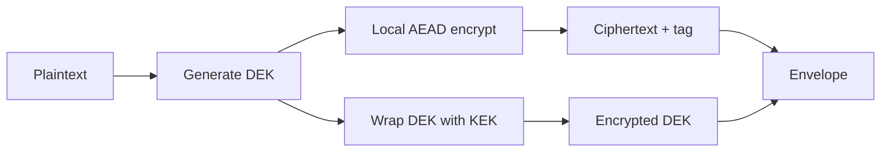
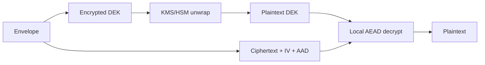

# Envelope Encryption: Scalable Data Encryption with Data Keys and Key Encryption Keys

Envelope encryption is the production pattern for encrypting application data without asking a key-management service to process every byte. Generate a short-lived **data encryption key** (DEK), encrypt the payload locally with an authenticated cipher, then wrap that DEK with a protected **key encryption key** (KEK) in KMS, an HSM, or a key vault. Store the encrypted DEK beside the ciphertext.

For API-level detail, use the AWS KMS and AWS Encryption SDK references linked at the end. This post focuses on the design decisions that matter in real systems.

---

## Core Model

| Layer | Role | Critical rule |
|---|---|---|
| **KEK** | Long-lived wrapping key managed by KMS/HSM/key vault | Should not leave the protected boundary in plaintext |
| **DEK** | Per-object/message/file content key | Store only the encrypted DEK; plaintext DEK lives briefly in memory |
| **Envelope** | Versioned metadata around ciphertext | Must include algorithm, encrypted DEK, IV/nonce, key ID/provider, and authenticated context |

Encrypt path:



Decrypt path:



The KEK protects keys. The DEK protects data. Mixing those responsibilities is where many weak designs start.

---

## What KMS Actually Does

AWS KMS `GenerateDataKey` returns two forms of the same key:

- `Plaintext`: the DEK your process uses immediately for local encryption.
- `CiphertextBlob`: the encrypted DEK you persist in the envelope.

On decrypt, the application sends only the encrypted DEK to `Decrypt`; if IAM/key policy/grants and encryption context checks pass, KMS returns the plaintext DEK.

Important constraints:

- `GenerateDataKey` uses a symmetric KMS key.
- KMS does not store the encrypted DEK for you.
- Encryption context is authenticated but not secret; it appears in CloudTrail.
- The exact encryption context used to wrap the DEK must be supplied when unwrapping it.

Use direct KMS `Encrypt` only for small secrets. For files, blobs, rows, backups, and object storage, use envelope encryption.

---

## The Security-Critical Parts

### Use AEAD, Not "AES Somewhere"

Use AES-GCM or ChaCha20-Poly1305. Do not use raw AES-CBC without a MAC, do not ignore authentication tags, and do not invent a custom integrity layer.

### Never Reuse a GCM Nonce with the Same DEK

For one DEK per object, a fresh random 96-bit IV is standard. If one DEK encrypts many chunks, the nonce schedule must be deterministic and collision-free, usually a random per-object prefix plus a counter. Treat chunk framing as protocol design, not formatting.

### Bind Metadata with AAD

Authenticate metadata that must not be silently changed:

- tenant ID
- object ID
- algorithm suite
- key ID/provider
- schema or envelope version
- purpose/content type

If ciphertext for `tenant=A` is copied to `tenant=B`, decryption should fail.

### Keep the Envelope Explicit

A minimal JSON envelope can look like this:

```json
{
  "version": 1,
  "alg": "AES-256-GCM",
  "keyProvider": "aws-kms",
  "kekId": "arn:aws:kms:eu-west-1:111122223333:key/...",
  "encryptedDataKey": "base64...",
  "iv": "base64...",
  "aad": {
    "tenantId": "tenant-42",
    "objectId": "invoice-2026-0001",
    "purpose": "invoice-pdf"
  },
  "ciphertext": "base64..."
}
```

Binary, JSON, and Protobuf are all fine. The requirements are versioning, unambiguous algorithm identification, encrypted data-key storage, exact AAD reconstruction, and safe rejection of unsupported versions or critical fields.

---

## Coding Section: Expert-Level Implementation Notes

Prefer the AWS Encryption SDK when its message format fits. It already handles framed messages, algorithm suites, encrypted data keys, commitment policy, and encryption context. Hand-roll the envelope only when you need a strict storage format, streaming contract, or cross-language compatibility target.

Manual implementation checklist:

```text
encrypt(plaintext, metadata):
  aad = canonical_encode(metadata)
  data_key = KMS.GenerateDataKey(key_id, encryption_context=metadata)
  iv = secure_random(12 bytes)
  ciphertext = AES-256-GCM.encrypt(data_key.plaintext, iv, aad, plaintext)
  zero(data_key.plaintext)
  return envelope(version, alg, key_id, data_key.ciphertext_blob, iv, aad, ciphertext)

decrypt(envelope, expected_metadata):
  reject unsupported version/alg/key provider
  aad = canonical_encode(expected_metadata)
  reject if aad does not match envelope metadata policy
  plaintext_dek = KMS.Decrypt(envelope.encryptedDataKey, encryption_context=expected_metadata)
  plaintext = AES-256-GCM.decrypt(plaintext_dek, envelope.iv, aad, envelope.ciphertext)
  zero(plaintext_dek)
  return plaintext
```

Critical Java points:

- Use `Cipher.getInstance("AES/GCM/NoPadding")` with `GCMParameterSpec(128, iv)`.
- Use a 32-byte DEK for AES-256 and a 12-byte IV for GCM.
- Call `cipher.updateAAD(aad)` before `doFinal`.
- Treat `AEADBadTagException` as a security failure; do not retry with modified metadata.
- Clear plaintext DEK byte arrays in `finally`, while accepting that JVM memory zeroization is best-effort.
- Serialize AAD canonically. Different key ordering or whitespace can break decrypts.
- Do not log plaintext, plaintext DEKs, full envelopes, KMS `Plaintext`, or crypto failure request bodies.

For full Java examples, use the official AWS Encryption SDK Java example and KMS `GenerateDataKey` / `Decrypt` docs in the references instead of copying large snippets into the post.

---

## Rotation and Access Design

KEK rotation and DEK rotation are different operations.

| Operation | What changes | When to use |
|---|---|---|
| **KEK rewrap** | Replace encrypted DEK and key metadata only | KMS key migration, cross-account migration, policy cleanup |
| **DEK rotation** | Decrypt and re-encrypt the payload with a new DEK | DEK exposure, nonce mistake, algorithm migration, content rewrite |

Rewrapping does not fix a leaked plaintext DEK. If the DEK leaked and an attacker copied the ciphertext, the payload must be re-encrypted under a new DEK.

For multi-region or multi-principal systems, decide whether each principal/region gets its own wrapped DEK, uses a KMS multi-Region key, or goes through an authorization broker. The answer is an authorization architecture decision as much as a cryptographic one.

---

## Common Failure Modes

- Persisting plaintext DEKs in databases, logs, crash dumps, or serialized envelopes.
- Treating KMS encryption context as secret.
- Authenticating ciphertext but not metadata such as tenant, object, algorithm, and key ID.
- Reusing an AES-GCM IV with the same DEK.
- Using one DEK for an unbounded stream without a specified nonce/chunking protocol.
- Building a custom envelope without versioning or algorithm agility.
- Assuming object replication also replicates decrypt permission.

---

## Decision Rule

Use the AWS Encryption SDK when you can accept its message format. Use manual KMS data keys when the envelope format is part of your storage or interoperability contract. In both cases, the non-negotiables are: high-entropy DEKs, AEAD encryption, unique nonces, authenticated metadata, encrypted DEK persistence, and versioned envelopes.

---

**References**

- [AWS KMS Developer Guide - AWS KMS key hierarchy](https://docs.aws.amazon.com/kms/latest/developerguide/concepts.html)
- [AWS KMS API Reference - GenerateDataKey](https://docs.aws.amazon.com/kms/latest/APIReference/API_GenerateDataKey.html)
- [AWS KMS API Reference - Decrypt](https://docs.aws.amazon.com/kms/latest/APIReference/API_Decrypt.html)
- [AWS KMS Developer Guide - Encryption context](https://docs.aws.amazon.com/kms/latest/developerguide/encrypt_context.html)
- [AWS Encryption SDK Developer Guide - Concepts](https://docs.aws.amazon.com/encryption-sdk/latest/developer-guide/concepts.html)
- [AWS Encryption SDK Developer Guide - Java example code](https://docs.aws.amazon.com/encryption-sdk/latest/developer-guide/java-example-code.html)
- [NIST SP 800-38D - GCM and GMAC](https://csrc.nist.gov/pubs/sp/800/38/d/final)
- [RFC 8439 - ChaCha20 and Poly1305 for IETF Protocols](https://datatracker.ietf.org/doc/html/rfc8439)
