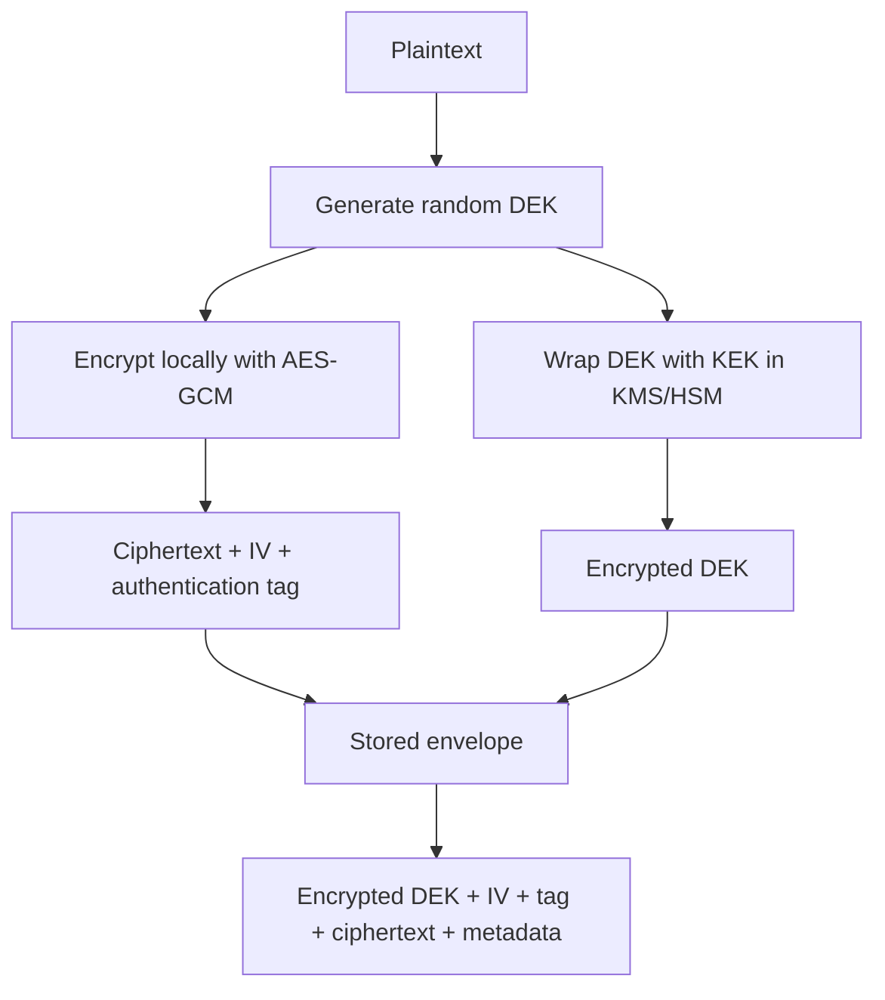
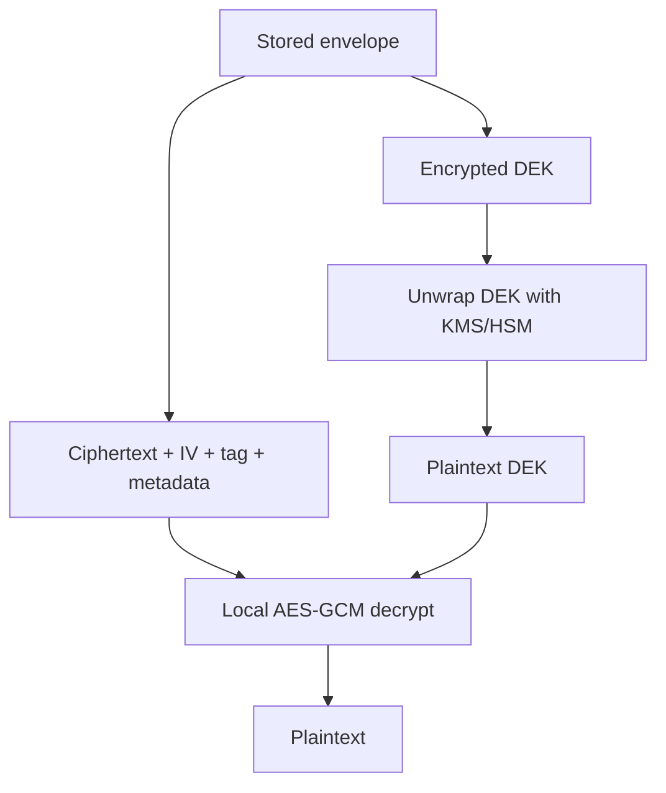

# Envelope Encryption: Scalable Data Encryption with Data Keys and Key Encryption Keys

Envelope encryption is the standard architecture for encrypting large volumes of application data without forcing a central key management system to process every byte. Instead of encrypting the data directly with a long-lived master key, the system generates a fresh **data encryption key** (DEK), encrypts the payload locally with that DEK, and then encrypts the DEK with a **key encryption key** (KEK). The encrypted payload and encrypted DEK are stored together.

This pattern is used by cloud KMS products, object storage, databases, backup systems, secrets managers, and client-side encryption libraries because it separates two problems cleanly:

- **Bulk encryption** happens close to the data, using fast symmetric authenticated encryption such as AES-GCM.
- **Key protection and access control** happen in a hardened key management boundary such as AWS KMS, an HSM, or a dedicated key vault.

The "envelope" is the metadata wrapper that travels with the ciphertext: encrypted data key, algorithm identifiers, IV/nonce, authentication tag, key ID, and authenticated context.

---

## The Core Model

Envelope encryption uses a two-layer key hierarchy.

| Layer | Common name | Purpose | Storage |
|---|---|---|---|
| **KEK** | Key encryption key, wrapping key, KMS key, master key | Encrypts/wraps data keys | Stored in KMS/HSM/key vault; normally never exported in plaintext |
| **DEK** | Data encryption key, content encryption key | Encrypts application data | Generated per object/message/file; stored only as encrypted key material |

The encrypt path:



The decrypt path:



The KEK protects keys. The DEK protects data. Confusing those two responsibilities is the source of many weak encryption designs.

---

## Why Not Encrypt Everything Directly with KMS?

AWS KMS `Encrypt` can encrypt small payloads directly, but direct KMS encryption is not the architecture for large objects or high-throughput data paths. KMS is an online key service with authorization, audit logging, throttling, latency, and cost characteristics. Bulk encryption should be local.

Envelope encryption gives you:

- **Scalability** - AES-GCM can encrypt gigabytes locally without a KMS round trip per block.
- **Blast-radius reduction** - a compromised DEK exposes one object or a bounded set of objects, not the entire corpus.
- **Centralized access control** - only principals allowed to unwrap the encrypted DEK can decrypt the object.
- **Auditing** - KMS decrypt calls can be logged with CloudTrail and correlated with encryption context.
- **Rotation without bulk re-encryption** - rewrap encrypted DEKs under a new KEK without decrypting and rewriting all data.
- **Crypto agility** - the envelope can carry versioned algorithm metadata so old objects remain decryptable.

The tradeoff is operational complexity: you must store enough metadata to decrypt later, bind that metadata cryptographically, and handle plaintext data keys carefully in memory.

---

## AWS KMS Data Keys

AWS KMS formalizes envelope encryption around **data keys**. `GenerateDataKey` returns two forms of the same random data key:

1. `Plaintext` - used immediately by the application to encrypt data locally.
2. `CiphertextBlob` - the same data key encrypted under the specified symmetric KMS key.

The application stores the encrypted data key next to the encrypted data, then erases the plaintext data key from memory as soon as possible.

On decrypt, the application sends the encrypted data key to `Decrypt`. If the caller is authorized and the request matches the original encryption context, KMS returns the plaintext data key. The application uses that plaintext key to decrypt the local ciphertext and then clears it from memory.

In AWS terminology:

| AWS term | Envelope encryption term |
|---|---|
| KMS key | KEK / wrapping key |
| Data key | DEK / content encryption key |
| `GenerateDataKey` | Generate plaintext DEK and encrypted DEK |
| `Decrypt` on encrypted data key | Unwrap DEK |
| Encryption context | Additional authenticated data bound to the KMS operation |

### Important AWS Constraints

- `GenerateDataKey` requires a **symmetric encryption KMS key**. Asymmetric KMS keys cannot be used to generate symmetric data keys.
- The plaintext data key returned by KMS is delivered to your application over TLS. After that point, your process owns the risk of memory exposure.
- KMS does not store your encrypted data key or plaintext data key for you. You must store the encrypted data key with the encrypted object.
- Encryption context is not secret. AWS logs it in plaintext in CloudTrail, so it must contain identifiers, not sensitive data.
- Encryption context is cryptographically bound to the ciphertext that KMS produces. The same context must be supplied during decrypt or KMS rejects the request.

---

## Authenticated Encryption Is Mandatory

Envelope encryption is not just "AES plus a wrapped key." The data encryption layer must provide confidentiality and integrity. Use an AEAD mode such as:

- **AES-GCM** - standardized in NIST SP 800-38D; widely hardware-accelerated.
- **ChaCha20-Poly1305** - standardized in RFC 8439; strong software performance, especially where AES acceleration is unavailable.

Do not use raw AES-CBC without a MAC. Do not invent an encrypt-then-hash format. Do not ignore authentication tags. Without ciphertext integrity, an attacker can often modify encrypted data in meaningful ways even if they cannot read it.

### AES-GCM Nonce Discipline

AES-GCM is excellent but unforgiving: a nonce/IV must not repeat for the same key. Reusing a `(key, nonce)` pair can reveal relationships between plaintexts and can allow authentication forgery.

For a fresh random 256-bit DEK per object, a random 96-bit IV per encryption is standard and practical. If the same DEK encrypts multiple chunks or records, nonce management becomes a protocol design problem; use a deterministic counter-based nonce with a per-object random prefix, or use a library that specifies chunk framing correctly.

### Bind Metadata with AAD

AEAD modes accept **additional authenticated data** (AAD): bytes that are authenticated but not encrypted. Use AAD for metadata that must not be silently changed:

- tenant ID
- object ID
- schema version
- algorithm suite
- key ID
- content type
- creation timestamp or version counter

If an attacker copies ciphertext from `tenant=A` to `tenant=B`, AAD should make decryption fail.

This is the same security idea behind AWS KMS encryption context: contextual metadata is cryptographically bound to the operation.

---

## Minimal Envelope Format

A production envelope should be explicit and versioned. One reasonable JSON shape:

```json
{
  "version": 1,
  "alg": "AES-256-GCM",
  "keyProvider": "aws-kms",
  "kekId": "arn:aws:kms:eu-west-1:111122223333:key/1234abcd-12ab-34cd-56ef-1234567890ab",
  "encryptedDataKey": "base64...",
  "iv": "base64...",
  "aad": {
    "tenantId": "tenant-42",
    "objectId": "invoice-2026-0001",
    "purpose": "invoice-pdf"
  },
  "ciphertext": "base64..."
}
```

The exact structure can be binary, JSON, Protobuf, or a library-defined message format. The important properties are:

- It contains all non-secret material required to decrypt.
- It identifies the algorithm suite unambiguously.
- It stores the encrypted data key, not the plaintext data key.
- The metadata used as AAD is reconstructed exactly during decrypt.
- The parser rejects unknown critical fields and unsupported versions safely.

---

## Java: Local Envelope Encryption with AES-GCM

The following example shows the local cryptographic shape without AWS. It generates a random DEK, encrypts data with AES-GCM, and wraps the DEK using another AES key with AES key wrap. In a real system, the KEK would normally live in AWS KMS, an HSM, or another key vault instead of application memory.

```java
import javax.crypto.Cipher;
import javax.crypto.KeyGenerator;
import javax.crypto.SecretKey;
import javax.crypto.spec.GCMParameterSpec;
import javax.crypto.spec.SecretKeySpec;
import java.nio.charset.StandardCharsets;
import java.security.SecureRandom;
import java.util.Arrays;
import java.util.Base64;

public final class LocalEnvelopeEncryption {
    private static final SecureRandom RNG = new SecureRandom();
    private static final int AES_256_BITS = 256;
    private static final int GCM_IV_BYTES = 12;      // 96-bit IV recommended for GCM
    private static final int GCM_TAG_BITS = 128;

    public record Envelope(
        String algorithm,
        byte[] wrappedDataKey,
        byte[] iv,
        byte[] ciphertext
    ) {}

    public static Envelope encrypt(byte[] plaintext, byte[] aad, SecretKey kek) throws Exception {
        byte[] dekBytes = generateAesKeyBytes();
        SecretKey dek = new SecretKeySpec(dekBytes, "AES");
        byte[] iv = randomBytes(GCM_IV_BYTES);

        Cipher cipher = Cipher.getInstance("AES/GCM/NoPadding");
        cipher.init(Cipher.ENCRYPT_MODE, dek, new GCMParameterSpec(GCM_TAG_BITS, iv));
        cipher.updateAAD(aad);
        byte[] ciphertext = cipher.doFinal(plaintext);

        byte[] wrappedDek = wrapKey(dek, kek);
        destroy(dekBytes);

        return new Envelope("AES-256-GCM", wrappedDek, iv, ciphertext);
    }

    public static byte[] decrypt(Envelope envelope, byte[] aad, SecretKey kek) throws Exception {
        byte[] dekBytes = unwrapKeyBytes(envelope.wrappedDataKey(), kek);
        SecretKey dek = new SecretKeySpec(dekBytes, "AES");
        try {
            Cipher cipher = Cipher.getInstance("AES/GCM/NoPadding");
            cipher.init(Cipher.DECRYPT_MODE, dek, new GCMParameterSpec(GCM_TAG_BITS, envelope.iv()));
            cipher.updateAAD(aad);
            return cipher.doFinal(envelope.ciphertext());
        } finally {
            destroy(dekBytes);
        }
    }

    private static SecretKey generateAesKey() throws Exception {
        return new SecretKeySpec(generateAesKeyBytes(), "AES");
    }

    private static byte[] generateAesKeyBytes() throws Exception {
        KeyGenerator generator = KeyGenerator.getInstance("AES");
        generator.init(AES_256_BITS, RNG);
        return generator.generateKey().getEncoded();
    }

    private static byte[] wrapKey(SecretKey dek, SecretKey kek) throws Exception {
        Cipher wrap = Cipher.getInstance("AESWrap");
        wrap.init(Cipher.WRAP_MODE, kek);
        return wrap.wrap(dek);
    }

    private static byte[] unwrapKeyBytes(byte[] wrappedDek, SecretKey kek) throws Exception {
        Cipher wrap = Cipher.getInstance("AESWrap");
        wrap.init(Cipher.UNWRAP_MODE, kek);
        SecretKey key = (SecretKey) wrap.unwrap(wrappedDek, "AES", Cipher.SECRET_KEY);
        return key.getEncoded();
    }

    private static byte[] randomBytes(int length) {
        byte[] bytes = new byte[length];
        RNG.nextBytes(bytes);
        return bytes;
    }

    private static void destroy(byte[] bytes) {
        if (bytes != null) {
            Arrays.fill(bytes, (byte) 0);
        }
    }

    public static void main(String[] args) throws Exception {
        SecretKey kek = generateAesKey(); // demo only; use KMS/HSM in production
        byte[] aad = "tenant=tenant-42;object=invoice-2026-0001".getBytes(StandardCharsets.UTF_8);
        byte[] plaintext = "payment terms: net 30".getBytes(StandardCharsets.UTF_8);

        Envelope envelope = encrypt(plaintext, aad, kek);
        byte[] decrypted = decrypt(envelope, aad, kek);

        System.out.println(new String(decrypted, StandardCharsets.UTF_8));
        System.out.println(Base64.getEncoder().encodeToString(envelope.wrappedDataKey()));
    }
}
```

This code is intentionally explicit. In production, prefer a mature envelope encryption library because correct framing, streaming, commitment, rewrapping, multi-keyring handling, and cross-language compatibility are easy to get subtly wrong.

---

## Java with AWS KMS: Manual Envelope Encryption

This example uses AWS KMS for the KEK operation and Java Cryptography Architecture for local AES-GCM. It is useful when you need a custom envelope format.

Maven dependencies:

```xml
<dependency>
  <groupId>software.amazon.awssdk</groupId>
  <artifactId>kms</artifactId>
</dependency>
```

If your project does not manage AWS SDK versions through the AWS SDK BOM, add the current AWS SDK for Java 2.x version explicitly.

Implementation:

```java
import software.amazon.awssdk.core.SdkBytes;
import software.amazon.awssdk.services.kms.KmsClient;
import software.amazon.awssdk.services.kms.model.DataKeySpec;
import software.amazon.awssdk.services.kms.model.DecryptRequest;
import software.amazon.awssdk.services.kms.model.GenerateDataKeyRequest;
import software.amazon.awssdk.services.kms.model.GenerateDataKeyResponse;

import javax.crypto.Cipher;
import javax.crypto.spec.GCMParameterSpec;
import javax.crypto.spec.SecretKeySpec;
import java.security.SecureRandom;
import java.util.Arrays;
import java.util.Map;

public final class AwsKmsEnvelopeEncryption {
    private static final SecureRandom RNG = new SecureRandom();
    private static final int GCM_IV_BYTES = 12;
    private static final int GCM_TAG_BITS = 128;

    public record Envelope(
        byte[] encryptedDataKey,
        byte[] iv,
        byte[] ciphertext
    ) {}

    public static Envelope encrypt(
        KmsClient kms,
        String kmsKeyId,
        byte[] plaintext,
        byte[] aad,
        Map<String, String> encryptionContext
    ) throws Exception {
        GenerateDataKeyResponse dataKey = kms.generateDataKey(GenerateDataKeyRequest.builder()
            .keyId(kmsKeyId)
            .keySpec(DataKeySpec.AES_256)
            .encryptionContext(encryptionContext)
            .build());

        byte[] plaintextDataKey = dataKey.plaintext().asByteArray();
        byte[] encryptedDataKey = dataKey.ciphertextBlob().asByteArray();
        byte[] iv = randomBytes(GCM_IV_BYTES);

        try {
            Cipher cipher = Cipher.getInstance("AES/GCM/NoPadding");
            cipher.init(Cipher.ENCRYPT_MODE,
                new SecretKeySpec(plaintextDataKey, "AES"),
                new GCMParameterSpec(GCM_TAG_BITS, iv));
            cipher.updateAAD(aad);
            byte[] ciphertext = cipher.doFinal(plaintext);

            return new Envelope(encryptedDataKey, iv, ciphertext);
        } finally {
            Arrays.fill(plaintextDataKey, (byte) 0);
        }
    }

    public static byte[] decrypt(
        KmsClient kms,
        Envelope envelope,
        byte[] aad,
        Map<String, String> encryptionContext
    ) throws Exception {
        byte[] plaintextDataKey = kms.decrypt(DecryptRequest.builder()
            .ciphertextBlob(SdkBytes.fromByteArray(envelope.encryptedDataKey()))
            .encryptionContext(encryptionContext)
            .build())
            .plaintext()
            .asByteArray();

        try {
            Cipher cipher = Cipher.getInstance("AES/GCM/NoPadding");
            cipher.init(Cipher.DECRYPT_MODE,
                new SecretKeySpec(plaintextDataKey, "AES"),
                new GCMParameterSpec(GCM_TAG_BITS, envelope.iv()));
            cipher.updateAAD(aad);
            return cipher.doFinal(envelope.ciphertext());
        } finally {
            Arrays.fill(plaintextDataKey, (byte) 0);
        }
    }

    private static byte[] randomBytes(int length) {
        byte[] bytes = new byte[length];
        RNG.nextBytes(bytes);
        return bytes;
    }
}
```

The `aad` and `encryptionContext` serve related but different roles:

| Field | Enforced by | Travels to AWS? | Should contain |
|---|---|---|---|
| AES-GCM AAD | Local AES-GCM authentication tag | No | Metadata needed to bind ciphertext locally |
| KMS encryption context | AWS KMS authenticated encryption and authorization | Yes, logged in CloudTrail | Non-secret identifiers for authorization and audit |

For many systems, use the same logical metadata in both places, serialized consistently for local AAD and represented as key-value pairs for KMS encryption context.

---

## Java with the AWS Encryption SDK

If you do not need a custom envelope format, the AWS Encryption SDK is usually safer than hand-rolled envelope encryption. It implements a structured message format, algorithm suites, data key handling, encryption context, and key provider/keyring integration.

At a high level:

```java
import com.amazonaws.encryptionsdk.AwsCrypto;
import com.amazonaws.encryptionsdk.CommitmentPolicy;
import com.amazonaws.encryptionsdk.CryptoResult;
import com.amazonaws.encryptionsdk.kmssdkv2.KmsMasterKey;
import com.amazonaws.encryptionsdk.kmssdkv2.KmsMasterKeyProvider;

import java.nio.charset.StandardCharsets;
import java.util.Map;

public final class AwsEncryptionSdkExample {

    public static byte[] encrypt(String kmsKeyArn, byte[] plaintext) {
        AwsCrypto crypto = AwsCrypto.builder()
            .withCommitmentPolicy(CommitmentPolicy.RequireEncryptRequireDecrypt)
            .build();

        KmsMasterKeyProvider keyProvider = KmsMasterKeyProvider.builder()
            .buildStrict(kmsKeyArn);

        Map<String, String> encryptionContext = Map.of(
            "tenantId", "tenant-42",
            "purpose", "invoice-pdf"
        );

        CryptoResult<byte[], KmsMasterKey> result =
            crypto.encryptData(keyProvider, plaintext, encryptionContext);

        return result.getResult();
    }

    public static byte[] decrypt(String kmsKeyArn, byte[] ciphertext) {
        AwsCrypto crypto = AwsCrypto.builder()
            .withCommitmentPolicy(CommitmentPolicy.RequireEncryptRequireDecrypt)
            .build();

        KmsMasterKeyProvider keyProvider = KmsMasterKeyProvider.builder()
            .buildStrict(kmsKeyArn);

        CryptoResult<byte[], KmsMasterKey> result =
            crypto.decryptData(keyProvider, ciphertext);

        Map<String, String> context = result.getEncryptionContext();
        if (!"tenant-42".equals(context.get("tenantId"))) {
            throw new SecurityException("Unexpected encryption context");
        }

        return result.getResult();
    }

    public static void main(String[] args) {
        String keyArn = "arn:aws:kms:eu-west-1:111122223333:key/1234abcd-12ab-34cd-56ef-1234567890ab";
        byte[] ciphertext = encrypt(keyArn, "hello".getBytes(StandardCharsets.UTF_8));
        byte[] plaintext = decrypt(keyArn, ciphertext);
        System.out.println(new String(plaintext, StandardCharsets.UTF_8));
    }
}
```

The SDK ciphertext is not just raw AES-GCM output. It is a self-describing encrypted message that includes encrypted data keys and cryptographic metadata. That is the point: the message can be stored and later decrypted without relying on fragile external bookkeeping, provided the caller still has permission to use the required KMS key.

---

## Key Rotation and Rewrapping

Envelope encryption makes rotation practical because the KEK and DEK have different lifecycles.

### Rotating the KEK

If the KMS key rotates internally, previously encrypted data remains decryptable because the KMS key retains old backing key material as needed. New encryptions use the current backing key.

If you migrate from one KMS key to another, you can **rewrap**:

1. Read the encrypted data key.
2. Ask the old KEK to decrypt/unwrap it.
3. Ask the new KEK to encrypt/wrap the same plaintext data key.
4. Replace only the encrypted data key and key metadata.

The payload ciphertext does not change. This is much cheaper than decrypting and re-encrypting every large object.

### Rotating the DEK

To rotate the DEK, you must decrypt and re-encrypt the payload under a new data key. This is required when:

- the DEK may have been exposed,
- the encryption algorithm changes,
- nonce discipline was violated,
- policy requires periodic content-key rotation,
- the data is being rewritten anyway.

Do not treat KEK rotation as a cure for compromised plaintext data keys. If a DEK leaked and an attacker copied the ciphertext, rewrapping that same DEK under a new KEK does not protect the already-exposed data.

---

## Multi-Region and Multi-Principal Designs

For distributed systems, envelope encryption is often where cryptography meets authorization architecture.

### Multi-Region

If data is replicated across Regions, you have three common choices:

| Design | Behavior | Tradeoff |
|---|---|---|
| Single-Region KEK | All decrypts call one Region's KMS | Simple but adds cross-region latency and availability coupling |
| Regional KEKs with rewrap | Each Region stores a local encrypted DEK | More metadata, better locality and failure isolation |
| AWS KMS multi-Region keys | Related keys in multiple Regions with shared key ID properties | Useful for disaster recovery and active-active workloads, but still requires careful policy design |

Do not assume object replication automatically gives decryption rights. KMS policy, IAM policy, grants, encryption context constraints, and Region placement all matter.

### Multi-Principal Access

If multiple services need to decrypt the same object, avoid copying plaintext DEKs into each service. Prefer:

- one encrypted DEK per authorized KEK,
- grants or key policies scoped by encryption context,
- a broker service that performs authorization and decrypts only when necessary,
- the AWS Encryption SDK with multiple keyrings/master keys when cross-account or migration behavior is needed.

The correct choice depends on whether principals should have independent cryptographic access or mediated application-level access.

---

## Common Failure Modes

### Storing the Plaintext Data Key

If the plaintext DEK is stored in a database, log line, crash dump, metric, or serialized envelope, the KEK no longer protects the data. Only the encrypted DEK should persist.

### Treating Encryption Context as Secret

AWS KMS encryption context is logged in plaintext and can appear in audit systems. Use values such as `tenantId`, `objectId`, and `purpose`; never put passwords, tokens, personal data, or trade secrets in it.

### Not Authenticating Metadata

If `objectId`, `tenantId`, `alg`, or `keyId` can be modified without detection, ciphertext substitution attacks become possible. Bind metadata with AEAD AAD and, for KMS operations, with encryption context.

### Reusing AES-GCM IVs

Never reuse an IV with the same DEK. If you encrypt multiple chunks with one data key, the chunk nonce schedule must be deterministic and collision-free.

### Logging Plaintext on Decrypt Failures

Decryption exceptions often happen in error paths where logging is verbose. Never log plaintext, plaintext data keys, decrypted buffers, or full request bodies from crypto failure paths.

### Writing a Custom Format Without Versioning

Every envelope format eventually needs migration: algorithm changes, provider changes, multiple wrapped keys, compression changes, or additional authenticated fields. Include a version from day one.

---

## Design Checklist

| Question | Good answer |
|---|---|
| What is the DEK scope? | One object, file, message, row group, or small bounded batch |
| What AEAD algorithm is used? | AES-256-GCM or ChaCha20-Poly1305 from a mature provider |
| How is the nonce generated? | Unique per `(DEK, encryption operation)`, preferably 96-bit for GCM |
| What metadata is authenticated? | Tenant, object ID, algorithm, key ID, purpose, version |
| Where is the encrypted DEK stored? | With the ciphertext or in strongly consistent metadata linked to it |
| Where is the plaintext DEK stored? | Nowhere persistent; only in process memory briefly |
| How is decrypt authorized? | KMS/IAM/key policy/grants plus encryption context constraints |
| How is access audited? | KMS decrypt events, application audit logs, object identifiers |
| How is rotation handled? | KEK rewrap for key migration; payload re-encryption for DEK compromise |
| Can old objects be decrypted? | Envelope versioning and algorithm support are retained |

---

## Summary

Envelope encryption is a key-management architecture, not a single algorithm. The secure version has four mandatory properties:

1. Generate high-entropy data keys.
2. Encrypt data locally with authenticated encryption.
3. Wrap data keys with a protected KEK in KMS/HSM/key vault.
4. Store versioned, authenticated metadata with the ciphertext.

AWS KMS implements the KEK and data-key generation side of this model; the AWS Encryption SDK implements the full client-side envelope format. Use the SDK when its message format fits. Write a manual envelope only when you need a specific storage format, streaming model, or interoperability contract, and then treat the format as a security protocol rather than a serialization detail.

---

**References**

- [AWS KMS Developer Guide - AWS KMS key hierarchy](https://docs.aws.amazon.com/kms/latest/developerguide/concepts.html)
- [AWS KMS API Reference - GenerateDataKey](https://docs.aws.amazon.com/kms/latest/APIReference/API_GenerateDataKey.html)
- [AWS KMS API Reference - Decrypt](https://docs.aws.amazon.com/kms/latest/APIReference/API_Decrypt.html)
- [AWS KMS Developer Guide - Encryption context](https://docs.aws.amazon.com/kms/latest/developerguide/encrypt_context.html)
- [AWS Encryption SDK Developer Guide - Concepts](https://docs.aws.amazon.com/encryption-sdk/latest/developer-guide/concepts.html)
- [AWS Encryption SDK Developer Guide - Java example code](https://docs.aws.amazon.com/encryption-sdk/latest/developer-guide/java-example-code.html)
- [NIST SP 800-38D - Recommendation for Block Cipher Modes of Operation: Galois/Counter Mode (GCM) and GMAC](https://csrc.nist.gov/pubs/sp/800/38/d/final)
- [RFC 8439 - ChaCha20 and Poly1305 for IETF Protocols](https://datatracker.ietf.org/doc/html/rfc8439)
