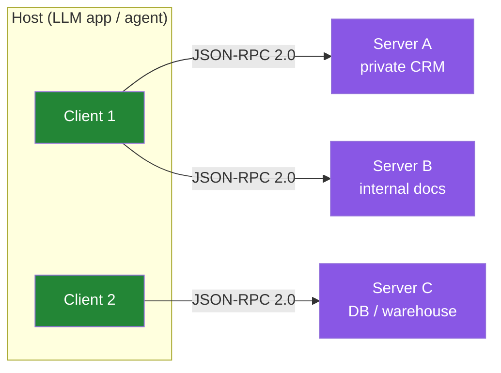
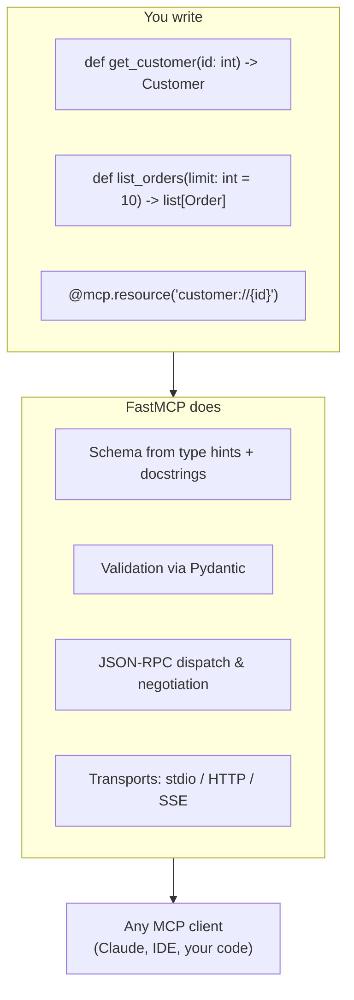
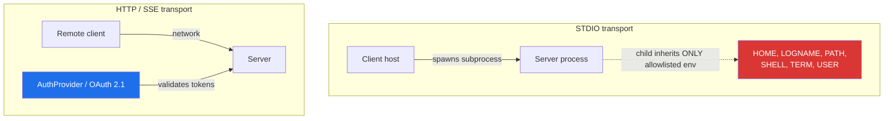

# FastMCP & MCP: Building Custom Servers and Clients for LLM & Agentic AI

By now, every LLM can chat. The hard problem is **access**: getting a model to read from your private API, query your internal databases, or trigger your backend workflows — safely, typed, and with the model knowing what it can and cannot do. The [Model Context Protocol (MCP)](https://modelcontextprotocol.io) solves this as the "USB-C of AI integration": a vendor-neutral, JSON-RPC 2.0-based standard that lets LLM apps (hosts) discover and call the capabilities of any server that speaks the protocol.

[**FastMCP**](https://gofastmcp.com) is the Python framework that made MCP ergonomic. It created the high-level Python API that was incorporated into the official `mcp` Python SDK in 2024; the actively maintained standalone project now ships **over a million downloads a day**, and some version of FastMCP powers **~70% of MCP servers across all languages** (~25k GitHub stars, Apache-2.0, stewarded by Prefect). If you are exposing internal systems to LLM tooling, FastMCP is the path of least resistance.

This post is a practical, expert-level walkthrough: we build a real FastMCP server exposing private data as **resources** and private actions as **tools**, then consume it from a FastMCP **client**, and finally harden it with authentication, authorization, and production deployment. We end with the honest limitations — because the biggest errors in this space come from treating MCP as a magic gateway.

---

## The Protocol, in 60 Seconds

MCP is built on **JSON-RPC 2.0** over a stateful connection. Three roles:

- **Hosts** — the LLM applications that initiate connections (Claude, an IDE, your own agent loop).
- **Clients** — connectors *inside* the host that speak to exactly one server.
- **Servers** — expose context and capabilities.



Servers offer three feature families; the client may offer its own back to the server:

| Direction | Feature | What it is |
|---|---|---|
| Server → Client | **Resources** | Context and data — for the user or the model ("here's the schema"). URI-addressed, often templates. |
| Server → Client | **Prompts** | Templated messages/workflows a user can invoke. |
| Server → Client | **Tools** | Functions the model may *execute* — the dangerous ones. |
| Client → Server | **Sampling** | Server-initiated, user-approved LLM calls. |
| Client → Server | **Roots** | Server asks about the URI/filesystem boundaries it operates in. |
| Client → Server | **Elicitation** | Server requests additional information from the user. |

Connections are **stateful**, capabilities are **negotiated** at startup, and both sides agree on a protocol version. Transport matters and is covered below; the key tension for private systems is that **STDIO** (local subprocess) and **HTTP/SSE** (remote) have very different security postures.

---

## Why FastMCP Instead of Raw `mcp`

You can hand-write an MCP server against the official SDK, managing request types, session state, and capability negotiation yourself. FastMCP removes essentially all of that ceremony. Its model is: write plain Python functions, annotate them, and FastMCP derives the JSON schemas, dispatches requests, and handles the wire protocol.



Beyond ergonomics, FastMCP gives you a **first-class client** (`fastmcp.Client`), composition (`mount`, `create_proxy`), a middleware pipeline, OAuth/OAuth 2.1 provider support, and streaming-friendly resource handling — all from one dependency.

---

## Example 1: A Server for a Private CRM

We'll expose a fictional internal CRM with two capabilities: read-only data (resources) and actions (tools). A few notes before the code:

- The type of each parameter and the return type become the **JSON Schema** — use proper types and rich docstrings; that's what the model "sees."
- Every tool can optionally take a `Context` parameter; FastMCP injects it (so it never appears in the schema).

```python
from fastmcp import FastMCP, Context
from pydantic import BaseModel

# Create the server. "instructions" is injected into the system prompt
# of any host LLM, so describe boundaries here.
mcp = FastMCP(
    "crm",
    instructions=(
        "The CRM exposes customer and order data. Tools are read-only; "
        "never ask the user to paste credentials — call the auth helper."
    ),
)

class Customer(BaseModel):
    id: int
    name: str
    tier: str  # bronze | silver | gold
    account_manager: str

class Order(BaseModel):
    id: int
    customer_id: int
    total: float
    status: str


# ---- Resources: data for the model / user to READ ----

@mcp.resource("crm://customers/{customer_id}")
def get_customer_resource(customer_id: int) -> Customer:
    """Fetch a customer record (URI-addressed, cacheable context)."""
    return _db.get_customer(customer_id)


@mcp.resource("crm://schema")
def crm_schema() -> str:
    """A JSON-serialized copy of the CRM's SQL schema."""
    return json.dumps(_db.schema())


# ---- Tools: actions the model may EXECUTE ----

@mcp.tool
def list_customers(tier: str | None = None) -> list[Customer]:
    """List customers, optionally filtered by tier.

    Args:
        tier: one of bronze, silver, gold. If omitted, all tiers.
    """
    return _db.list_customers(tier=tier)


@mcp.tool
def get_customer_orders(customer_id: int, limit: int = 10) -> list[Order]:
    """Return the most recent orders for a customer."""
    return _db.orders_for_customer(customer_id, limit=limit)


@mcp.tool
def cancel_order(order_id: int, ctx: Context) -> Order:
    """Cancel a pending order (idempotent; safe to retry)."""
    ctx.info(f"Cancelling order {order_id}")          # -> client logs
    result = _db.cancel(order_id)
    ctx.report_progress(0.5, 1.0)                     # -> client progress UI
    return result
```

Two FastMCP behaviors worth knowing:

1. **Schema generation is exact.** `list_customers(tier: str | None)` produces a schema with `tier` optional; `get_customer_orders` documents `limit` as optional with default 10. Docstrings become `descriptions`. This is the model's interface contract — treat it like a public API you version.
2. **Resource vs. tool is a real decision.** Resources are *selected* by the user/model as context ("show me customer 42"), tools are *invoked* for effects. Putting a write operation behind a resource misleads hosts about side effects — keep mutations in tools.

---

## Example 2: The Client Side

`fastmcp.Client` (v2.0.0+) talks to any server — in-memory, a local script via STDIO, or a remote HTTP/SSE endpoint — behind one interface:

```python
import asyncio
from fastmcp import Client

async def main() -> None:
    # (a) in-memory: import the server object directly (no transport)
    from crm_server import mcp as crm
    async with Client(crm) as client:
        await demo(client)

    # (b) local subprocess via STDIO
    async with Client("python crm_server.py") as client:
        await demo(client)

    # (c) remote HTTP server
    async with Client("http://localhost:8000/mcp") as client:
        await demo(client)

async def demo(client: Client) -> None:
    print(await client.list_tools())
    print(await client.list_resources())

    # Structured data is returned in result.data (v2.10.0+)
    res = await client.call_tool("get_customer_orders", {"customer_id": 42})
    print(res.data)          # list[Order]

    # Resource read
    customer = await client.read_resource("crm://customers/42")
    print(customer.data)

    # Streaming progress back from the server
    async def on_progress(current: float, total: float) -> None:
        print(f"progress: {current}/{total}")

    await client.call_tool(
        "cancel_order", {"order_id": 7},
        timeout=30.0,
        progress_handler=on_progress,
    )

asyncio.run(main())
```

Things that routinely trip people up on the client side:

- **Timeouts.** Model-driven calls can legitimately take tens of seconds. Pass an explicit `timeout=` for any tool that might be slow; the default is fine for chat but wrong for batch work.
- **Multi-server name collisions.** When one client drives many servers, tools are prefixed (`crm_list_customers`, `docs_search`), and **collisions are resolved by prefix**. If you're building a single big "everything" server, use `namespace=` on `mount()` (below) to control that namespace.
- **`call_tool` returns `data` only when the result is structured.** For opaque tool results, rely on `.text` / content blocks. FastMCP also lets servers return typed results (e.g. `Result(customer)` or `StreamableResult`) for richer shapes — check `result.data` first, then fall back to text.

---

## Private Data Without Private Leaks: Security Model

The most important security rule in MCP: **the transport decides what your secrets see.**



- **STDIO servers run as a child of the host process.** FastMCP passes only an explicit **environment allowlist** (POSIX defaults: `HOME`, `LOGNAME`, `PATH`, `SHELL`, `TERM`, `USER`). API keys and tokens do **not** get inherited automatically — this is deliberate. Pass them explicitly:

```python
from fastmcp import Client, StdioTransport

transport = StdioTransport(
    command="python",
    args=["crm_server.py"],
    cwd="/srv/crm",
    env={"CRM_API_KEY": os.environ["CRM_API_KEY"]},  # explicit, never implicit
)
async with Client(transport) as client:
    ...
```

- **HTTP servers are network-exposed.** FastMCP's `AuthProvider` enables OAuth 2.1 flow discovery (server metadata advertises the token endpoint, PKCE, scopes). In production you point it at your existing IdP/API gateway; for machine-to-machine calls, FastMCP's client supports the **client-credentials grant** (`ClientCredentialsOAuthProvider`, v4.0.0+): point it at the server URL and it auto-discovers the token endpoint:

```python
from fastmcp import Client
from fastmcp.auth import ClientCredentialsOAuthProvider

auth = ClientCredentialsOAuthProvider(
    client_id=os.environ["CLIENT_ID"],
    client_secret=os.environ["CLIENT_SECRET"],
    server_url="https://mcp.example.com/mcp",
)
async with Client("https://mcp.example.com/mcp", auth=auth) as client:
    ...
```

- **Authorization is separate from authentication** (v3.0.0+). Auth = *who* you are; authorization = *what you may do*. FastMCP lets you attach callables that receive an `AuthContext` and return a boolean — combined with **AND** semantics. This is where per-tenant or per-scope rules live:

```python
def can_cancel(ctx: AuthContext) -> bool:
    return "crm:cancel" in ctx.scopes and ctx.user_tier != "viewer"

mcp = FastMCP("crm", auth=AuthProvider(...), auth_checks=[can_cancel])
```

- **`get_access_token()` inside a tool returns the calling user's token** when auth is active (it is `None` on STDIO, where trust comes from the local environment). That lets you forward identity downstream — useful, but be explicit: a tool receiving another user's scoped token is a classic privilege-escalation hole.

### Environment allowlist recap
Anything the server needs at runtime (DB URLs, service account keys) must be supplied **by whoever launches the server** — the host, a supervisor, or your container environment. FastMCP will not silently leak your laptop's secrets into a child MCP server.

---

## Deployment: From `python server.py` to Production

The same server object runs in four modes:

```python
# (1) Interactive / MCP host: run once and exit
mcp.run()                       # defaults to stdio when no transport given

# (2) Direct HTTP server (FastMCP's own ASGI app)
mcp.run(transport="http", host="0.0.0.0", port=8000)

# (3) Bring-your-own ASGI app — mount into FastAPI/Starlette
app = FastAPI()
app.mount("/mcp", mcp.streamable_http_app())

# (4) Run via uvicorn/gunicorn with multiple workers
#     uvicorn crm_server:app --workers 4
```

Guidance that transfers from normal Python web services:

- **Put it behind your gateway.** Auth, TLS termination, rate limiting, and audit logging belong at the edge, not in the server. FastMCP's auth provider integrates with OAuth 2.1; your gateway does the rest.
- **Workers and state.** MCP connections are stateful, but you can run stateless workers if per-request state is pinned (sticky sessions) or avoided. FastMCP 4 (below) removes the statefulness requirement entirely — it runs on MCP's sessionless protocol.
- **Graceful failure.** Tools fail with structured errors (`ToolError`, `InternalError`) that flow back to the model as JSON-RPC errors. Return them deliberately (`raise ToolError("customer is archived")`) rather than leaking raw exceptions, which can expose internals to a model that may summarize them verbatim.

---

## Composition, Middleware, and the OpenAPI Trap

### Composability: one server from many

`mount()` (v2.2.0+) merges servers live, and `create_proxy()` mounts a remote or subprocess server as if it were local — the gateway pattern for your internal estate:

```python
from fastmcp import FastMCP, create_proxy

gateway = FastMCP("internal")
gateway.mount(crm_server, namespace="crm")          # same process
gateway.mount(await create_proxy("https://docs.mcp.internal/mcp"))  # remote
gateway.mount(await create_proxy("python docs_server.py"))         # subprocess
gateway.run(transport="http", port=8000)
```

### Middleware: cross-cutting concerns without touching tools

FastMCP's middleware pipeline (v2.9.0+) wraps every inbound message — the right place for request logging, rate limiting, and adding scopes to an `AuthContext`:

```python
async def rate_limit(ctx, call_next):
    key = ctx.connection_id
    if not limiter.allow(key):
        raise ToolError("rate limit exceeded")
    return await call_next(ctx)

mcp = FastMCP("crm", middleware=[rate_limit])
```

> Middleware is a **FastMCP concept**, not part of the MCP spec — it's the frame around the protocol. It composes with auth checks but they're separate knobs.

### The OpenAPI trap

FastMCP can auto-convert existing REST APIs: `FastMCP.from_openapi(...)` / the FastAPI integration. It's a great accelerator for prototyping. But the FastMCP docs are blunt: **the maintainers recommend curated, hand-written servers over auto-converted APIs** for production LLM use (see the essay "Stop Converting Your REST APIs to MCP"). Why:

- LLMs choose tools by **description, not by operation name**. Auto-generated tools inherit REST endpoint docs, which are written for humans, not function-calling models — tool selection quality drops sharply.
- REST APIs tend to be **coarse and chatty**. One model call to "get a customer" may need 3–5 REST round trips behind the scenes; a hand-written tool returns the whole answer in one shot.
- Schema cruft (auth headers, pagination params, envelope types) becomes tool-call noise the model has to reason about.

**Rule of thumb:** auto-convert to explore, hand-write the 10–30 tools that matter, and wrap each with purpose-built arguments and honest descriptions.

---

## What's New: FastMCP 4 and MCP's Sessionless Protocol

The MCP spec moved to a **sessionless protocol**, and FastMCP 4 (currently in beta) is built for it. The headline change: servers can run **stateful apps** without sessions — FastMCP keeps per-connection state *out of the protocol* and negotiates both protocol eras per connection, so one server speaks to old and new clients simultaneously. Consequences for builders:

- **Sticky sessions become optional.** Sessionless means you can scale statelessly behind a load balancer without pinning connections — a real win for the HTTP deployment above.
- **Background tasks** are first-class: a tool can kick off work and the client can observe progress/updates rather than blocking on one long call.
- **Pin your version.** FastMCP 4 is explicitly beta: `uv add fastmcp==4.0.0b4` (or whatever the current release is). The docs warn to expect sharp edges, and 3.x APIs you rely on may shift. For stable production work today, stay on 3.x; watch the upgrade guide when 4 goes GA.

There's also a sibling client concept worth noting: FastMCP **apps** — interactive UIs rendered *inside* the conversation (forms, dashboards) rather than chat-only. Useful for internal tools where you want a human-in-the-loop surface on top of the same server.

---

## Limitations and Traps (Read This Before Production)

- **STDIO security is "local trust."** A malicious or compromised client can read whatever env the server is given. If your server touches sensitive systems, run it remote with real auth — don't rely on "it's local."
- **Auto-converted APIs degrade tool selection.** Restate the warning: schema cruft and endpoint-shaped tools measurably hurt model accuracy. Curate.
- **The model controls the flow, not you.** MCP tools are *invoked by the model*. Idempotency, validation, and idempotent-safe retries live in your tools — the host will retry, parallelize, or hallucinate arguments. `cancel_order` above is idempotent by design for exactly this reason.
- **Auth only exists over HTTP/SSE.** There is no auth handshake on STDIO. Don't design a "secure" STDIO server and assume the host is authenticated.
- **Version churn is real.** Spec revisions (2025-03-26 → 2025-06-18 → 2025-11-25, and now the sessionless revision FastMCP 4 targets), plus FastMCP's own majors, mean pinning matters. The good news: the **primitives are stable** — tools/resources/prompts from this post will survive upgrades with mostly cosmetic changes.
- **Middleware is not portable.** Code you write against FastMCP's middleware won't transfer to non-FastMCP servers; keep cross-cutting logic thin and protocol-agnostic.
- **Large resources bloat context.** A resource that returns a 5 MB dataset gets stuffed into the model's context window. Prefer tools with parameters or streaming for anything big; resources shine for small, URI-addressable context.

---

## When to Reach for FastMCP / MCP

- **You want every LLM tool to speak one protocol.** Once your internal systems speak MCP, Claude, your IDE, your agents, and your own apps all consume them identically — no per-integration glue.
- **You're already in Python.** FastMCP is the fastest path from "I have a private API" to "the model can use it," with typing and Pydantic validation for free.
- **You need the client side too.** `fastmcp.Client` is a genuinely good MCP client — you may never need a separate integration library for your agent loop.
- **You value boundaries.** Resources (read) vs. tools (write) + explicit auth/authorization force a cleaner security model than "expose the endpoint."

If you just want a model to *chat*, you don't need MCP. If you want a model to *act on your private systems* — read your CRM, query your warehouse, cancel an order — FastMCP turns that from a bespoke integration project into ~60 lines of annotated Python.

---

**References**

- [FastMCP Documentation](https://gofastmcp.com)
- [FastMCP on GitHub (PrefectHQ/fastmcp)](https://github.com/PrefectHQ/fastmcp)
- [Model Context Protocol Specification](https://modelcontextprotocol.io/specification)
- [FastMCP Client docs](https://gofastmcp.com/clients/client)
- [FastMCP Auth docs](https://gofastmcp.com/clients/authentication)
- [FastMCP HTTP deployment docs](https://gofastmcp.com/servers/deployment/http)
- [FastMCP Composition (mount / create_proxy)](https://gofastmcp.com/servers/composition)
- [FastMCP Middleware docs](https://gofastmcp.com/servers/middleware)
- [Stop Converting Your REST APIs to MCP (Jeremiah Lowin)](https://jlowin.dev/posts/stop-converting-your-rest-apis-to-mcp)
- [FastMCP 3.0 Launch](https://jlowin.dev/blog/fastmcp-3-launch)
- [FastMCP for TypeScript](https://github.com/PrefectHQ/fastmcp-ts)
