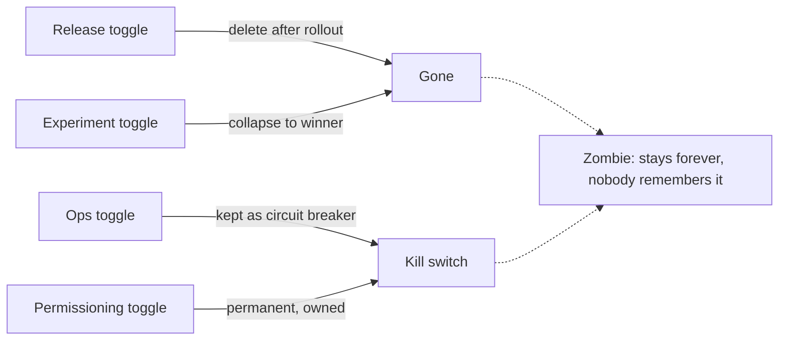

# The Toggle That Bankrupted a Firm

The most expensive bit in the history of software was a single boolean. On August 1, 2012 Knight Capital reused a retired feature flag, one of eight production servers still ran the dead code behind it, and in 45 minutes the firm executed 4 million stray trades, assumed $7 billion of positions, lost $460 million, and was sold. Feature toggles are not a safety feature you install once — they are inventory that rots, and when they rot they deploy your worst code for you.

This post is a compact, practitioner's guide: what toggles are, the four types and their lifetimes, runtime management systems and JVM libraries, the disasters and their shared root causes (zombie flags, reused toggles, combinatorial explosion, absent ownership), and the practices that keep a flag farm from becoming the next Knightmare.

---

## 1. What a Feature Toggle Is

A **feature toggle (aka flag)** is a switch in code that changes system behavior without a deployment:

```java
if (featureFlags.isEnabled("new_checkout")) {
    service.executeNewCheckout(order);
} else {
    service.executeLegacyCheckout(order);
}
```

Its one superpower: it **decouples deployment from release** — you can ship dark code to production and expose it gradually, instantly, or to a subset of users, and you can reverse a bad change with a configuration flip instead of a rollback. That decoupling is why trunk-based development and continuous delivery are practical. But every toggle is a second behavior path that must be tested, reasoned about, and eventually deleted.

> **Expert note.** The value comes from the *timing* of the flip, not the `if`. A toggle you flip once at deploy time is equivalent to config; a toggle you flip per-request is routing logic. Conflating those is where most toggle debt begins (Pete Hodgson, *Feature Toggles*).

---

## 2. The Four Types (and Their Lifecycles)

Martin Fowler and Pete Hodgson's classification is the industry standard. Each type differs in **longevity** and **dynamism**, and treating them the same is the root of most flag debt.

| Type | Purpose | Lifetime | Decision |
|---|---|---|---|
| **Release** | Hide in-progress work; merge to trunk, ship dark | Days–weeks; delete after 100% rollout | Static per deploy |
| **Experiment** | A/B tests, cohort routing | Weeks–months; collapse to winner | Per-request (cohort) |
| **Ops** | Kill switches, degrade under load | Short-lived, or permanent for real switches | Dynamic re-config |
| **Permissioning** | Gate features by tier/role/entitlement | Permanent by design (business model) | Per-request |



The rule of thumb: **if the eventual state is "100% of users get one variation", the flag is temporary** — schedule its removal the day you create it.

---

## 3. Pros and Cons

**Pros**

- Decouples deploy from release → trunk-based dev, continuous delivery.
- Gradual rollout / canary / Champagne-Brunch (internal users first).
- Instant rollback: flip a flag, not a release.
- A/B experimentation: measure a feature before promising it.
- Ops toggles degrade a system gracefully under load.

**Cons**

- **Combinatorial explosion:** N binary toggles create 2ᴺ reachable states — 10 toggles → 1,024; 20 → over a million. Untested combinations wait to bite.
- **Carrying cost:** every flag is an extra branch to test, review, debug, and reason about (Fowler: flag inventory is "inventory which comes with a carrying cost").
- **Test surface growth:** "both paths" doubles the states you must verify.
- **Debt that never gets paid:** cleanup is unglamorous and unflaggingly deferred — the majority of flags shipped are never removed.
- **Security surface:** untested dark code can be activated accidentally; legacy paths become reachable.

---

## 4. Runtime Management: Libraries & Systems

A production toggle stack needs three parts: **evaluation** (how code reads flags), **distribution** (how state reaches servers), and **control plane** (who changes flags, with audit). Options:

### JVM libraries (embed in the app)

- **Togglz** (Apache-2.0) — the classic Java library. Features as enums, `FeatureManager.isActive(...)`, a Spring Boot starter, an actuator console, strategies like username/gradual rollout.

```java
public enum MyFeatures implements Feature {
    NEW_CHECKOUT,
    DARK_MODE;

    public boolean isActive() {
        return FeatureContext.getFeatureManager().isActive(this);
    }
}
```

```java
@Service
public class CheckoutService {
    private final FeatureManager manager;

    CheckoutService(FeatureManager manager) { this.manager = manager; }

    public Receipt checkout(Order order) {
        if (manager.isActive(MyFeatures.NEW_CHECKOUT)) {
            return orderService.executeNewCheckout(order);
        }
        return orderService.executeLegacyCheckout(order);
    }
}
```

- **FF4J** (Apache-2.0) — toggles, roles/groups, flipping strategies, caches, a web console + REST API; AOP-driven toggling lets you swap implementations via annotations instead of nested `if`s.

### Dedicated flag services (control plane + distribution)

| System | License | Model | One-line take |
|---|---|---|---|
| **LaunchDarkly** | Proprietary (SaaS) | Managed | Enterprise default; RBAC, approvals, audit, 30+ SDKs |
| **Unleash** | Apache-2.0 | Self-host / SaaS | Enterprise-friendly OSS, environment isolation, strategies |
| **Flagsmith** | BSD-3 | Self-host / SaaS | Flags + remote config, API-first |
| **GrowthBook** | MIT core | Self-host / SaaS | Strongest OSS experimentation (warehouse-native stats) |
| **Flipt** | Apache-2.0 (OSS) | Self-host | GitOps-native flags, declarative YAML |
| **OpenFeature** | Apache-2.0, CNCF | Standard | Vendor-neutral SDK layer; providers swap underneath |

**OpenFeature** is the biggest shift of 2024–2026: you code against one API (`client.getBooleanValue(flagKey, defaultValue)`), and the vendor — LaunchDarkly, Unleash, Flagsmith, whatever — becomes a config change rather than a rewrite. The tradeoff is the lowest common denominator of provider features.

> **Choosing:** small team → any simple tool, discipline matters more than platform. Regulated/self-host → Unleash or Flagsmith. Experimentation-first → GrowthBook or Split/Statsig. Enterprise governance → LaunchDarkly. Portability → wire OpenFeature from day one. And evaluate the control plane and evaluation plane separately — flags that need sub-10ms reads should evaluate locally with cached rules, never hit the network per request.

---

## 5. The Disasters

### 5.1 Knight Capital, August 1, 2012 — $460 million in 45 minutes

The SEC filing is unusually complete (Administrative Proceeding 34-70694):

1. Knight's SMARS order router had dead code from a retired feature, **Power Peg**, still present and callable since 2003. In 2005 the cumulative-quantity tracking that made Power Peg terminate was moved out — un-retested.
2. Preparing for NYSE's Retail Liquidity Program, developers **reused** the Power Peg flag for the new RLP code. Deployment was manual and **partial**: one of eight servers never received the update, with no second-reviewer verification.
3. At 9:30 a.m., orders carrying the repurposed flag hit the old server, invoked Power Peg, and — without its termination condition — routed child orders **endlessly**. 212 parent orders → ~4 million executions, 397 million shares, 154 stocks. Long $3.5B, short $3.15B.
4. There was **no kill switch** and no incident procedure. Knight's panicked remedy — uninstalling the new code from the seven good servers — *activated the dead path fleet-wide* and made it worse. The system ran ~45 minutes.
5. Warning signals existed and were ignored: 97 "Power Peg disabled" BNET-emails at 8:01 a.m. were not designed as alerts. SEC fined Knight $12 million; the firm was sold to Getco.

**The lesson is not "flags are dangerous".** The flag was fine in 2003. It became deadly because *retirement left the code path callable*, the flag was *reused*, deployment was *unverified*, and there was *no independent kill switch*. A two-PR cleanup alone would have prevented most of it.

### 5.2 LinkedIn — all flags on

LinkedIn accidentally deployed with **every flag in the "on" position**. Each flag individually worked and was tested; the *combination* had never existed in production. Conflicting, outdated code clashed, and the site was unusable until flag state was restored. This is combinatorial explosion made real: the configuration space (2ᴺ) silently contained a never-tested state that a single misclick reached.

### 5.3 Facebook — the premature "big red button"

Facebook once activated a feature before it was ready and "took the site down for a few minutes" to disable it. The flag worked; the *activation process* was the failure — nothing required a second approver before flipping the switch (DecoupledLogic, 2013).

### 5.4 Cloudflare — the two sides of the kill switch

Two incidents, opposite lessons:

- **2017 parser bug:** a new parser feature leaked memory and exposed customer data (the "Cloudbleed" leak). Cloudflare's *global kill switches* disabled the implicated features in minutes — but a third vulnerable feature, **Server-Side Excludes, had no kill switch** because it predated them, and bounding its impact required a world-wide patch. The missing switch is what extended the blast radius.
- **2022 WAF regex:** an unbounded regex burned every edge CPU. Recovery was fast *because a global kill switch built years earlier disabled the WAF in seconds* — 27 minutes of outage instead of hours. Kill switches built before you need them bound the duration of the worst incidents.

---

## 6. Common Root Causes

| Cause | What it looks like | Example |
|---|---|---|
| **Zombie flags** | Flag + dead code left after decommission; nobody knows it's callable | Power Peg, dead since 2003, fired in 2012 |
| **Reusing toggles** | Repurposing an existing flag instead of naming a new one; old and new meanings collide across fleet | Knight's RLP flag == Power Peg on one server |
| **Combinatorial explosion** | Untested 2ᴺ states; flags interact in ways no CI run covers | LinkedIn all-flags-on |
| **Lack of ownership** | No owner, no expiry, no inventory; flags accumulate forever | Uber reportedly accumulated ~2,000 stale flags before building tooling |
| **Partial/inconsistent deployment** | Flag semantics differ across servers/versions because deploys aren't verified | Knight's missing 8th server |
| **No kill switch** | The only way to disable a feature is another deploy | Knight ramped it up instead of down |
| **Rollback trap** | Rollback restores an *old binary*, not the *old input*; it can re-arm dead paths | Knight's uninstall worsened the trading |

---

## 7. Best Practices: How Not to Repeat Them

1. **Classify, then schedule.** Type every flag at creation (release/experiment/ops/permissioning) with an owner and an expected removal/review date. A release flag must never silently become permanent config.
2. **Never reuse a flag.** When a feature is retired, remove the flag *and its code path together* (the "two-PR" rule: one to delete the branch, one to delete the definition). Knight's reused flag is the canonical counterexample.
3. **Use time bombs.** Release flags get an expiration; after it, a test fails or the app refuses to start until cleanup. Converting silent debt into loud failure gets it paid.
4. **Cap inventory.** A Lean-style limit on live flags forces retirement before creation — like a work-in-progress limit.
5. **Test both states.** CI should build and pass with the flag **on and off** (GitHub's dual-build pattern), and you must test the **default when the flag service is down** — that default is what runs during half your incidents.
6. **Fight the explosion, don't test it.** You cannot test 2ᴺ combinations. Keep active flags few, never nest toggles, toggle at entry points (smallest surface), and explicitly test the critical combinations.
7. **Make reversal cheap and independent.** Gradual rollout (canary, cohort) plus a **global kill switch that does not require a deploy**. Cloudflare's 2022 recovery exists because its switch was built years before the incident.
8. **Automate flag-as-code.** Manage flags in Git (PRs, review, audit) rather than a free-text dashboard; review and rollback look familiar.
9. **Govern the control plane.** RBAC, four-eyes approval for production flips, and an audit log of who changed what flag when. The flip is a production change; treat it like one.
10. **Track the blast radius.** If a flag guards a hot path (checkout, auth, routing), deploy the flag change like a code change — canary it, and give it a kill switch.

---

## 8. A Minimal Safe Toggle in Java

A bare `if (boolean)` is fine for two weeks. For anything long-lived, make the toggle carry its own governance — owner, expiry, and a kill switch that can't be overridden:

```java
public record FeatureToggle(String key, String owner,
                            Instant expiresAt, boolean defaultState) {

    public boolean isActive(FeatureStateStore store) {
        FeatureState state = store.resolve(key);
        if (state == FeatureState.OVERRIDE_KILL) return false;   // kill switch wins
        if (Instant.now().isAfter(expiresAt)) {
            return defaultState;                                   // zombie: fail closed
        }
        return state != FeatureState.OFF && defaultState;
    }
}
```

```java
enum FeatureState { ON, OFF, OVERRIDE_KILL }
```

```java
FeatureToggle newCheckout = new FeatureToggle(
    "new_checkout", "payments-team", Instant.parse("2026-10-31T00:00:00Z"), true);

if (newCheckout.isActive(store)) {
    orderService.executeNewCheckout(order);
} else {
    orderService.executeLegacyCheckout(order);
}
```

Points this encodes: **named** (no magic-string collisions across services), **owned**, **expired** (fails closed after date → cleanup is forced), and **kill-switchable** (an operator can shut it down without a deploy, even if the default would enable it). This is the shape of code Knight Capital would still be alive with — and the difference between a feature that ships safely and a $460 million bit.

---

## 9. References

- **Pete Hodgson**, *Feature Toggles (aka Feature Flags)*, martinfowler.com — the canonical taxonomy. [martinfowler.com/articles/feature-toggles.html](https://martinfowler.com/articles/feature-toggles.html)
- **Martin Fowler**, *FeatureFlag* bliki (2010). [martinfowler.com/bliki/FeatureFlag.html](https://martinfowler.com/bliki/FeatureFlag.html)
- **SEC**, *Order Instituting Proceedings*, Knight Capital Americas LLC, Administrative Proceeding No. 34-70694 (2013). [sec.gov](https://www.sec.gov/files/litigation/admin/2013/34-70694.pdf) ; press release, *SEC Charges Knight Capital* (SEC fine $12M). [sec.gov](https://www.sec.gov/newsroom/press-releases/2013-222)
- **postmortem.io**, *Knightmare: A DevOps Cautionary Tale*. [postmortem.io](https://postmortem.io/incidents/knight-capital--2012-08-01--knightmare-a-devops-cautionary-tale/)
- **Jean-Rémi Desjardins (InfoQ)**, *When Feature Flags Go Wrong* — LinkedIn all-flags-on, Knight rollback trap. [infoq.com/articles/feature-flags-gone-wrong](https://www.infoq.com/articles/feature-flags-gone-wrong/)
- **Cloudflare**, *Incident Report on Memory Leak Caused by Cloudflare Parser Bug* (2017). [blog.cloudflare.com](https://blog.cloudflare.com/incident-report-on-memory-leak-caused-by-cloudflare-parser-bug/)
- **Failure Modes**, *The Regex That Burned Every Cloudflare CPU* (2026). [failure-modes.dev/library/fm-001](https://failure-modes.dev/library/fm-001)
- **DecoupledLogic**, *Production Updates with a Big Red Button* (Facebook premature flag activation, 2013). [decoupledlogic.com](https://decoupledlogic.com/2013/06/10/production-updates-with-a-big-red-button/)
- **FlagShark**, *The Feature Flag Time Bomb: Every Failure Pattern, Documented* (2025) — zombie/reuse/combinatorial taxonomy, Uber stale flags. [flagshark.com](https://flagshark.com/blog/feature-flag-time-bomb-failure-patterns/)
- **Togglz** — Feature Flags for Java. [togglz.org](https://www.togglz.org/)
- **FF4J** — Feature Flipping for Java. [ff4j.github.io](https://ff4j.github.io/)
- **Unleash**, **Flagsmith**, **GrowthBook**, **Flipt**, **LaunchDarkly** — feature flag platforms (see §4).
- **OpenFeature**, CNCF — vendor-neutral feature flag SDK specification. [openfeature.dev](https://openfeature.dev)