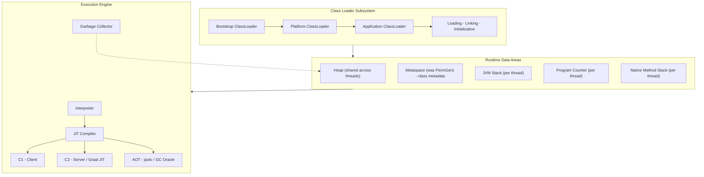
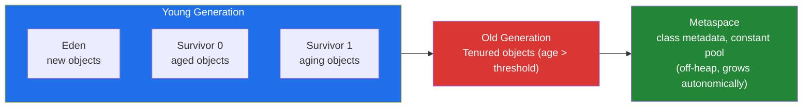
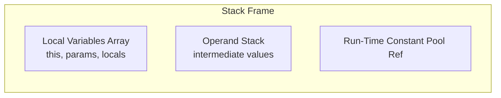
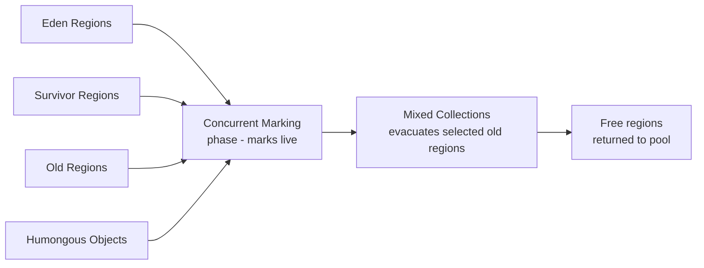
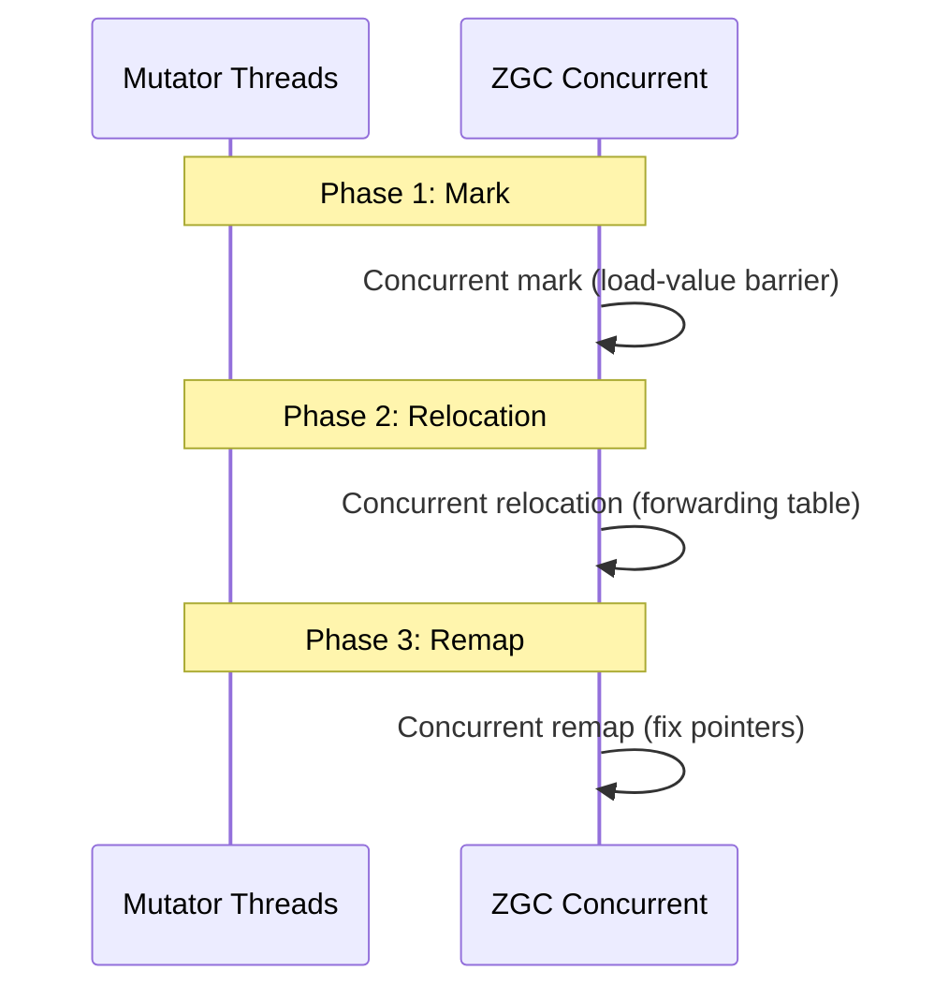
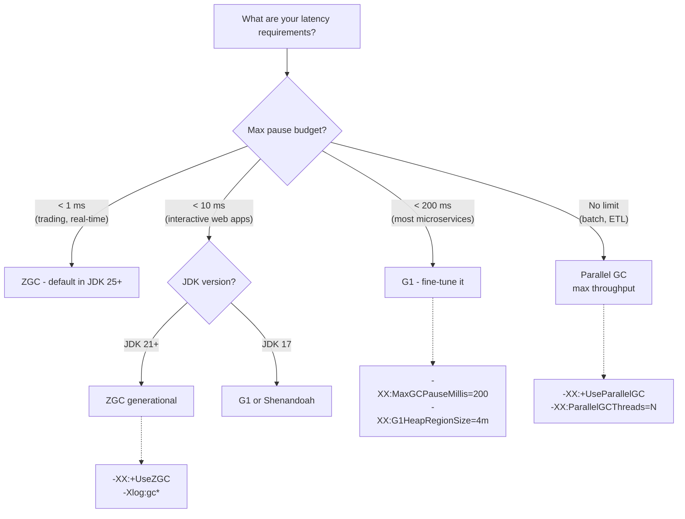

# JVM Architecture: Heap, Stack & GC Algorithms (JDK 11–25)

This post covers the JVM's runtime architecture at depth — the memory areas every Java developer relies on, how garbage collectors evolved from JDK 11 through the JDK 25 LTS, and exactly which knobs to turn when things go wrong.

---

## The JVM Runtime in One Diagram



- **Class Loader:** loads `.class` bytecode, verifies, prepares, resolves, initializes. Three-tier delegation (bootstrap → platform → application).
- **Runtime Data Areas:** the memory regions defined by the JVM specification.
- **Execution Engine:** interprets bytecode, JIT-compiles hot paths, manages GC.

---

## Heap Area — The Object Universe

The heap is where **all objects and arrays** live. It is shared across threads, created at JVM startup, and managed entirely by the GC.



| Region | What Lives There | Config Flag |
|---|---|---|
| **Eden** | Newly allocated objects | `-XX:NewRatio` (default 2 → young is ⅓ of heap) |
| **Survivor (S0/S1)** | Objects that survived a young GC, copied between them | `-XX:SurvivorRatio` (default 8 → Eden:Survivor = 8:1:1) |
| **Old** | Objects promoted after surviving `-XX:TenuringThreshold` (default 15) copies | `-Xmx` / `-Xms` |
| **Metaspace** | Class metadata, method areas, constant pool (replaced PermGen in JDK 8) | `-XX:MaxMetaspaceSize` (unlimited by default) |

**Key fact:** a young GC (`Minor GC`) is a **copying** collector — it moves live objects from Eden + one Survivor to the other Survivor. An old GC (`Major` / `Full GC`) varies by algorithm but is always more expensive.

### Tuning the Heap

```bash
# Total heap
-Xms4g -Xmx4g

# Young generation sizing
-XX:NewSize=1g -XX:MaxNewSize=1g
-XX:NewRatio=3        # old : young = 3:1

# Survivor spaces
-XX:SurvivorRatio=6   # eden : survivor = 6:1:1
-XX:TargetSurvivorRatio=90   # try to fill survivor to 90% before promotion
-XX:TenuringThreshold=6

# Metaspace
-XX:MaxMetaspaceSize=512m
-XX:MetaspaceSize=256m        # initial threshold for GC
```

---

## Stack Area — Per-Thread Execution Context

Every thread gets its own **JVM stack** (native thread on platform threads, heap-allocated on virtual threads). Each method invocation pushes a **stack frame**:



| Component | Contents | Notes |
|---|---|---|
| **Local Variables** | Primitives, object references, `returnAddress` | Indexed from 0 (`this` for instance methods) |
| **Operand Stack** | Intermediate computation values | Pushed/popped per bytecode instruction |
| **Dynamic Linking** | Symbolic references → direct references | Resolved lazily |
| **PC Register** | Address of current (or next) bytecode instruction | Per thread, native (not in stack frame) |

Stack size per thread:

```bash
-Xss1m           # default on most platforms (~1024 KB)
-Xss256k         # shrink for many-thread apps (risky for deep recursion)
-XX:ThreadStackSize=256
```

For **virtual threads** (JDK 21+), the stack lives on the heap and is far smaller (tens of KB). Configurable:

```bash
-Djdk.virtualThreadStackSize=64k
```

---

## Garbage Collection Algorithms — The Full Landscape

### Serial GC (`-XX:+UseSerialGC`)

Single-threaded, stop-the-world. Uses a copying young collector + mark-sweep-compact old collector. For single-core heaps < ~200 MB. Never use on a server.

```bash
-XX:+UseSerialGC -Xmx256m
```

### Parallel GC (`-XX:+UseParallelGC` — **default in JDK 11–21**)

Multi-threaded young + old, stop-the-world. Throughput-optimised. Best for batch jobs where pause time doesn't matter.

```bash
-XX:+UseParallelGC
-XX:ParallelGCThreads=N        # default = CPU cores
-XX:MaxGCPauseMillis=200       # soft target, Parallel tries to tune heap sizing
```

### G1 GC (`-XX:+UseG1GC` — **default since JDK 9, replaced by ZGC as ergonomic default in JDK 25**)

Region-based, generational, partially concurrent. Divides heap into ~2048 regions (1–32 MB each). Young collections are STW but parallel; concurrent marking + mixed collections handle old gen incrementally.



```bash
-XX:+UseG1GC
-XX:G1HeapRegionSize=4m        # 1-32 MB, default ~ heap / 2048
-XX:MaxGCPauseMillis=200       # G1 tries hard to meet this
-XX:G1NewSizePercent=5         # min young size (default 5%)
-XX:G1MaxNewSizePercent=60     # max young size (default 60%)
-XX:G1HeapWastePercent=5       # allowed waste before initiating mixed
-XX:G1MixedGCCountTarget=8     # number of mixed phases
-XX:InitiatingHeapOccupancyPercent=45  # trigger concurrent cycle at 45% old occupancy
```

### ZGC (`-XX:+UseZGC` — **default ergonomic since JDK 25**)

Low-latency, non-generational (JDK 11–20) → **generational** (JDK 21+). Coloured pointers, load-reference barriers. Pause times < 1 ms regardless of heap size. No tenuring — objects stay in place until compacted.



```bash
-XX:+UseZGC
-XX:ZAllocationSpikeTolerance=2.0  # larger = more reserve memory
-XX:ZCollectionInterval=120        # force cycle every N seconds
-XX:ZFragmentationLimit=25         # max allowed fragmentation %
-Xlog:gc*:file=gc.log             # detailed ZGC logging
```

### Shenandoah GC (`-XX:+UseShenandoahGC`)

Low-pause like ZGC, but uses **brooks pointers** (forwarding pointer in object header) instead of coloured pointers. Pause times are also < 1–10 ms. Available as an experimental feature in some JDK distributions.

```bash
-XX:+UseShenandoahGC
-XX:ShenandoahGCHeuristics=adaptive   # or compact, static, aggressive
-XX:ShenandoahUncommitDelay=30000     # ms before returning memory to OS
-XX:ShenandoahAllocationThreshold=10  # % heap before triggering cycle
```

---

## GC Comparison Matrix

| Collector | JDK Availability | Pause Target | Throughput | Memory Overhead | Best For |
|---|---|---|---|---|---|
| **Serial** | All | ~seconds (STW) | Lowest | ~minimal | Tiny heaps, single-core |
| **Parallel** | All | ~100 ms–1 s (STW) | **Highest** | Moderate | Batch, offline, throughput-first |
| **G1** | 9+ | ~10–200 ms (mostly concurrent) | High | Higher (region table) | Default server GC through JDK 21 |
| **ZGC (non-gen)** | 11–20 | **< 1 ms** | Moderate | Very high (coloured ptrs, forwarding) | Ultra-low-latency, very large heaps |
| **ZGC (generational)** | **21+** | **< 1 ms** | **Close to G1** | High (coloured ptrs) | **Best default for latency-sensitive** |
| **Shenandoah** | 12+ (OpenJDK) | **< 10 ms** | Moderate-high | Moderate (brooks ptr) | Low-latency, large heaps |
| **Epsilon** | 11+ | Never | N/A | None | Testing, no-GC workloads |

---

## What Changed at Each JDK

| JDK | Release | GC Default | Key GC Change |
|---|---|---|---|
| **11** | 2018-09 | G1 | ZGC experimental (via `--XX:+UnlockExperimentalVMOptions`), Epsilon added |
| **12** | 2019-03 | G1 | Shenandoah experimental (OpenJDK only, not in Oracle builds), promptness improvements |
| **13** | 2019-09 | G1 | ZGC uncommit unused memory |
| **14** | 2020-03 | G1 | Parallel + G1 updates; CMS removed (`-XX:+UseConcMarkSweepGC` → error) |
| **15** | 2020-09 | G1 | ZGC no longer experimental, Shenandoah promoted to production |
| **16** | 2021-03 | G1 | ZGC concurrent thread-stack processing |
| **17 LTS** | 2021-09 | G1 | ZGC yield improvements; sealed classes, pattern matching previews |
| **18** | 2022-03 | G1 | UTF-8 by default, simple web server |
| **19** | 2022-09 | G1 | Virtual Threads preview, JDK Flight Recorder event streaming |
| **20** | 2023-03 | G1 | Scoped values incubator, record patterns second preview |
| **21 LTS** | 2023-09 | G1 | **ZGC becomes generational** (dramatically reduces CPU overhead vs non-gen ZGC), Virtual Threads final, structured concurrency preview |
| **22** | 2024-03 | G1 | Stream gatherers preview, unnamed vars, string templates preview |
| **23** | 2024-09 | G1 | Module import declarations preview, markdown in javadoc |
| **24** | 2025-03 | G1 | JEP 491 — synchronized + virtual threads no longer pin, `-XX:+UseCompactObjectHeaders` (experimental) |
| **25 LTS** | 2025-09 | **ZGC** | **ZGC becomes default ergonomic GC** (replaces G1), Compact Object Headers, Value Types preview |

### Configuration Differences by JDK

```bash
# JDK 11 — ZGC is experimental
-XX:+UnlockExperimentalVMOptions -XX:+UseZGC

# JDK 15+ — ZGC is production
-XX:+UseZGC

# JDK 17 LTS — G1 default, everything stable
-XX:+UseG1GC                                      # default
-XX:+UseZGC                                       # production
-XX:+UseShenandoahGC                              # production (in OpenJDK builds)

# JDK 21 LTS — generational ZGC (major improvement)
-XX:+UseZGC                                       # picks generational by default
-XX:+ZGenerational                                # explicit (redundant since 21)

# JDK 24 — compact object headers (experimental, reduces header from 12→8 bytes on 64-bit)
-XX:+UnlockExperimentalVMOptions -XX:+UseCompactObjectHeaders
-XX:+UseZGC                                       # still not default

# JDK 25 LTS — ZGC is the ergonomic default
-XX:+UseZGC                                       # default (even without flag)
-XX:+UseG1GC                                      # opt in if you prefer
-XX:+UseCompactObjectHeaders                      # still experimental, huge wins for cache
```

---

## Picking the Right GC: Decision Flow



---

## Quick-Reference: Heap Diagnostics

```bash
# Print heap details at runtime
-XX:+PrintGCDetails -XX:+PrintGCDateStamps -Xloggc:gc.log

# JDK 9+ unified logging (use this)
-Xlog:gc*:file=gc.log:time,level,tags
-Xlog:gc+heap=debug    # heap layout before/after GC
-Xlog:gc+age=trace     # age table per survivor
-Xlog:gc+ergo=trace    # see what the JVM auto-tuned

# JFR — always on in JDK 17+
-XX:StartFlightRecording=duration=60s,filename=recording.jfr

# Heap dump on OOM
-XX:+HeapDumpOnOutOfMemoryError -XX:HeapDumpPath=/tmp/heap.hprof

# Live analysis
jcmd <pid> VM.native_memory summary
jmap -histo:live <pid>
jhsdb jmap --heap --pid <pid>
```

---

## Summary

- **Heap** is where objects live — tune `-Xmx`, `NewRatio`, `SurvivorRatio`, `TenuringThreshold`.
- **Stack** is per-thread execution state — tune `-Xss` for platform threads; virtual threads manage their own tiny stacks.
- **Metaspace** replaced PermGen — unbounded by default, always set `-XX:MaxMetaspaceSize`.
- **GC choice in 2026:** run **ZGC on JDK 25 LTS** for < 1 ms pauses; **G1 on JDK 17–21** if you need throughput and can tolerate 10–200 ms pauses; **Parallel** for batch.
- **JEP 491 (JDK 24+)** killed the biggest virtual-thread pinning issue — pair virtual threads with ZGC for the lowest-latency, highest-simplicity stack available today.

---

**References**

- [JVM Specification (Java SE 25 Edition)](https://docs.oracle.com/javase/specs/jvms/se25/html/)
- [JEP 439: Generational ZGC (JDK 21)](https://openjdk.org/jeps/439)
- [JEP 491: Synchronize Virtual Threads without Pinning (JDK 24)](https://openjdk.org/jeps/491)
- [JEP 477: ZGC Becomes Default on x86_64 (JDK 25)](https://openjdk.org/jeps/477)
- [JDK 25 Release Notes — GC Changes](https://openjdk.org/projects/jdk/25/)
- [Shenandoah GC Wiki](https://wiki.openjdk.org/display/shenandoah)
- [Oracle G1 GC Tuning Guide](https://docs.oracle.com/en/java/javase/17/gctuning/garbage-first-garbage-collector.html)
- [JVM Anatomy Quark Series (Shipilev)](https://shipilev.net/jvm/anatomy-quarks/)
