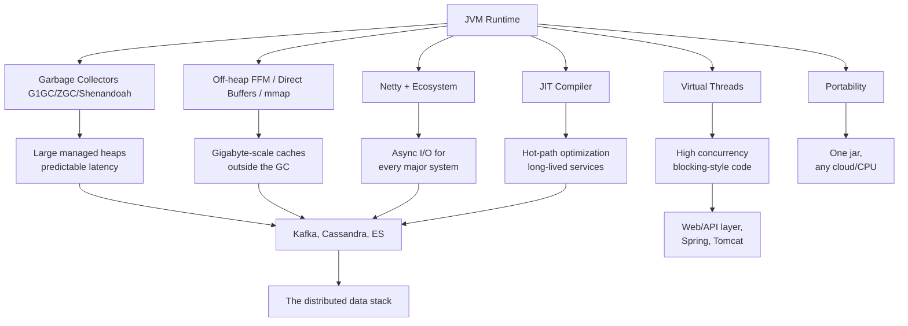

# The JVM Won the Data Plane. Nobody Noticed.

Kafka. Cassandra. Elasticsearch. Flink. Spark. ZooKeeper. Pulsar. Neo4j. HBase. Trino. They're not just "Java applications" — they're distributed systems whose architecture is *shaped* by the runtime they run on. Strip away the SQL engines, the replication protocols, and the fancy UIs, and underneath a huge share of the modern data stack sits the same 30-year-old runtime: the Java Virtual Machine.

This post is a tour of that hidden substrate. We'll look at who is built on the JVM, what the JVM actually gives them (and takes away), and the recurring patterns — heap vs. off-heap, garbage collectors, Netty, memory-mapped files, zero-copy — that show up again and again. You don't need to be a JVM tuning expert to read this; you just need to be curious about why half the infrastructure you run happens to be one `java` process.

---

## The JVM's Superpowers

Before we map the landscape, it's worth understanding *why* the JVM became the default substrate for distributed data software. The reasons are not romantic. They're engineering decisions that scaled.

**1. A managed runtime frees you from a whole class of bugs.**

In C/C++, a single buffer overflow or a dangling pointer in a network server is a security hole and a crash. Distributed systems fail all the time anyway — the last thing you want is `use-after-free` as an additional failure mode. The JVM's garbage collector and bounds-checked arrays eliminate entire categories of memory corruption. That's why tools that must be *definitely correct* (consensus protocols like ZooKeeper's Zab, Kafka's KRaft, Cassandra's hints) were written on the JVM.

**2. JIT compilation gives you "slow start, fast forever".**

Java is compiled to bytecode, then the JIT compiler (C1/C2 in HotSpot, or the new GraalVM JIT) observes the running program and optimizes the hot paths: inlining, lock elision, escape analysis, branch prediction. A long-running JVM server converges on performance close to — and sometimes better than — C++, because it optimizes for *your* workload, not a generic one. There's a cost: cold-start warm-up. The OSDI'16 paper *"Don't Get Caught in the Cold, Warm-up Your JVM"* quantified that warm-up penalty. That's why long-lived brokers and datastores (perfect for JVM) vastly outnumber JVM command-line tools.

**3. Garbage collectors are a product category.**

Nobody wants to write their own memory manager. The JVM gives you a menu: G1GC (predictable pauses, the modern default), ZGC (sub-millisecond pauses, heaps up to 16 TB), Shenandoah, and the classic CMS/Parallel collectors. Cassandra doesn't care *how* you stop the world, it cares that you don't stop it for 20 seconds. ZGC's arrival was a genuinely enabling event for big-heap, latency-sensitive JVM services.

**4. The boundary between heap and off-heap is a first-class design axis.**

`sun.misc.Unsafe`, direct byte buffers, and now the Foreign Function & Memory API (JEP 454, finalized in JDK 22) let JVM applications manage memory outside the heap — huge arenas, memory-mapped files, native allocations — while keeping the safety rails elsewhere. JEP 454's motivation explicitly names performance-critical JVM libraries like Lucene, Netty, and Ignite as off-heap consumers. This one feature is why databases can keep gigabytes of caches *out* of the GC's way.

**5. Virtual threads made blocking cheap again (JDK 21+).**

Before virtual threads, a high-concurrency server had two choices: threads (expensive, ~1 MB stacks each) or event loops (complex, callback-heavy). Virtual threads — millions of lightweight threads scheduled onto a few platform threads — let JVM code be written in a simple blocking style while scaling like an event loop. Java 21 made them mainstream, and Spring Boot 3.2+, Tomcat, Jetty, and countless JDBC/SQL drivers now run on them.

**6. One bytecode, every platform.**

Write once, run anywhere was the original promise, and for distributed systems it genuinely holds: the same Kafka jar runs on an Intel rack server, an Apple Silicon laptop, and an ARM cloud instance. No recompilation, no platform-specific `#ifdef` matrix.

**7. A deep, reusable ecosystem.**

Netty (the async I/O framework underneath Cassandra, Elasticsearch, Flink, Pulsar, and Trino), Kryo/Avro/Protobuf for serialization, RocksDB bindings via JNI, JMX/JFR for observability. Nobody builds a distributed database from scratch in Java; they build it on Netty and a JSON parser and a metrics library.

The combination is unique. Erlang gave you concurrency but not performance. C++ gave you performance but not safety. Go gave you concurrency and safety but, for a long time, a collector that pauses with big heaps and no mature Netty-class framework. The JVM delivered all of it — with tuning knobs, but all of it.



---

## The Map: Who Runs on the JVM

Here's the big picture. The JVM's share of the *operational* data tier is larger than most people realize — especially once you notice which names are *not* on the list.

| Category | JVM systems | Famous non-JVM competitors |
|---|---|---|
| Message queues / event streaming | Kafka, Pulsar, RocketMQ, ActiveMQ/Artemis | RabbitMQ (Erlang), NSQ (Go), Redis Streams (C) |
| NoSQL databases | Cassandra, HBase, Accumulo, JanusGraph, Druid, Pinot | MongoDB (C++), ScyllaDB (C++), ClickHouse (C++) |
| Search | Elasticsearch, OpenSearch, Solr (Lucene) | Meilisearch (Rust), Typesense (C++) |
| Stream processing | Flink, Spark Streaming, Kafka Streams, Storm, Samza | Redpanda (C++/Rust) |
| Coordination / metadata | ZooKeeper, BookKeeper, KRaft, Camunda Zeebe | etcd (Go), Consul (Go) |
| In-memory computing | Hazelcast, Ignite, Geode, Infinispan | Redis (C), Memcached (C) |
| SQL engines / lakes | Trino, Presto, Hive, StarRocks (Java+), Spark SQL | DuckDB (C++), DataFusion (Rust) |
| Graph databases | Neo4j | TigerGraph (C++) |
| Workflow / orchestration | Camunda, Airflow workers (JVM?) | Temporal (Go) |

Now let's walk through the major segments and what the JVM does *inside* each one.

---

## Segment 1: Event Streaming — Kafka and Friends

Kafka is the backbone of modern event-driven architecture, and it's a JVM program (written in Scala, compiled to JVM bytecode). Kafka 4.0 requires Java 17+ on brokers and recommends Java 21 LTS — the last version to support Java 11 was 3.x. Every one of Kafka's architectural tricks leans on a JVM/OS feature.

**Messages live in the OS page cache, not the heap.**

Kafka deliberately keeps its heap small and lets the operating system cache log segments. When a consumer reads a message that was just written, it's served straight from the page cache — no disk I/O, no JVM involvement. The broker's heap is for bookkeeping, batching structures, and in-flight requests, not for the actual data.

**Zero-copy reads.**

Consumers reading from the page cache don't copy data through the JVM at all. Kafka uses `FileChannel.transferTo()` — the `sendfile` syscall — which lets the kernel copy data from page cache directly to the socket. The JVM's NIO layer is the reason this is a one-liner instead of a platform-specific detour.

**GC tuning is a replication concern, not just a latency concern.**

A Kafka broker uses G1GC with a target like `MaxGCPauseMillis=20`. But the real risk isn't consumer latency — it's that a long pause stalls the broker's heartbeats and fetch requests to its *peers*. Past a threshold (the session/ISR timeout), followers get kicked out of the ISR, and the partition must be re-replicated. So the tuning target is "pauses short enough that the cluster doesn't believe I'm dead." A 2018-era HotSpot full GC of several seconds was a genuine Kafka incident; modern G1/ZGC made that class of outage much rarer.

**No Netty — pure Java NIO.**

A fun detail: unlike Cassandra/ES/Pulsar, Kafka does *not* use Netty. Its `SocketServer` uses plain Java NIO with a selector loop and a carefully tuned thread pool. It's one of the best arguments that Java's standard library is enough for high-throughput I/O when you know what you're doing.

**Pulsar is the mirror image.**

Apache Pulsar uses Netty directly, keeps message data in off-heap direct buffers, and splits storage from serving via Apache BookKeeper (also JVM). Its I/O path is deliberately off-heap to avoid GC pressure on the read path.

---

## Segment 2: Databases — Cassandra and the Big-Heap Problem

Cassandra is the canonical study in "what happens when your database and your garbage collector live in the same process." One JVM per node; Cassandra 4.x+ runs on Java 11/17, and 5.0 supports JDK 17 in production.

**The heap is the database's working set.**

Memtables (the in-memory write buffer that gets flushed to SSTables), row caches, and pending writes all live on the heap. So the heap has to be big enough to absorb write bursts — but *not so big* that the GC can't keep up.

**The compressed-oops ceiling.**

Cassandra's heap sizing rules are legendary and derive from a JVM implementation detail: compressed object pointers (compressed OOPs) can address only 32 GB of memory; above that, HotSpot disables the optimization and every pointer doubles in size. The practical cap people cite is **31 GB** — the largest heap that keeps compressed pointers and that a default G1GC can manage comfortably. Cassandra's default heap calculation is `max(min(1/2 ram, 1024MB), min(1/4 ram, 8GB))`, and the operational sweet spot is 8–16 GB, with `-Xms` and `-Xmx` set equal to prevent resizing.

**Off-heap everything else.**

Everything that can leave the heap is pushed out: bloom filters, the row/key caches, and in newer versions the chunk cache and Netty's direct buffers for the native protocol. The result: a node's total memory usage is far above its heap, but only the heap is the GC's problem.

**The GC death spiral.**

This is Cassandra's nightmare scenario and it's purely a JVM interaction. Cassandra uses the phi-accrual failure detector: if a node doesn't respond for a while, peers mark it down (default phi threshold ≈ 8, which corresponds to a roughly 18-second silence). If a stop-the-world pause exceeds that window, the cluster treats the node as dead, stream data away from it, and re-replicate it when it wakes up. A node that is *running* but paused for too long is worse than a node that's actually down. Tuning the GC (G1's `MaxGCPauseMillis` ≈ 300, IHOP ≈ 70) is fundamentally about not exceeding the failure-detector's patience.

**The C++ response: ScyllaDB.**

ScyllaDB reimplemented Cassandra in C++ (Seastar, shard-per-core, no shared memory) precisely to escape the JVM's GC and heap. It gets dramatic per-core throughput — and gives up the JVM's portability, ecosystem, and (some would argue) debuggability. The Cassandra-vs-Scylla debate is really a proxy for "managed runtime vs. native" — and it's worth remembering Cassandra still wins every "features first" argument.

**Neo4j and HBase show the same shape.**

Neo4j keeps its graph store and page caches off-heap (memory-mapped files) while the JVM heap handles query state and caches. HBase's BlockCache and memstore sit on the heap, with off-heap options for the BlockCache, and its region servers live or die by GC pauses (it famously suggested G1 tuning). Same runtime, same design tension: *what belongs in the managed heap, and what must live outside it.*

---

## Segment 3: Search — Lucene's Off-Heap World

Elasticsearch and OpenSearch are JVM applications built on Lucene, itself a JVM library. Search is the most instructive case for the **memory-mapped file** pattern.

**Lucene maps index segments with mmap.**

Instead of loading index data into the heap, Lucene `mmap`s its segment files, and the OS page cache does the caching. The result is that Lucene's working set — often many gigabytes — lives entirely outside the JVM heap. "Search is limited by RAM" usually means "by *OS* RAM (page cache)," not JVM heap.

**The 50%-of-RAM rule and the 31 GB cap.**

Elasticsearch's classic guidance: give the JVM heap no more than ~50% of node RAM (the page cache needs the rest), and never exceed ~31 GB (compressed OOPs again). Above that, you lose 50% of the JVM's effective memory and gain only the heap you can't afford to use anyway.

**Circuit breakers as a JVM safety net.**

Because the heap is a hard, finite pool, Elasticsearch runs in-process circuit breakers (defaulting to ~95% of heap) that reject queries rather than let an unbounded result set blow up the JVM. This is a distinctly *managed-runtime* pattern: the runtime gives you a hard memory boundary, and the application enforces quotas against it.

**The Netty transport.**

Elasticsearch's node-to-node and REST HTTP paths run on Netty. Between Netty's off-heap buffers and Lucene's mmap'd segments, an ES node keeps only its query state, aggregations, and small caches on the heap.

---

## Segment 4: Stream and Batch Processing — Flink and Spark

Stream processing is where the JVM's *compilation and memory model* directly shape the product.

**Flink's TaskManager memory is a negotiated budget.**

Flink 2.x (JDK 17 default) exposes a famous memory model in which the process's RAM is divided up explicitly:

```text
Total Process Memory
├── JVM heap
│   ├── Task heap (your operators)
│   └── Framework heap
├── Off-heap
│   ├── Managed memory (RocksDB state backend, via JNI)
│   ├── Network memory (Netty buffers)
│   └── JVM overhead, metaspace
```

Every byte has an owner. The RocksDB state backend is C++ invoked over JNI, but its memory is *billed* against Flink's managed-memory budget so the JVM and RocksDB don't starve each other. Flink's shuffle and RPC run on Netty with pooled, off-heap buffers. The result: a streaming engine whose only way to talk to stateful storage is to co-manage memory with a foreign native library — something the JVM's explicit off-heap machinery makes tractable.

**Spark: the JVM as a batch compiler.**

Spark 4.0 runs on JDK 17 (dropping JDK 8/11) and is written in Scala. Its two signature features are both JVM-inflected:

- **Code generation**: Catalyst and Tungsten generate JVM bytecode at query time (`GeneratedColumnAccessor`, `UnsafeRow`, etc.) so a `SELECT` over a billion rows becomes tight, branch-free loops over off-heap rows — not generic interpreter code.
- **JVM limits are your limits**: the JVM method size limit (64 KB of bytecode per method) and the JIT inliner (8 KB) are constant constraints on code generation. Spark has to *shape its generated code* around them — a reminder that the runtime is a real, physical system.

Spark's trend is now *escaping* the JVM where speed demands it: Gluten (Velox C++ runtime) and Comet (DataFusion/Rust) offload whole execution trees to native engines via Arrow columnar format. The JVM becomes the *orchestrator* and the native engine becomes the *worker*. The runtime you bet on doesn't have to be the only runtime you run.

**Kafka Streams: the library approach.**

Unlike Flink/Spark (separate cluster), Kafka Streams is a JVM library you embed in your own JVM application. No separate runtime — just `KStream` topologies running in your existing process, coordinated over the Kafka cluster itself. It's the purest example of "the JVM is the deployment unit."

---

## Segment 5: Coordination — ZooKeeper and the Consensus Layer

ZooKeeper is the load-bearing wall of the Hadoop-era stack and beyond. It's a JVM program whose entire job is to run the Zab consensus protocol. A few observations:

- **Consensus code must be boring and correct.** C++ consensus is possible (etcd is Go, after all), but the JVM's memory safety and mature concurrency primitives made ZooKeeper the default choice for Kafka's metadata (until KRaft), HBase's region assignments, and Solr's cluster state.
- **ZooKeeper is JVM + NIO + a synchronous write path.** Its throughput is modest by design; correctness is the product.
- **KRaft is Kafka replacing ZooKeeper *with another JVM Raft.*** Kafka's own metadata quorum is JVM-native Raft (inspired by ZooKeeper's design). BookKeeper (Pulsar's storage) similarly sits on ZooKeeper. Camunda's Zeebe runs Atomix, a JVM Raft library. The JVM isn't just for data plane throughput — it's the control-plane substrate too.

Contrast: the modern cloud-native world reached for **etcd** (Go) for the same job. Go's memory safety and simple concurrency made it a credible ZooKeeper replacement for Kubernetes. But note the pattern: *both* camps picked a garbage-collected, memory-safe language. Nobody chose C for their coordination service.

---

## Segment 6: In-Memory Computing — Hazelcast, Ignite, Geode

The in-memory data grid segment is almost entirely JVM, and it leans on the off-heap superpower harder than anything else:

- **Hazelcast** stores data off-heap by default, uses a JVM-native Raft (the CP subsystem) for consistency, and is embeddable *inside* your existing Java application.
- **Apache Ignite** keeps data in off-heap *page memory* (its own disk/page model) and offers a distributed SQL grid; its tuning guides are famously about balancing JVM heap vs. off-heap pages.
- **Apache Geode / Pivotal GemFire** — the product that powered trading floors — runs entirely on JVM heap and was one of the original arguments for "big JVM heap + concurrent GC."

These products exist *because* the JVM can keep gigabytes outside the GC's reach while still being embeddable in a plain Java process. Redis (C) and Memcached (C) serve the same need in the cache niche; the *data grid* niche — with SQL, transactions, and embeddability — belongs to the JVM.

---

## The Recurring Playbook

Strip the individual systems down and the same five moves appear over and over. This is the practical takeaway: **if you understand these five patterns, you understand the JVM's role in distributed systems.**

| Pattern | What it does | Where you see it |
|---|---|---|
| **OS page cache as the data cache** | Keep data on disk, let the kernel cache it; keep the JVM heap small | Kafka, Lucene/ES, Druid, Pinot |
| **mmap for working sets** | Memory-map index/data files so the OS manages paging | Lucene (ES/OpenSearch/Solr), Neo4j store, Cassandra SSTable index buffers |
| **Off-heap everything volatile** | Push caches/bloom filters/network buffers out of the GC's way | Cassandra bloom filters, Pulsar/ES/Netty buffers, Ignite/Hazelcast storage |
| **GC tuning = availability** | The pause budget must fit inside failure detectors and replication timeouts | Cassandra phi detector, Kafka ISR session, HBase region server znode leases |
| **Async I/O via Netty** | Non-blocking, pooled, off-heap networking as a shared building block | Cassandra, ES, Flink, Pulsar, Trino, RocketMQ, Artemis |

Plus two emerging ones that are reshaping the field:

- **Virtual threads (JDK 21+)** — moving the industry *back* toward simple blocking code in the API/control layers, with Spring Boot 3.2+, Tomcat, Jetty, and most SQL drivers now virtual-thread aware.
- **Native escape hatches** — JVM systems outsourcing the hottest paths to native runtimes (Gluten/Velox, Comet/DataFusion) and interop via FFM/Arrow, because the JVM itself is now stable enough to *host* the escape.

## Where the JVM Is Weak

An honest tour should name the trade-offs. The JVM's weaknesses are real and are exactly why systems like ScyllaDB, Redpanda, DuckDB, and DataFusion exist:

1. **Cold start.** Warm-up means suboptimal throughput for the first minutes. Long-lived services hide it; short-lived containers and serverless don't. (AppCDS, CRaC, and GraalVM Native Image attack this, at the cost of flexibility.)
2. **Heap is a ceiling and a tax.** The 31 GB compressed-OOPs ceiling, and the fact that *all* managed allocation is subject to GC, push architects toward off-heap gymnastics.
3. **GC tuning is still an expert skill.** G1/ZGC made it far easier, but every Cassandra/ES/Spark team has a horror story of a full-GC incident.
4. **Higher memory baseline.** A JVM process is heavy: metaspace, JIT, code cache, thread stacks. Native systems (Scylla, Redpanda) get more throughput per GB on the same hardware.
5. **You can't ship a tiny JVM process.** Base images are hundreds of MB. For the data tier that's irrelevant; for edge compute it's a non-starter.

The fascinating thing is that the native challengers *prove* the JVM's model was right: Scylla reimplements Cassandra's data model with an explicit shard-per-core actor runtime, Redpanda reimplements Kafka's protocol with deterministic task scheduling — both essentially building what the JVM gives you for free, by hand, in C++. The JVM won the feature race decades ago; the native engines are winning the raw-throughput race today, and the two camps are converging on the same architecture: a safe, managed control plane with native execution where it matters.

---

## Takeaway

The JVM isn't just "where Java apps live." It's the single most important runtime in distributed systems: the substrate for message brokers, databases, search engines, stream processors, and consensus services that carry a majority of the world's event-driven traffic. Its gifts — managed memory, adaptive compilation, off-heap escape hatches, virtual threads, a deep async I/O ecosystem — are exactly what distributed infrastructure demands. Its curses — warm-up, GC tuning, memory ceilings — are the price, and they've produced an entire industry of tuning guides and a credible native competition.

So the next time you're staring at a Kafka broker's G1 log or wondering why Elasticsearch wants exactly 31 GB, remember: you're not debugging a Java app. You're looking at the seams of a 30-year-old runtime that accidentally became the operating system of the data plane.

## References

- [Is Java Fast Enough for Distributed Applications?](https://charap.co/is-java-fast-enough-for-distributed-applications/) — a tour of JVM-backed distributed systems (Hadoop, Spark, HBase, Cassandra, ZooKeeper, BookKeeper, Kafka) and why the JVM fit
- [Don't Get Caught in the Cold, Warm-up Your JVM (OSDI'16)](https://www.usenix.org/conference/osdi16/technical-sessions/presentation/barrier) — quantifying JVM warm-up cost
- [JEP 454: Foreign Function & Memory API](https://openjdk.org/jeps/454) — off-heap and native interop, with Lucene/Netty/Ignite named as motivation
- [Cassandra: Heap pressure and GC tuning (netdata)](https://www.netdata.cloud/blog/cassandra-heap-pressure-and-gc/) — the 31 GB compressed-OOPs ceiling, 8–16 GB sweet spot, and GC death spiral
- [Apache Flink: Memory tuning and GC tuning](https://flink.apache.org/2020/10/15/memory-management-improvements-in-flink-1-10/) — TaskManager memory model, managed memory, Netty buffers, RocksDB state
- [Comparison of JVM message queues (MDPI)](https://www.mdpi.com/2079-9292/12/12/2504) — Kafka, Artemis, Pulsar, RocketMQ under load on the JVM
- [Apache Kafka 4.0 release notes / Java compatibility](https://kafka.apache.org/40/documentation.html) — Java 17/21 requirements
- [Apache Spark 4.0 release notes](https://spark.apache.org/releases/spark-release-4-0-0.html) — dropped JDK 8/11, JDK 17 default, codegen and JVM limits
- [Elasticsearch: Heap: Sizing and setting JVM heap](https://www.elastic.co/guide/en/elasticsearch/reference/current/important-settings.html) — 50% RAM rule and the 31 GB cap
- [Apache ZooKeeper](https://zookeeper.apache.org/) — the JVM coordination service and Zab protocol
- [Apache Pulsar architecture](https://pulsar.apache.org/docs/3.3.x/concepts-architecture-overview/) — Netty I/O and BookKeeper on the JVM
- [Apache Ignite off-heap memory](https://ignite.apache.org/docs/latest/data-modeling/data-regions) — page memory outside the JVM heap
- [Apache Lucene documentation](https://lucene.apache.org/core/) — mmap'd index segments
- [ScyllaDB vs Cassandra](https://www.scylladb.com/technology/why-scylladb-is-the-next-generation-cassandra/) — the native, shard-per-core reimplementation
- [Gluten (Spark native acceleration)](https://github.com/apache/incubator-gluten) — offloading Spark execution to Velox over Arrow
