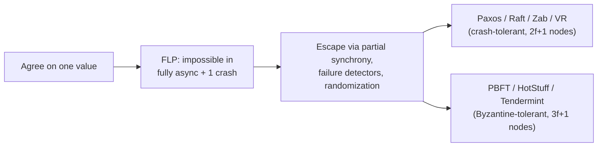
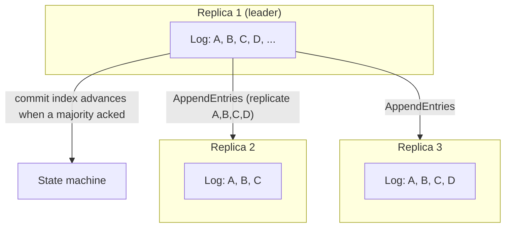
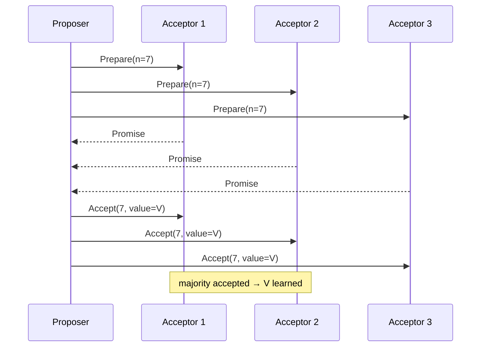
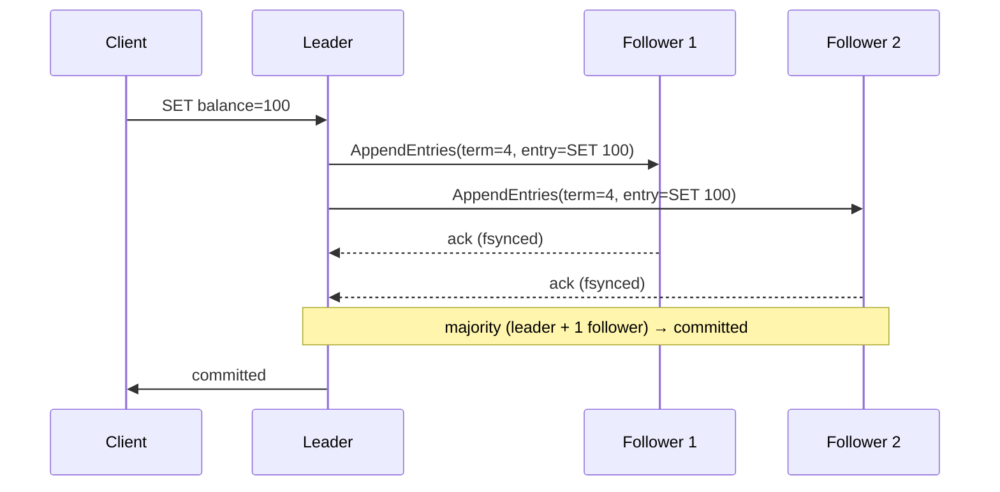
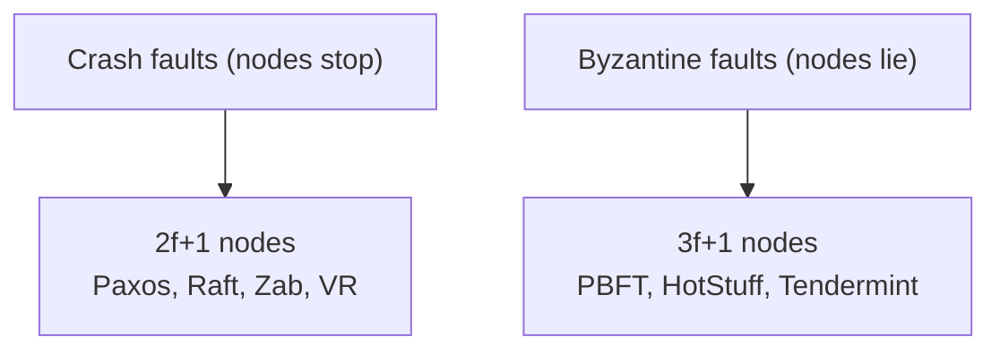

# Majority Rules: How Paxos and Raft Make Distributed Systems Agree

Every time you run `kubectl apply`, every time a CockroachDB transaction commits, every time a Kafka broker records the cluster's metadata — a group of machines just agreed on something despite the fact that some of them may be slow, dead, or temporarily cut off from the rest. That agreement is **distributed consensus**: the problem of getting `N` machines to agree on a single value (or an ordered sequence of values) even when processes crash and the network drops, duplicates, or reorders messages.

This post is written for someone starting from scratch but who wants more than a hand-wave. We'll cover the core idea (the replicated log), the two algorithms you'll actually meet in production — **Paxos** and **Raft** — plus the family around them (**Zab**, **Viewstamped Replication**, and Byzantine-fault-tolerant protocols like **PBFT** and **HotStuff**), and how real distributed databases and infrastructure actually use them.

---

## Why Consensus Is Hard

On a single machine, agreement is trivial: one CPU, one memory, one answer. The moment you spread state across machines, three things go wrong:

1. **Crash failures** — a node dies and stops responding. You can't tell "dead" from "just slow."
2. **Asynchronous networks** — messages arrive late, duplicated, or out of order, and there is no upper bound on delivery time.
3. **Clock drift** — no two machines share a reliable clock, so "when did this happen?" has no global answer.

The famous result here is the **FLP impossibility** (Fischer, Lynch, Paterson, 1985): in a *fully asynchronous* system where even one process can crash, **no deterministic algorithm can reach consensus**. That sounds like a death sentence for the whole field — yet every distributed database exists. The escape hatches are:

- **Partial synchrony** — assume the system behaves asynchronously but is "usually" synchronous; algorithms make progress when the network is good and stay safe when it isn't.
- **Failure detectors** — unreliable liveness signals ("I haven't heard from node 3") that let a group *suspect* a leader is dead and try to elect a new one.
- **Randomness** — randomized election timeouts, which break ties cleanly.

Every real consensus algorithm is a careful deal with the FLP devil: **safe always, live when the network eventually recovers**.

---

## The Core Idea: The Replicated Log

Almost every practical consensus system is *log replication*. The insight: if a group of replicas applies the **same sequence of commands in the same order**, their state machines converge to identical states — even if a replica crashes and catches up later. So consensus isn't really about a single value; it's about **agreeing on an append-only log**:

If any two replicas disagree about the log, they execute different histories and the system is corrupt. So the heart of every algorithm is: **propose an entry, collect acknowledgements from a quorum, and only then tell clients "committed."**

### Quorums: the arithmetic that makes it work

A **quorum** is any set of nodes large enough that two quorums must overlap. With simple majorities, that's `⌊N/2⌋ + 1` nodes — so a 3-node group needs 2 acknowledgements, a 5-node group needs 3.

That single overlap property is what makes consensus safe: any two decisions share at least one node, so a later decision can *always* discover an earlier one. This is also why production clusters use **odd** sizes (3, 5, 7):

- 3 nodes → survive 1 failure
- 5 nodes → survive 2
- 7 nodes → survive 3

A 3-node cluster tolerating 1 fault is the sweet spot: adding nodes adds latency (each entry needs a majority to ack) without adding fault tolerance. This is why Kubernetes etcd deployments are typically 3–5 nodes, not 100.

---

## Paxos: The Foundational Algorithm

Leslie Lamport wrote the first version of Paxos in 1990 (published 1998 as *The Part-Time Parliament*, with the famous allegory of a parliament on a Greek island; the readable version is *Paxos Made Simple*, 2001). Fun fact: it isn't even the oldest — **Viewstamped Replication** (Oki & Liskov, 1988) already solved the same problem — but Paxos is the one whose framework everything else builds on.

### Single-decree Paxos in one breath

A set of **proposers** wants a set of **acceptors** (the voters, `2f+1` of them) to agree on one value, in two phases:

1. **Prepare**: a proposer picks a ballot number `n`, asks acceptors to *promise* not to accept any ballot below `n` and to return any value they've already accepted. A value proposed with the highest ballot number wins.
2. **Accept**: the proposer sends `Accept(n, value)`; when a **majority** accepts, the value is **learned** and reported to clients.

The magic (and the difficulty) is in the details: a proposer who discovers a higher-numbered promise must abandon its value; acceptors can break their promise only to a *higher* ballot; two concurrent proposers can starve each other forever. Getting these corner cases right is why Lamport said "there are only two kinds of distributed systems: those that have run Paxos and those that will."

### Multi-Paxos: the leader optimization

Single-decree Paxos costs **two round trips per value** — too slow. **Multi-Paxos** runs Phase 1 (prepare/promise) **once for a whole window of log slots**, elects a stable **leader**, and then commits each subsequent value in a single round trip. This "pin a leader, amortize the prepare phase" trick is the ancestor of everything that follows — Raft, Zab, and VR all refine the same idea.

**Where you'll find it:** Google's **Chubby** lock service (whose authors famously called implementing Paxos "surprisingly difficult"), **Spanner**, and Microsoft's Autopilot. Spanner is the most interesting case: every data shard is its own **Paxos group** (a handful of replicas voting on writes), and Spanner layers **TrueTime** — GPS + atomic clock hardware with a bounded uncertainty interval `ε` — on top, so transactions can be ordered *externally* across all the groups. Consensus gives Spanner per-shard agreement; TrueTime gives it global ordering. Nothing else in production does this at Google's scale.

---

## Raft: Paxos You Can Actually Implement

Raft (Ongaro & Ousterhout, USENIX ATC 2014) is a deliberate redesign of Multi-Paxos with one explicit thesis: **understandability**. The paper is famous for decomposing consensus into clear sub-problems and for being genuinely implementable from the paper alone.

| | Paxos | Raft |
|---|---|---|
| Design goal | Formal correctness | Understandability & implementability |
| Leadership | Any node can propose; leader is an optimization | Exactly one leader; only it proposes |
| Log recovery | Acceptors may hold gaps; leader reconciles | Followers' logs are **strict prefixes** of the leader's; leader pushes one log forward |
| Roles | Proposer / Acceptor / Learner (fuzzy) | Three explicit states: Follower, Candidate, Leader |
| Leader election | Ballot numbers | **Terms** + randomized timeouts |

Raft's machinery, all in service of the replicated log:

1. **Leader election** — every node is a *follower*; if it hears no heartbeat within a **randomized** election timeout (100–300 ms typical), it becomes a *candidate*, increments its **term**, and asks for votes via `RequestVote`. A candidate wins with a majority; the randomness prevents multiple candidates from splitting the vote forever. Only a node with an up-to-date log may become leader — this is what makes log recovery simple.
2. **Log replication** — the leader receives client writes, appends an entry, and sends `AppendEntries` (also used as heartbeats) carrying `prevLogIndex`/`prevLogTerm` so followers can detect gaps. A follower acking means the entry is **durable on its disk**. Once a majority acks, the leader advances its `commitIndex` and followers learn it on the next round.
3. **Safety over liveness** — an entry is committed only when a majority has it *in its log*; a new leader in a higher term can't overwrite committed entries because the quorum intersection guarantees it inherited them.

**Where you'll find it:** everywhere.

| System | Algorithm | Role |
|---|---|---|
| **etcd** | Raft (Go) | Kubernetes' brain — every cluster's API-server state lives in its Raft log |
| **Kafka (KRaft)** | Raft | Replaced ZooKeeper with a built-in Raft metadata log (KIP-500) |
| **Consul** | Raft + Serf | Raft for the strongly-consistent KV/catalog; gossip (SWIM) for membership |
| **CockroachDB** | Multi-Raft | One Raft group per 64 MB range, sharded across nodes |
| **TiKV / TiDB** | Multi-Raft + PD | Same model — Raft per region, Placement Driver for scheduling |
| **Hazelcast** | Raft | In-process CP subsystem (locks/counters) for Java apps |

---

## The Family Around It

**Zab (ZooKeeper Atomic Broadcast)** — ZooKeeper doesn't run Paxos; it runs Zab (Junqueira, Reed & Serafini, 2011). The subtle difference: Paxos agrees on *client requests*, which may be executed in any order; ZooKeeper replicates *state updates* produced by a primary, which must be applied **in exactly the original generation order** (think: write `B` only after `A`). Zab adds a recovery phase to guarantee that ordering — that's what makes ZooKeeper's znodes, locks, and leader leases behave correctly. With Kafka's move to KRaft, ZooKeeper is on its way out, but it remains the archetype of the "coordination service."

**Viewstamped Replication (VR)** — Oki & Liskov's 1988 primary-backup protocol. Conceptually the same family as Paxos (the refinement-mapping literature shows Paxos, VR, and Zab all refine the same abstract "Multi-Consensus" specification), which is why VR keeps appearing in modern research. CockroachDB's design and several new protocols borrow VR's cleaner view-change logic.

**Byzantine-fault-tolerant (BFT) protocols** — everything above assumes **crash faults**: nodes stop, but never lie. Blockchain-style systems assume nodes can be **malicious** — lying, forging, colluding. That changes everything:

- Crash-tolerant needs `2f+1` nodes to survive `f` faults; **BFT needs `3f+1`** — quorums of `2f+1` must intersect *and* leave `f` honest nodes outside any colluding group.
- **PBFT** (Castro & Liskov, 1999) made BFT practical with a three-phase prepare/commit; used in permissioned chains like Hyperledger Fabric variants. Its cost is `O(n²)` messages — fine for dozens of nodes, hopeless for thousands.
- **HotStuff** (2018) cut that to `O(n)` per phase and became the basis of the Diem/Aptos consensus — "3f+1" optimized for the era of big validator sets.
- **Tendermint** (Cosmos) is the other prominent BFT design in the wild.

**Variants worth knowing by name:** *Flexible Paxos* (quorums only need to intersect across phases — you can size write and read quorums differently), *Fast Paxos* (clients propose directly to acceptors, one parallel send instead of two round trips), *EPaxos* (no stable leader — every replica can order commands, better for WAN where locality varies), *Mencius* (rotating leadership).

---

## How Real Systems Deploy This: Sharded Consensus

The pattern that made consensus scale is **sharding**. Nobody runs one giant Raft group for a whole database — that would bottleneck all writes through one log. Instead:

- Data is split into **ranges/regions/splits** (e.g., 64 MB each in CockroachDB).
- **Each range runs its own Raft/Paxos group** across 3 replicas.
- A meta-layer tracks which group owns which keys, and routes the client there.

A node failure then triggers elections **only for the ranges that node hosted** — the rest of the cluster keeps serving. This is *Multi-Raft* (CockroachDB, TiKV) and *Multi-Paxos* (Spanner). It's the same algorithm, applied per-shard, with a coordination layer above it.

Production databases also fine-tune the "one leader serves everything" rule:

- **Follower reads / non-voting replicas** — read-only replicas that follow the log but don't join the quorum (CockroachDB non-voting replicas, Spanner read replicas). Strongly consistent reads still hit the leader; geo-located reads trade freshness for latency.
- **Leaseholders** — CockroachDB pins a *lease* so reads and writes go to one node without re-entering consensus; the Raft leader and leaseholder are kept aligned.
- **Quorum leases / fast Paxos reads** — a quorum of replicas agrees "no new writes for `T`" so reads can skip the leader.

---

## Who's Running What Today

Consensus is no longer exotic — it's the load-bearing infrastructure underneath most of the modern data stack. If you've touched Kubernetes, Kafka, or a cloud SQL database this week, you've used it. A snapshot of production systems by algorithm:

### Raft (the workhorse)

| System | What it uses Raft for |
|---|---|
| **etcd** | The whole store — and via it, **Kubernetes** (every API-server state change), service discovery, lock servers |
| **Kafka (KRaft)** | Cluster metadata (topics, partitions, configs) — replaced ZooKeeper |
| **Consul / Vault / Nomad** | Strongly-consistent KV, service catalog, and leader election (HashiCorp's Raft library) |
| **CockroachDB** | One Raft group per 64 MB range; leaseholder + non-voting replicas |
| **TiKV / TiDB** | One Raft group per region, driven by the Placement Driver |
| **MongoDB** | A *pull-based variant* of Raft — secondaries fetch the oplog from any peer, not just the primary; up to 7 voting members, 50 total (formally specified in TLA+) |
| **ScyllaDB** | Raft for schema + topology changes, and now strongly consistent tables (one group per tablet) |
| **YugabyteDB** | Per-tablet Raft groups in the DocDB storage layer |
| **Redpanda** | Raft for data replication across partitions |
| **Neo4j** | Causal clustering (catalog + data replication) |
| **Hazelcast** | In-process CP subsystem — distributed locks, semaphores, counters |
| **RabbitMQ** | **Quorum queues** and streams — durable replicated queues (default since 4.0) |
| **NATS JetStream** | One Raft group per stream and per consumer, plus a cluster-wide meta group |
| **ClickHouse** | Keeper — its ZooKeeper-compatible service, built on Raft |
| **IBM MQ** | Replicated log for high-availability queue managers |
| **Splunk** | Search head cluster state |
| **Camunda** | Data replication in the Zeebe engine |

### Paxos (the premium tier — fewer, heavier users)

| System | What it uses Paxos for |
|---|---|
| **Google Spanner** | Multi-Paxos groups per shard + TrueTime for globally ordered transactions |
| **Google Chubby** | The classic lock service (and the paper every Paxos implementation quotes as "hard") |
| **OceanBase** (Ant Group) | Multi-Paxos replication of log streams across zones; survives a full zone/DC loss |
| **PolarDB** (Alibaba) | PALF — a Paxos-backed append-only log with batching + pipelining for low commit latency |
| **PaxosStore** (Tencent/WeChat) | Leaseless Paxos at WeChat scale — thousands of machines, billions of peak TPS (accounts, payments, Moments) |
| **Ceph** | The MON monitor quorum uses Paxos to agree on the cluster map |
| **FoundationDB** | Paxos-based commit/recovery for its transactional metadata |

### Zab & BFT (the specialists)

- **Zab**: **Apache ZooKeeper** — the coordination service behind HBase, Hadoop, and pre-KRaft Kafka. ZooKeeper is being retired from many stacks (Kafka moved, ClickHouse replaced it), but it remains the archetype of the "coordination service as a product."
- **BFT**: **Hyperledger Fabric** (PBFT-style ordering), **Tendermint/Cosmos** (Byzantine consensus with slashing), and **Aptos/Diem** (HotStuff-derived). All of these assume *lying* nodes, not just dead ones — which is why they pay the `3f+1` tax.

### The emerging trend

Notice how many Raft deployments are **per-partition**: Kafka, Redpanda, NATS, ScyllaDB, and the per-range databases all run a Raft group *per shard* rather than one global log. That's the sharding pattern above, generalized: consensus is now a primitive you embed, not a service you run — which is exactly why Raft libraries (`etcd/raft`, `hashicorp/raft`, RabbitMQ's `ra`) took off. If you're adding fault-tolerant replication to a new system in 2026, you embed a Raft library and get a replicated log for free.

---

## Where Consensus Actually Breaks in Production

Consensus algorithms get all the fame; **deployment gets all the blame**. In production, the failure modes are rarely the algorithm — they're:

1. **Disk fsync latency.** Every Raft entry must be durable on the leader's disk before it counts its own acknowledgement, and on each follower's before that follower acks. A slow disk (shared SAN, noisy neighbor, `fsync` misconfiguration) directly throttles write throughput. etcd's own guidance: keep `wal_fsync_duration_seconds` p99 under **10 ms**, and provision fast NVMe for etcd volumes.
2. **Election timeout misconfiguration.** etcd defaults are `heartbeat-interval = 100 ms`, `election-timeout = 1000 ms`, and the rule of thumb is `election-timeout ≥ 10 × RTT` between members. Across regions, heartbeat intervals grow and election timeouts go to *seconds*; get this wrong and the cluster endlessly re-elects ("leader flapping"), which is worse than having no leader.
3. **Reading stale data from followers.** The classic footgun: a follower read doesn't know about the last committed write. Systems handle it with leases or by routing strongly-consistent reads to the leader; if your app uses follower reads, it must tolerate staleness.
4. **Monitoring the wrong thing.** The things that matter: member count and health, whether a leader exists (no leader = total unavailability), number of leader changes (flapping), the consensus term/log index (should advance), and proposal/commit rates.

---

## What to Take Away

- **Consensus = replicated log.** Agreeing on an ordered sequence of commands lets replicas apply the same state machine and stay identical.
- **Paxos is the foundation; Raft is what you implement.** Every production crash-tolerant system is a variant of the same idea; Raft won the popularity contest because it's the one normal engineers can build and debug.
- **Quorums make it safe.** Majority quorums overlap, and overlap is safety. Odd node counts, `2f+1` for crashes, `3f+1` for Byzantine.
- **Databases shard consensus.** Multi-Raft / Multi-Paxos means thousands of small groups, not one giant log — that's how CockroachDB, TiKV, and Spanner scale.
- **BFT is a different world.** Blockchains assume lying nodes; the math and the message costs are completely different from the databases you're used to.
- **Most outages are operational.** fsync latency, timeout tuning, and follower-read staleness — not bugs in the algorithm.

If you're building a new strongly-consistent service today, use Raft and a mature library (`etcd/raft`, `hashicorp/raft`) — do not hand-roll Paxos. And if you only need coordination primitives (locks, leader election, service registry), you often don't need to implement anything: run etcd or ZooKeeper and consume the consensus that's already there.

---

**References**

- [Lamport, *Paxos Made Simple* (2001)](https://lamport.azurewebsites.net/pubs/paxos-simple.pdf)
- [Lamport, *The Part-Time Parliament* (TOCS 1998)](https://lamport.azurewebsites.net/pubs/lamport-paxos.pdf)
- [Ongaro & Ousterhout, *In Search of an Understandable Consensus Algorithm* (Raft, ATC 2014)](https://raft.github.io/raft.pdf)
- [Junqueira, Reed & Serafini, *Zab: High-performance broadcast for primary-backup systems* (DSN 2011)](https://www.usenix.org/legacy/event/nsdi11/tech/full_papers/Junqueira.pdf)
- [Oki & Liskov, *Viewstamped Replication* (PODC 1988)](https://www.cs.cornell.edu/fbs/publications/vrReplication.pdf)
- [Castro & Liskov, *Practical Byzantine Fault Tolerance* (OSDI 1999)](https://pmg.csail.mit.edu/papers/osdi99.pdf)
- [Yin et al., *HotStuff: BFT Consensus with Linearity in the Amortized Communication Complexity* (2018)](https://arxiv.org/abs/1803.05069)
- [Howard et al., *Flexible Paxos: Quorum intersection revisited* (2016)](https://arxiv.org/abs/1608.06696)
- [Fischer, Lynch & Paterson, *Impossibility of Distributed Consensus with One Faulty Process* (1985)](https://groups.csail.mit.edu/tds/papers/Lynch/jacm85.pdf)
- [Google SRE Book — Managing Critical State (consensus + CAP)](https://sre.google/sre-book/managing-critical-state/)
- [etcd docs (Raft consensus)](https://etcd.io/docs/v3.5/learning/)
- [CockroachDB — Replication Layer (Raft)](https://www.cockroachlabs.com/docs/stable/architecture/replication-layer)
- [Google Cloud Spanner — Replication (Paxos)](https://cloud.google.com/spanner/docs/replication)
- [TiKV — Deep Dive (Raft consensus)](https://tikv.github.io/deep-dive-tikv/consensus-algorithm/introduction.html)
- [HashiCorp Consul — Consensus (Raft)](https://developer.hashicorp.com/consul/docs/architecture/consensus)
- [MongoDB — Fault-Tolerant Replication with Pull-Based Consensus (NSDI 2021)](https://www.usenix.org/system/files/nsdi21-zhou.pdf)
- [ScyllaDB — Raft for Strong Consistency](https://docs.scylladb.com/stable/architecture/raft.html)
- [RabbitMQ — Quorum Queues (Raft)](https://www.rabbitmq.com/docs/quorum-queues)
- [NATS — JetStream Clustering (Raft)](https://docs.nats.io/running-a-nats-service/configuration/clustering/jetstream_clustering)
- [OceanBase — Distributed Relational Database (Paxos)](https://github.com/oceanbase/oceanbase)
- [Tencent PaxosStore (Paxos at WeChat scale)](https://github.com/Tencent/paxosstore)
- [FoundationDB — Distributed Transactional KV Store](https://github.com/apple/foundationdb)
- [The Secret Lives of Data (interactive Raft guide)](http://thesecretlivesofdata.com/raft/)
