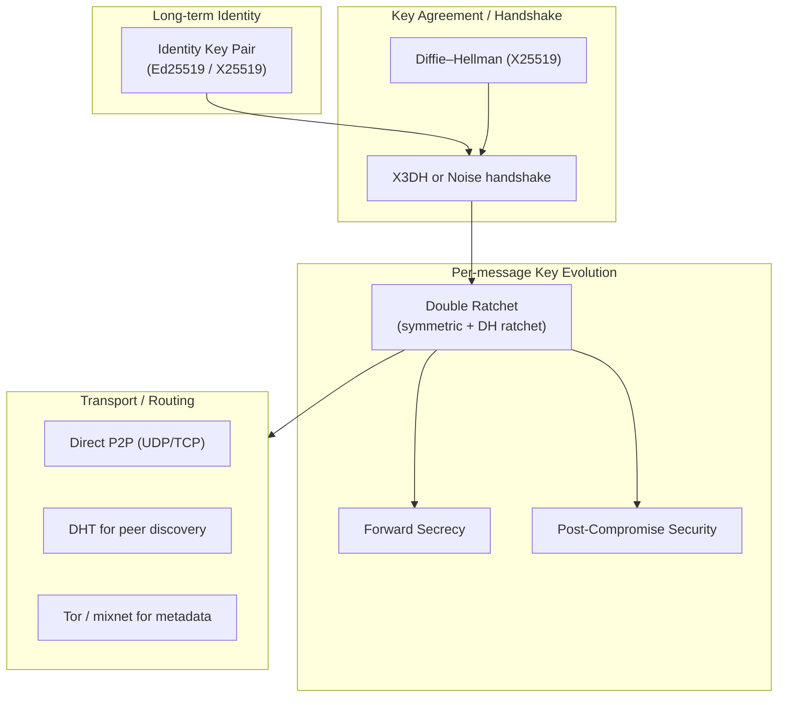
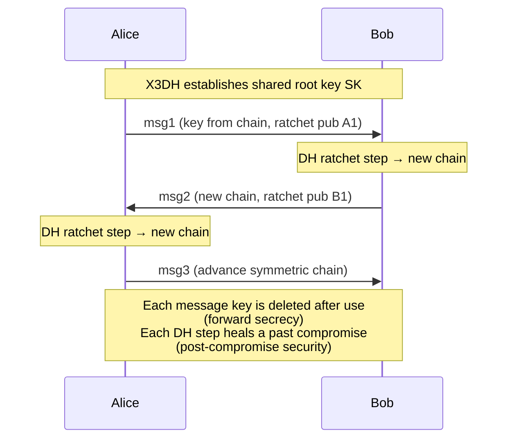
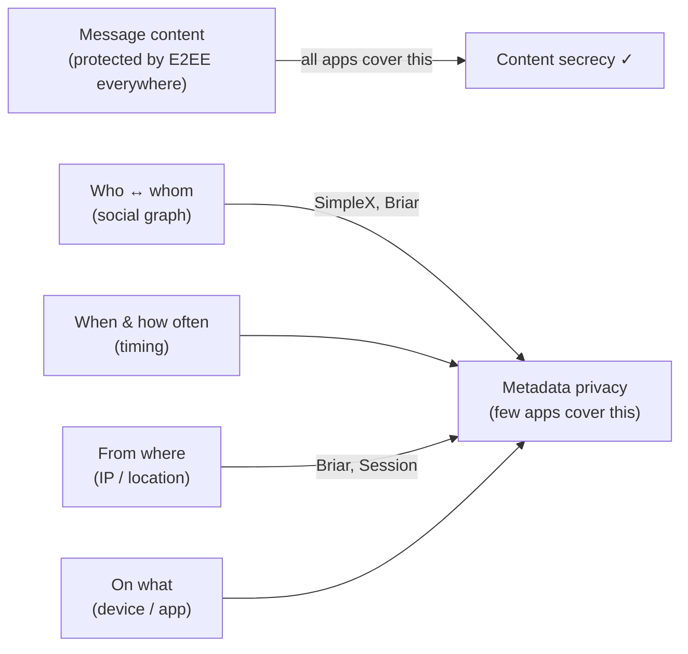

# P2P Secure Messaging: Signal, Tox, Briar & Jami Compared

Every message you send is two things at once: the content you typed, and the metadata that surrounds it — who you talked to, when, how often, from which IP, on which device. Modern messaging apps are very good at protecting the first and surprisingly careless about the second. In an era where data is the product, the metadata graph is often more valuable than the words: it reveals your relationships, your routines, your sources, and your location, even when the message body is perfectly encrypted.

This post builds from the ground up. We start with the vocabulary a beginner needs (end-to-end encryption, transport vs. identity, the difference between "secure" and "private"), move through the cryptographic protocols these tools actually use — with standards references — and finish with an expert-level, side-by-side comparison of **Signal, Tox, Briar, and Jami**, plus the newer contenders (Matrix/Olm, Session, SimpleX, and the IETF MLS standard). The goal is not to crown a winner but to give you a clear mental model for evaluating *any* secure messenger against *your* threat model.

---

## Beginner: The Vocabulary You Actually Need

Before comparing tools, four distinctions matter more than any feature list.

| Term | What it means | Why it matters |
|---|---|---|
| **Encryption in transit (TLS)** | The link between your phone and the server is encrypted | The *server operator* can still read everything |
| **End-to-end encryption (E2EE)** | Only the sender and recipient hold the keys | The server relays ciphertext it cannot decrypt |
| **Content vs. metadata** | Content = the message body; metadata = who/when/where | E2EE protects content; metadata usually leaks |
| **Federated / P2P / centralized** | Where the routing happens | Determines who can be subpoenaed or shut down |

A useful slogan: **"secure" usually means content is protected; "private" means metadata is protected too.** Most mainstream apps are secure. Very few are private.

### What "Peer-to-Peer" really buys you

In a **centralized** model (Signal, WhatsApp), a single operator runs the servers. In a **federated** model (Matrix, XMPP), many operators run interoperating servers. In a **pure P2P** model (Tox, Briar over Bluetooth/Tor, Jami), there is *no operator* — clients find and talk to each other directly, often through a distributed hash table (DHT) or a mesh.

P2P removes the central point of data collection and the central point of failure (and censorship). The trade-offs are real: presence/offline delivery is harder, your IP address is exposed to peers unless you tunnel through Tor, and NAT traversal becomes your problem. There is no free lunch — only a different bill.

---

## The Cryptographic Building Blocks (Shared Foundations)

Almost every serious messenger is assembled from the same primitives. Understanding these five concepts lets you read any protocol whitepaper.

1. **Identity keys** — a long-term asymmetric key pair (usually Ed25519 for signing, X25519 for key agreement) that *is* your cryptographic identity. Verifying a contact's identity key ("safety number" / fingerprint) defeats man-in-the-middle attacks.
2. **Key agreement (Diffie–Hellman)** — two parties derive a shared secret over an untrusted channel. Modern systems use **X25519** ([RFC 7748](https://datatracker.ietf.org/doc/html/rfc7748)).
3. **Forward secrecy (FS)** — compromising today's key does **not** decrypt yesterday's messages, because each message uses an ephemeral key that is deleted after use.
4. **Post-compromise security (PCS) / self-healing** — if an attacker steals your keys *once*, the protocol "heals" after a few message exchanges and locks them out again. This is the signature property of the Double Ratchet.
5. **Authenticated encryption (AEAD)** — message bodies are sealed with AES-GCM or ChaCha20-Poly1305 ([RFC 8439](https://datatracker.ietf.org/doc/html/rfc8439)), giving confidentiality + integrity in one step.

> **Mental checklist for any messenger:** Does it have E2EE by default? Forward secrecy? Post-compromise security? And critically — *what does it do about metadata?*

---

## Signal Protocol — The Reference Standard

The **Signal Protocol** (formerly Axolotl) is the de facto baseline that nearly everyone else either uses or is measured against. WhatsApp, Google Messages (RCS), Facebook Messenger, and Skype all license or reimplement it. It is **centralized** (Signal Foundation runs the servers), not P2P — but no comparison is meaningful without it.

It is built from three published specifications:

- **X3DH (Extended Triple Diffie–Hellman)** — the asynchronous handshake. It lets Alice start an encrypted session with Bob *while Bob is offline*, by having Bob pre-publish a bundle of "prekeys" to the server. See the [X3DH specification](https://signal.org/docs/specifications/x3dh/).
- **Double Ratchet** — the per-message key evolution engine, combining a symmetric-key ratchet (a KDF chain) with a Diffie–Hellman ratchet. This is what delivers forward secrecy *and* post-compromise security. See the [Double Ratchet specification](https://signal.org/docs/specifications/doubleratchet/).
- **Sealed Sender** — an envelope mechanism that hides the *sender's* identity from the Signal server, reducing (but not eliminating) metadata exposure. See [Technology preview: Sealed sender](https://signal.org/blog/sealed-sender/).

### How the Double Ratchet works (the heart of it)

Every time the conversation changes direction, a fresh Diffie–Hellman exchange injects new entropy into the root key — that DH step is what "heals" a key compromise. Between direction changes, a one-way KDF chain produces a unique key per message and immediately forgets it.

### Pros and Cons

| | |
|---|---|
| **Pros** | Gold-standard cryptography; forward secrecy + post-compromise security; formally analyzed; Sealed Sender reduces metadata; phone-number-optional usernames now supported; open source clients and server |
| **Cons** | Centralized infrastructure (single operator, single jurisdiction — US); historically required a phone number; relies on Google/Apple push or a Signal-run service; not P2P, so the server sees connection metadata Sealed Sender doesn't cover |

---

## Tox Protocol — Pure P2P Over a DHT

**Tox** is a fully **peer-to-peer** protocol with no central servers at all. Peers find each other through a public **Kademlia-style distributed hash table (DHT)**, then talk directly. Your "Tox ID" *is* your public key — there is no account and no registration.

- **Identity & encryption:** built on the **NaCl / libsodium** stack — Curve25519 for key exchange, XSalsa20 for symmetric encryption, Poly1305 for authentication ([the NaCl primitives](https://nacl.cr.yp.to/)).
- **Transport:** a custom UDP-based protocol with TCP relays as a fallback for restrictive NATs.
- **Discovery:** the DHT maps public keys to network locations.

Tox's transparency about its own limitations is a strength. The project openly documents that the protocol **was never formally audited end-to-end**, that it has known metadata weaknesses, and that its perfect-forward-secrecy and post-compromise story is weaker than Signal's.

### Pros and Cons

| | |
|---|---|
| **Pros** | Truly serverless P2P; no phone number, email, or account; public-key-as-identity; open source; supports messaging, voice, video, file transfer |
| **Cons** | DHT participation **exposes your IP address** to peers; no Tor-by-default; no asynchronous/offline message delivery (both peers must be online); never received a comprehensive formal security audit; multiple competing client implementations of varying quality |

---

## Briar — Metadata Resistance via Tor and Mesh

**Briar** is built for a specific, demanding threat model: activists and journalists operating under surveillance or during internet shutdowns. Its defining choice is to treat **metadata as the primary enemy.**

- **Transport:** by default, every connection is routed through the **Tor network** as a hidden service, so peers never learn each other's IP address and the network can't easily see who is talking to whom. When the internet is down, Briar can sync directly over **Bluetooth or local Wi-Fi**, forming a mesh.
- **Protocol:** the **Bramble** protocol suite — the **Bramble Transport Protocol (BTP)** handles encrypted, authenticated connections, and the **Bramble Synchronization Protocol (BSP)** handles delay-tolerant, store-and-forward sync. See the [Bramble protocol specifications](https://code.briarproject.org/briar/briar-spec).
- **Crypto:** Briar's [security design](https://briarproject.org/how-it-works/) uses established primitives (Curve25519, the Double-Ratchet-style key management) with forward secrecy.
- **No central servers, no accounts.** Contacts are added by exchanging keys in person (QR code) or via a nearby link, which gives strong MITM resistance by default.

### Pros and Cons

| | |
|---|---|
| **Pros** | Best-in-class metadata protection (Tor by default); works offline via Bluetooth/Wi-Fi mesh; no servers, no phone number; designed for censorship circumvention; forward secrecy; underwent independent security audit (Cure53) |
| **Cons** | Tor routing adds latency; Android-first (desktop is newer, no native iOS due to background-execution limits); adding contacts requires more friction (by design); smaller ecosystem; group features more limited than mainstream apps |

---

## Jami — SIP-Based P2P with a DHT

**Jami** (a GNU project, formerly Ring) is a **distributed, P2P** communicator that reuses mature telecom standards. Its identity model is similar to Tox — your account is a key pair, and there is no central authentication server.

- **Discovery:** **OpenDHT**, a Kademlia distributed hash table maintained by the Jami project, locates peers by their public key. See [OpenDHT](https://github.com/savoirfairelinux/opendht).
- **Session & media:** Jami speaks **SIP** for session setup and uses **ICE** (Interactive Connectivity Establishment, [RFC 8445](https://datatracker.ietf.org/doc/html/rfc8445)) for NAT traversal, then secures media with **SRTP/DTLS-SRTP** ([RFC 5764](https://datatracker.ietf.org/doc/html/rfc5764)) — the same stack used by WebRTC. This makes Jami particularly strong for voice and video.
- **Identity:** X.509 certificates anchored to a self-generated key pair; an optional blockchain-based name registry maps human-readable usernames to keys.

### Pros and Cons

| | |
|---|---|
| **Pros** | True P2P with no central servers; excellent audio/video (standards-based SIP/ICE/SRTP); cross-platform (Linux, Windows, macOS, Android, iOS); no phone number; GNU project with permissive licensing; supports file transfer and conferencing |
| **Cons** | DHT/direct connections can **expose IP addresses** to peers (no Tor by default); offline messaging is limited (relies on the peer or a TURN relay); larger attack surface from the SIP/media stack; less formal cryptographic analysis than Signal |

---

## The Newer Contenders (Worth Knowing)

| Protocol / App | Model | Distinctive idea | Reference |
|---|---|---|---|
| **Matrix / Olm + Megolm** | Federated | Olm (1:1, a Double Ratchet implementation) + Megolm (efficient group ratchet); full message history sync across servers | [Olm/Megolm spec](https://gitlab.matrix.org/matrix-org/olm/-/blob/master/docs/megolm.md) |
| **Session** | Decentralized (onion routing) | Signal-derived crypto over a decentralized **onion-routing service-node network**; no phone number, uses random account IDs | [Session whitepaper](https://getsession.org/whitepaper) |
| **SimpleX** | No persistent identity | Has **no user identifiers at all** — routing uses per-contact, unidirectional simplex queues, eliminating the social graph from the server's view | [SimpleX overview](https://simplex.chat/docs/) |
| **MLS (IETF RFC 9420)** | Standard (any topology) | **Messaging Layer Security** — a standardized group key agreement using a "ratchet tree" that scales E2EE to thousands of members with FS + PCS | [RFC 9420](https://datatracker.ietf.org/doc/html/rfc9420) |

**MLS deserves special attention.** Published as [RFC 9420](https://datatracker.ietf.org/doc/html/rfc9420) in 2023, it is the first IETF *standard* for end-to-end-encrypted group messaging. Where the Double Ratchet handles pairs efficiently, MLS uses a tree of keys so that adding/removing a member or rotating keys costs `O(log n)` instead of `O(n)`. Expect it to become the common substrate beneath many future messengers.

---

## Expert: Side-by-Side Comparison

| Property | Signal | Tox | Briar | Jami | Session | SimpleX |
|---|---|---|---|---|---|---|
| **Architecture** | Centralized | Pure P2P (DHT) | P2P over Tor + mesh | P2P (OpenDHT) | Onion-routed network | Relay queues, no IDs |
| **Core key exchange** | X3DH | Curve25519 (NaCl) | Curve25519 / Bramble | X25519 + X.509 | X3DH-derived | X3DH-derived (NaCl) |
| **Session ratchet** | Double Ratchet | Custom (weaker PCS) | Double-Ratchet-style | Per-session keys | Double Ratchet | Double Ratchet |
| **Forward secrecy** | Yes | Partial | Yes | Yes | Yes | Yes |
| **Post-compromise security** | Yes | Limited | Yes | Limited | Yes | Yes |
| **Identity** | Phone # or username | Public key (Tox ID) | Public key (in person) | Key pair + cert | Random account ID | None (per-queue) |
| **Hides IP from peers** | N/A (server relays) | **No** | **Yes (Tor)** | No (TURN optional) | **Yes (onion)** | **Yes (relays)** |
| **Metadata resistance** | Moderate (Sealed Sender) | Weak | **Strong** | Weak–Moderate | Strong | **Strongest** |
| **Offline / async delivery** | Yes | **No** | Yes (store-and-forward) | Limited | Yes | Yes |
| **Works without internet** | No | No | **Yes (Bluetooth/Wi-Fi)** | No | No | No |
| **Group messaging** | Yes | Basic | Yes (forums/blogs) | Yes | Yes | Yes |
| **Voice / video** | Yes (strong) | Yes | No | **Yes (strong)** | Limited | Limited |
| **Formal audit** | Yes (extensive) | **No comprehensive audit** | Yes (Cure53) | Partial | Partial | Yes (Trail of Bits) |
| **Standards reused** | Own specs | NaCl/libsodium | Bramble | SIP/ICE/SRTP/DTLS | Signal + onion | Own (open spec) |

### How to read this table for *your* situation

- **You want the best-vetted crypto with the least friction** → Signal. Accept that it's centralized and US-jurisdiction.
- **You're an activist/journalist facing surveillance or shutdowns** → Briar (Tor + offline mesh) or SimpleX (no identifiers at all).
- **You want serverless, account-free chat among tech-comfortable peers** → Tox or Jami; understand the IP-exposure trade-off.
- **You need high-quality P2P voice/video** → Jami (its SIP/SRTP heritage shows).
- **You're hiding the social graph itself, not just message content** → SimpleX or Session.
- **You're building a *new* product with large encrypted groups** → standardize on MLS (RFC 9420).

---

## The Metadata Problem, Stated Plainly

This is the point most "which app is most secure" articles miss. Consider what each layer reveals:

A general-turned-CIA-director famously summarized the stakes of the metadata-only programs of the 2010s: *"We kill people based on metadata."* Whether or not you face that threat, the principle holds — **the encrypted body is the easy part; the envelope is where your life is exposed.**

A P2P architecture removes the *central* metadata collector, but it can *create new* metadata exposure: in a naive DHT, your IP is visible to peers. Briar (Tor), Session (onion routing), and SimpleX (no identifiers) are the designs that take this seriously. That is the real reason to care about P2P beyond ideology.

---

## Choosing the Right Tool — A Decision Framework

Ask, in order:

1. **What is my threat model?** A nosy ISP and a nation-state adversary call for completely different tools. Be honest; over-defending has usability costs that push you back to insecure apps.
2. **Is E2EE on by default?** If you have to turn it on, most people won't. Default-on is a real security property.
3. **Does it have forward secrecy and post-compromise security?** Non-negotiable for anything sensitive.
4. **What's the metadata story?** Centralized (Signal), DHT-with-exposed-IP (Tox/Jami), or metadata-resistant (Briar/Session/SimpleX)?
5. **Do I need offline/async or off-grid delivery?** This rules tools in or out fast (Tox needs both peers online; Briar works with no internet at all).
6. **Has it been independently audited, and is it open source?** "Trust us" is not a security model. Signal, Briar, and SimpleX have published audits; Tox notably has not.

**Common mistakes:**
- Equating "encrypted" with "private" — content secrecy ≠ metadata secrecy.
- Choosing a P2P tool for ideology, then leaking your IP to every peer in a DHT.
- Picking a tool with no audit because it has more features.
- Verifying no safety numbers / fingerprints, leaving the door open to MITM.
- Optimizing against a nation-state when your real adversary is an advertiser — and adopting something so clunky you stop using it.

---

## Summary

There is no single "most secure" messenger — there is only the best fit for a threat model. **Signal** sets the cryptographic bar (X3DH + Double Ratchet) but is centralized. **Tox** and **Jami** deliver genuine serverless P2P at the cost of IP/metadata exposure and lighter formal review. **Briar** is the tool of choice when the network itself is hostile, trading latency for Tor-grade metadata protection and off-grid mesh delivery. **Session** and **SimpleX** push hardest on hiding the social graph, and **MLS (RFC 9420)** is the standard that will likely underpin the next generation of encrypted group chat.

The through-line: encrypted content is now table stakes. The frontier — and the real value of the P2P and metadata-resistant designs — is protecting the *envelope*. In an era where data is the asset, that envelope is you.

---

**References**

- [Signal — X3DH Key Agreement Protocol](https://signal.org/docs/specifications/x3dh/)
- [Signal — The Double Ratchet Algorithm](https://signal.org/docs/specifications/doubleratchet/)
- [Signal — Technology preview: Sealed sender](https://signal.org/blog/sealed-sender/)
- [Tox Project — Documentation & protocol](https://tox.chat/) and the [NaCl cryptographic library](https://nacl.cr.yp.to/)
- [Briar — How it works (security design)](https://briarproject.org/how-it-works/) and [Bramble protocol specifications](https://code.briarproject.org/briar/briar-spec)
- [Jami / OpenDHT distributed hash table](https://github.com/savoirfairelinux/opendht)
- [Matrix — Olm and Megolm cryptographic ratchet specifications](https://gitlab.matrix.org/matrix-org/olm/-/blob/master/docs/megolm.md)
- [Session — Whitepaper](https://getsession.org/whitepaper)
- [SimpleX Chat — Documentation & design overview](https://simplex.chat/docs/)
- [RFC 9420 — The Messaging Layer Security (MLS) Protocol (IETF, 2023)](https://datatracker.ietf.org/doc/html/rfc9420)
- [RFC 7748 — Elliptic Curves for Security: X25519/X448 (IETF, 2016)](https://datatracker.ietf.org/doc/html/rfc7748)
- [RFC 8439 — ChaCha20 and Poly1305 for IETF Protocols (IETF, 2018)](https://datatracker.ietf.org/doc/html/rfc8439)
- [RFC 8445 — Interactive Connectivity Establishment (ICE) (IETF, 2018)](https://datatracker.ietf.org/doc/html/rfc8445)
- [RFC 5764 — DTLS Extension to Establish Keys for SRTP (IETF, 2010)](https://datatracker.ietf.org/doc/html/rfc5764)
