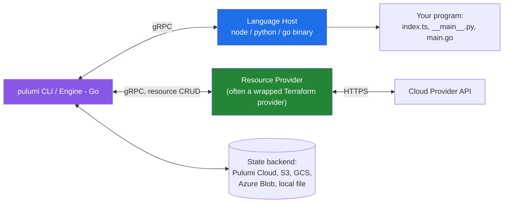

# Pulumi Deep Dive: Real Languages for Infrastructure as Code

Every mainstream IaC tool ends up compiling down to the same thing: a desired-state graph diffed against a provider's API. What differs is the authoring experience — and [**Pulumi**](https://www.pulumi.com/) makes the least conventional bet of the bunch. Instead of a DSL (HCL, in Terraform's case) it lets you write infrastructure in TypeScript, Python, Go, C#, Java, or YAML, and gets provider coverage almost for free by **auto-generating SDKs from the Terraform provider schema** rather than hand-writing its own providers.

This post assumes you already know roughly what Terraform does. It focuses on how Pulumi actually works under the hood, where that architecture genuinely wins, where it quietly costs you, and how it stacks up against Terraform/OpenTofu, AWS CDK, CDKTF, and Crossplane.

---

## Architecture: A Language Host Talking to a Deployment Engine

The detail most comparisons skip: Pulumi's core (`pulumi` CLI + the "engine") is written in Go and knows nothing about TypeScript or Python. Program execution happens in a **separate process** — a "language host" — that communicates with the engine over gRPC.



Running `pulumi up` actually **executes your program** — real code, in a real interpreter/runtime — and every `new aws.s3.Bucket(...)` call is a gRPC `RegisterResource` message sent back to the engine, which resolves the resulting dependency graph and drives providers to reconcile actual vs. desired state. This is fundamentally different from Terraform, which parses HCL into a static graph *before* anything resembling "your code" runs.

**Consequence most people don't appreciate:** because your program is live code, you get real control flow, loops, `try/catch`, package managers, unit-testable functions, and IDE autocomplete against actual types — not a second, weaker language bolted onto a config format. The trade-off is the opposite of Terraform's: HCL is intentionally *not* Turing-complete, which makes plans statically analyzable and diff-friendly. Pulumi programs can, in principle, do genuinely non-deterministic or side-effecting things during a preview, which Terraform's design rules out by construction.

---

## Little-Known Fact #1: Most Pulumi Providers Are Bridged Terraform Providers

This is the single most consequential (and least advertised) fact about Pulumi. The majority of `pulumi-aws`, `pulumi-azure`, `pulumi-gcp`, and dozens of others are generated by [**`pulumi-terraform-bridge`**](https://github.com/pulumi/pulumi-terraform-bridge), a shim that takes a Terraform provider binary (built against `terraform-plugin-sdk` or the newer `terraform-plugin-framework`), reads its resource schema, and generates a native SDK in every Pulumi language — complete with typed classes, input/output structs, and docs scraped from the upstream provider's Markdown.

Practical implications:

- **Day-one coverage** of any new Terraform provider is close to trivial — Pulumi has shipped provider parity for entire clouds (e.g., `pulumi-aws` tracking `terraform-provider-aws`) within days of upstream releases, because the bridge mostly regenerates.
- **Bugs and schema quirks in the underlying Terraform provider leak straight through.** If `terraform-provider-aws` has a known issue with a resource's `ForceNew` behavior or drift detection, `pulumi-aws` inherits it — you're debugging two layers, not one, and the fix has to land upstream in the Terraform provider first.
- A handful of providers are **"native"** — written directly against Pulumi's provider gRPC interface with no Terraform underneath: `pulumi-aws-native` and `pulumi-azure-native` are generated straight from AWS CloudFormation's and Azure's ARM resource schemas respectively, giving same-day coverage of newly announced cloud services without waiting on a Terraform provider release at all. `pulumi-kubernetes` is also native.
- The bridge is public and reusable — it's how third parties (and Pulumi itself) can bring any of the ~4,000 providers in the Terraform Registry into Pulumi's ecosystem without hand-authoring a new SDK generator per provider.

This explains a common point of confusion: "Pulumi supports every Terraform provider" is *approximately* true but not because of some universal adapter at runtime — it's because most Pulumi providers **are** compiled artifacts derived from Terraform provider source at build time.

---

## Little-Known Fact #2: State Is Just JSON, and `pulumi login --local` Needs No Account

Pulumi is often perceived as SaaS-first because the CLI defaults to Pulumi Cloud (`app.pulumi.com`) for state and secrets on first run. In reality the state format is a well-documented, versioned JSON checkpoint, and the backend is pluggable with zero code changes:

```bash
# Local filesystem backend — no account, no network calls
pulumi login --local
# or explicitly:
pulumi login file://~/.pulumi-state

# Self-managed object storage backends
pulumi login s3://my-org-pulumi-state
pulumi login gs://my-org-pulumi-state
pulumi login azblob://my-org-pulumi-state
```

This is functionally equivalent to Terraform's `backend "s3" {}` block, but it's a CLI-level login rather than committed-to-the-repo config, which means the same codebase can point at different state backends per operator/environment without editing files. The free-tier confusion ("Pulumi requires an account") is a documentation/onboarding problem, not an architectural one — self-hosted state has been supported since early versions.

---

## Little-Known Fact #3: Automation API — Infrastructure as a Library, Not a CLI Wrapper

Most teams shell out to `terraform apply` from CI and parse stdout. Pulumi ships a first-class, typed **Automation API** (`@pulumi/pulumi/automation`, `pulumi.automation` in Python, etc.) that runs the entire engine **in-process**, no CLI subprocess, no scraping text output:

```typescript
import * as automation from "@pulumi/pulumi/automation";

async function deployTenant(tenantId: string) {
  const stack = await automation.LocalWorkspace.createOrSelectStack({
    stackName: `tenant-${tenantId}`,
    projectName: "multi-tenant-saas",
    program: async () => {
      const bucket = new aws.s3.Bucket(`${tenantId}-data`);
      return { bucketName: bucket.id };
    },
  });

  await stack.setConfig("aws:region", { value: "eu-central-1" });
  const result = await stack.up({ onOutput: console.log });
  return result.outputs.bucketName.value;
}
```

This turns Pulumi into an embeddable provisioning engine rather than a CLI tool — teams use it to build self-service internal platforms where a web form or Slack bot triggers `deployTenant()` directly, with structured `UpResult` objects (resource diffs, outputs, duration) instead of parsed CLI output. Terraform has no equivalent; the closest analogues are HCP Terraform's API (a hosted service call, not an embeddable library) or hand-rolled wrappers around the `terraform` binary. This is arguably Pulumi's most differentiated real-world feature and the one least covered in "Pulumi vs Terraform" blog posts, which tend to fixate on the language question instead.

---

## Example: A Real Program (Not a Toy)

TypeScript, provisioning an S3 bucket + versioning + a Lambda triggered on object creation — deliberately chosen because it needs a loop and a conditional, which is where "real language" pays off vs. HCL's `for_each`/`dynamic` blocks:

```typescript
import * as pulumi from "@pulumi/pulumi";
import * as aws from "@pulumi/aws";

const config = new pulumi.Config();
const environments = config.requireObject<string[]>("environments"); // e.g. ["dev","staging","prod"]

const buckets = environments.map((env) => {
  const bucket = new aws.s3.BucketV2(`data-${env}`, {
    tags: { Environment: env, ManagedBy: "pulumi" },
  });

  new aws.s3.BucketVersioningV2(`data-${env}-versioning`, {
    bucket: bucket.id,
    versioningConfiguration: { status: "Enabled" },
  });

  // Only wire up the Lambda trigger for non-dev environments —
  // a plain `if` inside a loop, no HCL count/for_each gymnastics required.
  if (env !== "dev") {
    const role = new aws.iam.Role(`processor-role-${env}`, {
      assumeRolePolicy: aws.iam.assumeRolePolicyForPrincipal({
        Service: "lambda.amazonaws.com",
      }),
    });

    new aws.iam.RolePolicyAttachment(`processor-policy-${env}`, {
      role: role.name,
      policyArn: aws.iam.ManagedPolicy.AWSLambdaBasicExecutionRole,
    });

    const fn = new aws.lambda.Function(`processor-${env}`, {
      role: role.arn,
      runtime: aws.lambda.Runtime.NodeJS20dX,
      handler: "index.handler",
      code: new pulumi.asset.AssetArchive({
        ".": new pulumi.asset.FileArchive("./processor"),
      }),
    });

    new aws.s3.BucketNotification(`data-${env}-notify`, {
      bucket: bucket.id,
      lambdaFunctions: [{
        lambdaFunctionArn: fn.arn,
        events: ["s3:ObjectCreated:*"],
      }],
    });
  }

  return bucket;
});

export const bucketNames = buckets.map((b) => b.bucket);
```

Two things worth calling out for anyone coming from Terraform:

- **`Output<T>` is Pulumi's version of "unknown until apply."** `bucket.id` isn't a string — it's an `Output<string>`, a promise-like box representing a value that may not exist until the resource is created. You transform it with `.apply()` (or, as above, just reference it directly as an input to another resource — Pulumi tracks the dependency automatically and orders the graph for you). This is Pulumi's structural equivalent of Terraform's implicit dependency graph from interpolation syntax (`aws_s3_bucket.data.id`), just reified as a real type instead of string interpolation the tool parses back apart.
- **Secrets are a first-class `Output` flag, not a separate resource type.** `pulumi.secret(value)` marks any output as encrypted-at-rest in state and redacted from CLI/log output — including values *derived* from a secret, since the taint propagates through `.apply()` chains. Terraform's `sensitive = true` is comparable but is a static schema attribute, not something that flows dynamically through computed values.

---

## Pulumi vs. Terraform / OpenTofu

|  | Pulumi | Terraform / OpenTofu |
|---|---|---|
| **Authoring language** | TypeScript, Python, Go, C#, Java, YAML | HCL (JSON variant exists but is unergonomic) |
| **Execution model** | Runs your program; resource registrations stream to engine via gRPC | Parses HCL into a static graph, no imperative execution |
| **Provider ecosystem** | ~150 providers, majority auto-bridged from Terraform providers; some native | ~4,000 providers in the public registry, the reference implementation |
| **State format** | JSON checkpoint; Pulumi Cloud by default, pluggable (S3/GCS/Azure Blob/local) | Its own JSON state; HCP Terraform by default in newer CLI flows, pluggable backends |
| **Loops / conditionals** | Native language constructs | `for_each`, `count`, `dynamic` blocks — a constrained functional mini-language layered on HCL |
| **Testing** | Ordinary unit tests with your language's test framework, can mock resource registration | `terraform test` (HCL-based, newer, more limited), Terratest (external Go tool) |
| **Secrets in state** | `Output` secret-tainting, encrypted client-side per stack | `sensitive` attribute, encryption depends on backend |
| **Drift detection** | `pulumi refresh` | `terraform plan -refresh-only` |
| **Governance / OSS fork history** | Pulumi's core stayed Apache-2.0 throughout | Terraform relicensed to BUSL in Aug 2023; **OpenTofu** forked the last MPL-2.0 release (1.5.x) under the Linux Foundation and remains fully open source |
| **Learning curve for infra-only teams** | Steeper if the team doesn't already know a supported language | Gentler — HCL is small and declarative-only by design |
| **CI embedding** | Automation API — in-process, typed, no subprocess | Shell out to the `terraform` binary or call HCP Terraform's REST API |

The relicensing point matters more than it might seem: Terraform going BUSL in August 2023 is the direct reason OpenTofu exists, and it's part of why some organizations re-evaluated Pulumi (Apache-2.0, never dual-licensed) around the same time — not because Pulumi got better, but because Terraform's license risk became a live procurement question.

**When Terraform/OpenTofu wins:** you want a single declarative language that any infra engineer across any team can read without knowing a general-purpose programming language; you value HCL's static analyzability (tools like Checkov/tfsec parse a much more constrained grammar); your org already has years of Terraform modules and switching cost is the dominant factor; the provider you need has better/older Terraform support than Pulumi bridging has caught up to.

**When Pulumi wins:** your platform team is already a software team and wants to write infra with the same language, linter, and CI as the app itself; you need genuinely dynamic infra logic (per-tenant provisioning, computed resource graphs) that's awkward in HCL's expression language; you want infra provisioning embeddable as a library (Automation API) inside another service.

---

## Pulumi vs. AWS CDK vs. CDKTF

These three get conflated constantly because all three let you write TypeScript/Python infra. They are **not** the same architecture:

- **AWS CDK** compiles your program down to **CloudFormation templates**, then hands those to CloudFormation to execute. CDK never talks to AWS APIs directly during deploy — CloudFormation does, with all of CloudFormation's semantics (stack rollback behavior, drift detection, change sets, the 500-resource-per-stack limit). CDK is AWS-only.
- **CDKTF** (Cloud Development Kit for Terraform, by HashiCorp) compiles your program down to a **Terraform JSON configuration**, then hands it to the actual `terraform` binary to plan/apply. Same multi-cloud provider ecosystem as HCL Terraform, because it *is* Terraform underneath a code-generation layer.
- **Pulumi** has no intermediate declarative artifact at all — no CloudFormation template, no Terraform JSON. Your program's resource registrations go straight to the Pulumi engine over gRPC, which directly drives providers.

The practical difference: with CDK or CDKTF, you're always one layer removed — debugging sometimes means reading the generated CloudFormation/Terraform JSON to understand what will actually happen, and constructs you write are ultimately constrained by what the target format can express. Pulumi's programs *are* the execution, so `pulumi preview --diff` reflects your program's actual runtime behavior with nothing generated in between. The cost is that Pulumi's engine has to do more work itself (its own graph resolution, its own state locking) rather than delegating that to CloudFormation or Terraform's mature, decade-tested engine.

---

## Pulumi vs. Crossplane

Different category entirely, worth naming because they're sometimes pitched as substitutes. Crossplane runs **inside a Kubernetes cluster** as a set of CRDs and controllers — infrastructure is a Kubernetes object, reconciled continuously by a controller loop, the same way a Deployment is reconciled by its controller. Pulumi (like Terraform) is **run-driven**: something (a human, a CI job, a cron) invokes `pulumi up` at a point in time, and nothing reconciles state again until the next run.

This means Crossplane gives you continuous drift correction for free (a controller notices and fixes drift within its resync period, no scheduled job needed), at the cost of requiring a Kubernetes cluster as the control plane for literally all your infrastructure, including infrastructure that has nothing to do with Kubernetes. Pulumi requires an explicit `pulumi up` (or a scheduled one) to reconcile, but has no such platform dependency.

---

## Gotchas Worth Knowing Before You Commit

- **`Output<T>` leaking into plain JavaScript control flow is the #1 beginner bug.** `if (bucket.id === "something")` will never work as expected — `bucket.id` is an `Output`, not a string, so the comparison is always false/truthy in a way that has nothing to do with the actual bucket ID. Anything depending on a resource's runtime value must go through `.apply()` or `pulumi.all([...]).apply(...)` for multiple outputs.
- **Provider version pinning is per-language-SDK, not per-binary**, so `npm install @pulumi/aws@6.x` and Python's `pulumi-aws==6.x` can drift independently across a polyglot org even though both wrap the same underlying Terraform AWS provider version — check `PulumiPlugin.yaml` / the lock file, not just the language package manager's lockfile, when chasing a version mismatch.
- **`pulumi refresh` before `pulumi up` is not automatic** the way some assume; unlike Terraform (which does an implicit refresh as part of `plan` by default in most versions), Pulumi's preview uses the last-known state unless you pass `--refresh` or set `refresh: always` in the stack's `Pulumi.yaml` — meaning out-of-band console changes can go undetected longer than people expect.
- **Bridged providers can lag the upstream Terraform provider by days to weeks**, and the bridge occasionally has to skip or reshape a Terraform-specific feature (like block vs. attribute nesting quirks) that doesn't map cleanly onto a typed SDK — check `CHANGELOG.md` in the specific `pulumi-<provider>` repo, not just the Terraform provider's, before assuming day-one parity.

---

## Where to Go From Here

If you're evaluating Pulumi seriously: start with the Automation API section above before writing a single `.ts` file by hand — it's the feature that changes the calculus for teams building internal platforms, not the "TypeScript instead of HCL" pitch that dominates marketing. And regardless of which tool you land on, read the `pulumi-terraform-bridge` repo once — understanding that most providers are generated artifacts, not hand-maintained SDKs, changes how you debug a weird schema issue at 2am.

---

**References**

- [Pulumi — Official Site](https://www.pulumi.com/)
- [Pulumi Architecture & How Pulumi Works](https://www.pulumi.com/docs/iac/concepts/how-pulumi-works/)
- [pulumi-terraform-bridge (GitHub)](https://github.com/pulumi/pulumi-terraform-bridge)
- [Pulumi Automation API](https://www.pulumi.com/docs/iac/using-pulumi/automation-api/)
- [Pulumi State & Backends](https://www.pulumi.com/docs/iac/concepts/state-and-backends/)
- [OpenTofu — About](https://opentofu.org/docs/intro/)
- [AWS CDK vs. Pulumi vs. Terraform CDK](https://developer.hashicorp.com/terraform/cdktf)
- [Crossplane Documentation](https://docs.crossplane.io/)
