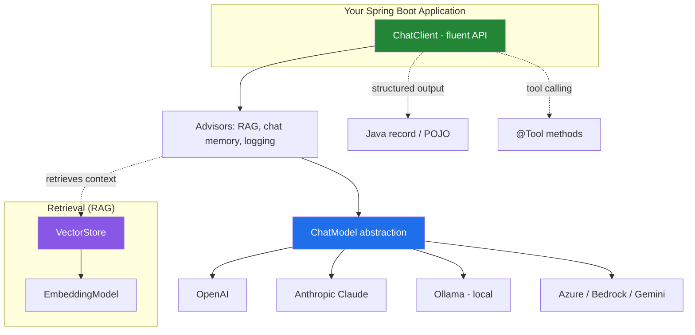

# Spring AI: Building AI Applications the Spring Way

For a couple of years, the practical answer to "how do I put an LLM into my backend?" was Python — LangChain, LlamaIndex, and a REST hop from your JVM services into a separate Python tier. [**Spring AI**](https://spring.io/projects/spring-ai) removes that hop. It brings the same building blocks — chat models, embeddings, vector stores, tool calling, RAG — into the Spring ecosystem, with the auto-configuration, dependency injection, and portability Spring developers already expect.

Spring AI reached **1.0.0 GA in May 2025**, so it is no longer a moving milestone target — the artifacts are on Maven Central and the API is stable. This post gives an overview of what the module does and walks through small, complete, runnable examples using **Maven and Java 21**.

---

## What Spring AI Actually Gives You

The core idea is a **portable abstraction** over AI providers. You write against interfaces like `ChatModel` and `EmbeddingModel` (and the higher-level `ChatClient`), and a Boot starter wires in a concrete provider — OpenAI, Anthropic, Azure OpenAI, Ollama, Mistral, Vertex AI Gemini, Amazon Bedrock, and more. Swapping providers is mostly a dependency and a property change, not a rewrite.



The pieces you'll use most:

- **`ChatClient`** — a fluent, `WebClient`-style API for prompting a model and reading the response.
- **Structured output** — map a model's reply straight into a Java `record` or POJO, no manual JSON parsing.
- **Advisors** — interceptors in the prompt pipeline for cross-cutting concerns like RAG retrieval, chat memory, and logging.
- **Tool/function calling** — let the model invoke your Java methods (annotated with `@Tool`) to fetch data or take actions.
- **Vector stores & embeddings** — the retrieval half of RAG, with a common `VectorStore` interface over pgvector, Redis, Qdrant, Chroma, and others.

---

## Example 1: A Minimal Chat Endpoint

Let's build the smallest useful thing — an HTTP endpoint that forwards a question to an LLM and returns the answer. Four files: `pom.xml`, an application class, config, and a controller.

### `pom.xml`

Spring AI ships a **BOM** so you manage one version and let it align all the starters. The OpenAI model starter is `spring-ai-starter-model-openai` (the GA naming convention is `spring-ai-starter-model-<provider>`).

```xml
<project xmlns="http://maven.apache.org/POM/4.0.0"
         xmlns:xsi="http://www.w3.org/2001/XMLSchema-instance"
         xsi:schemaLocation="http://maven.apache.org/POM/4.0.0
                             https://maven.apache.org/xsd/maven-4.0.0.xsd">
    <modelVersion>4.0.0</modelVersion>

    <parent>
        <groupId>org.springframework.boot</groupId>
        <artifactId>spring-boot-starter-parent</artifactId>
        <version>3.4.5</version>
        <relativePath/>
    </parent>

    <groupId>com.example</groupId>
    <artifactId>spring-ai-demo</artifactId>
    <version>0.0.1-SNAPSHOT</version>

    <properties>
        <java.version>21</java.version>
        <spring-ai.version>1.0.0</spring-ai.version>
    </properties>

    <dependencies>
        <dependency>
            <groupId>org.springframework.boot</groupId>
            <artifactId>spring-boot-starter-web</artifactId>
        </dependency>
        <dependency>
            <groupId>org.springframework.ai</groupId>
            <artifactId>spring-ai-starter-model-openai</artifactId>
        </dependency>
    </dependencies>

    <dependencyManagement>
        <dependencies>
            <dependency>
                <groupId>org.springframework.ai</groupId>
                <artifactId>spring-ai-bom</artifactId>
                <version>${spring-ai.version}</version>
                <type>pom</type>
                <scope>import</scope>
            </dependency>
        </dependencies>
    </dependencyManagement>

    <build>
        <plugins>
            <plugin>
                <groupId>org.springframework.boot</groupId>
                <artifactId>spring-boot-maven-plugin</artifactId>
            </plugin>
        </plugins>
    </build>
</project>
```

### `src/main/resources/application.properties`

The API key is read from an environment variable — never hard-code it.

```properties
spring.ai.openai.api-key=${OPENAI_API_KEY}
spring.ai.openai.chat.options.model=gpt-4o-mini
```

### `Application.java` and the controller

Because the OpenAI starter is on the classpath, Spring AI **auto-configures a `ChatClient.Builder`** bean. You inject the builder and build a client from it.

```java
package com.example;

import org.springframework.ai.chat.client.ChatClient;
import org.springframework.boot.SpringApplication;
import org.springframework.boot.autoconfigure.SpringBootApplication;
import org.springframework.web.bind.annotation.GetMapping;
import org.springframework.web.bind.annotation.RequestParam;
import org.springframework.web.bind.annotation.RestController;

@SpringBootApplication
public class Application {
    public static void main(String[] args) {
        SpringApplication.run(Application.class, args);
    }
}

@RestController
class ChatController {

    private final ChatClient chatClient;

    // ChatClient.Builder is auto-configured by the starter.
    ChatController(ChatClient.Builder builder) {
        this.chatClient = builder.build();
    }

    @GetMapping("/chat")
    String chat(@RequestParam String message) {
        return chatClient.prompt()   // start a prompt
                .user(message)        // the user turn
                .call()               // call the model (blocking)
                .content();           // extract the text reply
    }
}
```

Run it and curl the endpoint:

```bash
export OPENAI_API_KEY=sk-...
./mvnw spring-boot:run

curl "http://localhost:8080/chat?message=Explain%20Spring%20AI%20in%20one%20sentence"
```

That's a complete, working AI-backed service. The `prompt().user(...).call().content()` chain is the shape you'll reuse everywhere.

---

## Example 2: A System Prompt and Prompt Templates

Real prompts need a **system message** to set behavior, and often **template variables** filled at runtime. `ChatClient` handles both. Here `{voice}` is substituted from a parameter.

```java
@GetMapping("/joke")
String joke(@RequestParam String topic, @RequestParam String voice) {
    return chatClient.prompt()
            .system(sys -> sys
                    .text("You are a comedian who tells clean, one-line jokes " +
                          "in the voice of a {voice}.")
                    .param("voice", voice))
            .user("Tell me a joke about " + topic)
            .call()
            .content();
}
```

```bash
curl "http://localhost:8080/joke?topic=databases&voice=pirate"
```

You can also set a **default system prompt once** at build time so every call inherits it:

```java
this.chatClient = builder
        .defaultSystem("You are a concise assistant. Answer in at most 3 sentences.")
        .build();
```

---

## Example 3: Structured Output (Map Straight to a Java Record)

The feature that makes Spring AI feel native to Java: ask for a reply and get a typed object back. Spring AI injects format instructions into the prompt and deserializes the JSON response into your type. Just define a `record` and call `.entity()`.

```java
import java.util.List;

record Recipe(String title, List<String> ingredients, List<String> steps) {}

@GetMapping("/recipe")
Recipe recipe(@RequestParam String dish) {
    return chatClient.prompt()
            .user("Give me a simple recipe for " + dish)
            .call()
            .entity(Recipe.class);   // <- typed, not a raw String
}
```

```bash
curl "http://localhost:8080/recipe?dish=pancakes"
# => {"title":"Classic Pancakes","ingredients":[...],"steps":[...]}
```

`.entity()` also accepts `ParameterizedTypeReference` for generic types like `List<Recipe>`, so you can ask for a collection in one call.

---

## Example 4: Tool Calling (Let the Model Use Your Code)

LLMs don't know the current time, your database, or today's prices. **Tool calling** lets the model ask *your* code for that data mid-conversation. Annotate a method with `@Tool`, hand the object to `.tools()`, and Spring AI advertises it to the model and invokes it automatically when the model decides it's needed.

```java
import java.time.LocalDateTime;
import org.springframework.ai.tool.annotation.Tool;

class DateTimeTools {

    @Tool(description = "Get the current date and time")
    String getCurrentDateTime() {
        return LocalDateTime.now().toString();
    }
}

@GetMapping("/tools")
String tools(@RequestParam String question) {
    return chatClient.prompt()
            .user(question)
            .tools(new DateTimeTools())   // expose the tool for this call
            .call()
            .content();
}
```

```bash
curl "http://localhost:8080/tools?question=What%20time%20is%20it%20right%20now?"
```

The model sees it has a `getCurrentDateTime` tool, calls it, and folds the result into a natural-language answer — no manual orchestration on your side.

---

## Where RAG Fits In

Retrieval-Augmented Generation is a first-class citizen. You store document embeddings in a `VectorStore`, then attach a `QuestionAnswerAdvisor` that retrieves the most relevant chunks and injects them into the prompt before the model answers:

```java
String answer = chatClient.prompt()
        .user(question)
        .advisors(new QuestionAnswerAdvisor(vectorStore))  // retrieves + injects context
        .call()
        .content();
```

The `VectorStore` interface has the same shape across pgvector, Redis, Qdrant, Chroma, and friends, and Spring AI includes an ETL pipeline (`DocumentReader` → `TextSplitter` → `VectorStore`) for ingesting PDFs, HTML, and Markdown. That's a full post on its own, but the takeaway is that the retrieval half plugs into the exact same `ChatClient` you've already seen.

---

## Provider Portability: Swapping to Claude

Because everything above is written against `ChatClient`, changing providers touches only the dependency and the config — **not a single line of the controllers**. To run the same app on Anthropic's Claude, swap the starter:

```xml
<dependency>
    <groupId>org.springframework.ai</groupId>
    <artifactId>spring-ai-starter-model-anthropic</artifactId>
</dependency>
```

and the properties:

```properties
spring.ai.anthropic.api-key=${ANTHROPIC_API_KEY}
spring.ai.anthropic.chat.options.model=claude-sonnet-5
```

The `ChatClient`, structured output, tool calling, and RAG code all keep working unchanged. Want a fully local, no-cost setup for development? Use the `spring-ai-starter-model-ollama` starter and point it at a model running on your machine — same code again.

---

## When to Reach for Spring AI

- **You're already a Spring/Java shop.** Spring AI keeps AI logic in the same codebase, build, and deployment as the rest of your services — no separate Python tier, no extra network hop.
- **You want provider portability.** Coding against `ChatClient`/`ChatModel` means OpenAI, Anthropic, Azure, Bedrock, Gemini, and Ollama are configuration choices, not architectural commitments.
- **You value typed, testable AI code.** Structured output into records and tool calling into plain Java methods fit naturally into existing service and testing patterns.

If your team lives in the Python data-science ecosystem, LangChain/LlamaIndex may still feel more at home. But for JVM backends, Spring AI is now the path of least resistance from "I have a Spring Boot service" to "my Spring Boot service uses an LLM" — and since 1.0 GA, it's a stable one.

---

**References**

- [Spring AI — Project Page](https://spring.io/projects/spring-ai)
- [Spring AI Reference Documentation](https://docs.spring.io/spring-ai/reference/)
- [ChatClient API (Spring AI docs)](https://docs.spring.io/spring-ai/reference/api/chatclient.html)
- [Structured Output Converter (Spring AI docs)](https://docs.spring.io/spring-ai/reference/api/structured-output-converter.html)
- [Tool Calling (Spring AI docs)](https://docs.spring.io/spring-ai/reference/api/tools.html)
- [Retrieval Augmented Generation (Spring AI docs)](https://docs.spring.io/spring-ai/reference/api/retrieval-augmented-generation.html)
- [Spring AI 1.0 GA Announcement (Spring Blog)](https://spring.io/blog/2025/05/20/spring-ai-1-0-GA-released)
