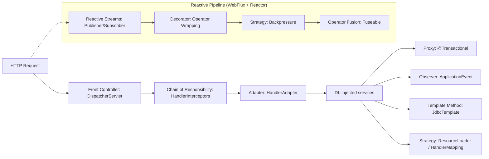

# Design Patterns Under the Hood of Spring Framework

Spring Framework is not just a DI container — it is a masterclass in applying Gang of Four design patterns at framework scale. The official Spring documentation itself states: *"you can use design patterns such as Factory, Abstract Factory, Builder, Decorator, and Service Locator to compose the various classes and object instances that make up an application."* Spring doesn't just recommend these patterns — it codifies them as first-class infrastructure.

This post maps the 12 core design patterns Spring implements internally, showing where each lives in the framework and how you interact with it daily.

---

## Summary: Patterns at a Glance

| # | Pattern | Category | Spring Implementation |
|---|---------|----------|----------------------|
| 1 | Factory Method | Creational | `BeanFactory`, `@Bean` methods |
| 2 | Abstract Factory | Creational | `ApplicationContext` |
| 3 | Singleton | Creational | Default bean scope (container-managed) |
| 4 | Prototype | Creational | `@Scope("prototype")` |
| 5 | Builder | Creational | `BeanDefinitionBuilder`, `UriComponentsBuilder` |
| 6 | Proxy | Structural | Spring AOP, `@Transactional`, `@Cacheable` |
| 7 | Adapter | Structural | `HandlerAdapter`, `HandlerInterceptorAdapter` |
| 8 | Decorator | Structural | `HttpServletRequestWrapper`, `DataSource` wrappers |
| 9 | Template Method | Behavioral | `JdbcTemplate`, `AbstractBeanFactory.createBean()` |
| 10 | Strategy | Behavioral | `ResourceLoader`, `HandlerMapping`, `@Retryable` |
| 11 | Observer | Behavioral | `ApplicationEvent`, `@EventListener` |
| 12 | Chain of Responsibility | Behavioral | `HandlerInterceptor` chain, `BeanPostProcessor` chain |
| 13 | Reactive Streams (Observer) | Behavioral | `Publisher`/`Subscriber`/`Subscription`, `Mono`/`Flux` |
| 14 | Decorator (Operator Wrapping) | Structural | Every Reactor operator wraps upstream (`FluxMap`, `MonoFilter`) |
| 15 | Strategy (Backpressure) | Behavioral | `OverflowStrategy`: BUFFER, DROP, LATEST |
| 16 | Strategy (Scheduler) | Behavioral | `Schedulers.parallel()`, `boundedElastic()`, `single()` |
| 17 | Assembly-Time Hook | Structural | `Flux.onAssembly()`, `Mono.onAssembly()` — cross-cutting at build time |
| 18 | Operator Fusion (Composite) | Structural | `Fuseable.QueueSubscription` — macro & micro fusion |

---

## 1. Factory Method Pattern

The Factory Method pattern provides an interface for creating objects without specifying their concrete class. This is the *root* of Spring's IoC container.

The `BeanFactory` interface is literally a factory — `getBean()` is a factory method that returns objects by name, type, or constructor arguments:

```java
public interface BeanFactory {
    Object getBean(String name) throws BeansException;
    <T> T getBean(Class<T> requiredType) throws BeansException;
    boolean containsBean(String name);
}
```

Your `@Bean` methods are factory methods too — each method in a `@Configuration` class acts as a factory that Spring calls to produce beans:

```java
@Configuration
public class AppConfig {

    @Bean
    public PaymentService paymentService(PaymentRepository repository) {
        return new StripePaymentService(repository);  // factory method
    }
}
```

The container invokes `paymentService()`, manages the returned object's lifecycle, and hands it to any class that needs a `PaymentService`. You never call this factory method yourself — the container does.

---

## 2. Abstract Factory Pattern

Where Factory Method creates one type of object, Abstract Factory creates *families* of related objects. Spring's `ApplicationContext` is an Abstract Factory — it extends `BeanFactory` and adds enterprise concerns (events, resource loading, AOP integration), acting as a factory that produces entire coherent object graphs.

```java
// Each ApplicationContext variant is a different "factory family"
AnnotationConfigApplicationContext ctx =
    new AnnotationConfigApplicationContext(AppConfig.class);

// The context creates not just individual beans, but the entire
// coordinated set: repositories, services, controllers, aspects...
UserService service = ctx.getBean(UserService.class);
```

Different `ApplicationContext` implementations (`AnnotationConfigApplicationContext`, `AnnotationConfigServletWebServerApplicationContext`, `GenericApplicationContext`) produce different families of beans tailored to their environment — web, standalone, reactive — while sharing the same `BeanFactory` contract.

---

## 3. Singleton Pattern (Container-Managed)

By default, every Spring bean is a singleton — one shared instance per IoC container. But Spring's Singleton differs from the GoF Singleton in a critical way: the *container* manages the singleton, not the class itself. Your classes stay as plain POJOs with no static instance or private constructor.

```java
@Service  // default scope = singleton
public class OrderService {
    // One instance shared across the entire application context.
    // The class itself is a normal POJO — no singleton machinery inside.
}
```

This is confirmed in the official docs: *"Spring's concept of a singleton bean differs from the singleton pattern as defined in the GoF patterns book. The GoF singleton hard-codes the scope of an object. The scope of the Spring singleton is best described as being per-container and per-bean."*

The trade-off: because the container owns the lifecycle, you can switch `@Scope("prototype")` without touching the class. The downside: singleton + mutable state = thread-safety bugs. Keep singletons stateless.

---

## 4. Prototype Pattern

The Prototype pattern creates a new instance every time it is requested. Spring's `prototype` scope does exactly this — the container instantiates, configures, and hands over the object, then loses all track of it. No further lifecycle callbacks are invoked by the container.

```java
@Component
@Scope(ConfigurableBeanFactory.SCOPE_PROTOTYPE)
public class ShoppingCart {
    private final List<CartItem> items = new ArrayList<>();
    // Fresh instance every time — safe for mutable state
}
```

```java
@Service
public class CheckoutService {

    // Wrong: singleton gets one prototype at injection time — never updated
    // Correct: use ObjectFactory or @Lookup for fresh instances
    private final ObjectFactory<ShoppingCart> cartFactory;

    CheckoutService(ObjectFactory<ShoppingCart> cartFactory) {
        this.cartFactory = cartFactory;
    }

    public ShoppingCart createCart() {
        return cartFactory.getObject(); // new instance each call
    }
}
```

---

## 5. Builder Pattern

The Builder pattern constructs complex objects step-by-step through a fluent API. Spring uses it internally for `BeanDefinition` construction, URI building, and HTTP header assembly:

```java
// Internal: Spring's own BeanDefinitionBuilder
BeanDefinition bd = BeanDefinitionBuilder
    .rootBeanDefinition(OrderService.class)
    .setScope("singleton")
    .addPropertyValue("maxRetries", "3")
    .getBeanDefinition();

// Common: building URIs
UriComponents uri = UriComponentsBuilder
    .fromHttpUrl("https://api.example.com")
    .path("/orders/{id}")
    .buildAndExpand(orderId);

// Common: building HTTP headers
HttpHeaders headers = new HttpHeaders();
headers.setContentType(MediaType.APPLICATION_JSON);
headers.setBearerAuth(token);
```

The builder pattern eliminates telescoping constructors while keeping construction code readable and immutable-safe.

---

## 6. Proxy Pattern

The Proxy pattern wraps an object to control access to it. This is the backbone of Spring AOP. When you annotate a method with `@Transactional`, `@Cacheable`, or `@Async`, Spring does not invoke your method directly — it creates a proxy that wraps the call.

Spring uses two proxy mechanisms:

| Proxy Type | Mechanism | When Used |
|-----------|-----------|-----------|
| JDK Dynamic Proxy | `java.lang.reflect.Proxy` | Target implements at least one interface |
| CGLIB Proxy | Subclasses the target at runtime | Target is a concrete class (default since Boot 2.0) |

```java
@Service
public class AccountService {

    @Transactional  // Spring wraps this in a proxy
    public void transfer(Account from, Account to, BigDecimal amount) {
        from.debit(amount);
        to.credit(amount);
        // Proxy commits the transaction after this method returns
        // (or rolls back on exception)
    }
}
```

The proxy intercepts the call, begins a transaction, delegates to the real `transfer()` method, and commits or rolls back. Your `AccountService` has zero transaction management code.

**Critical caveat:** self-invocation (`this.transfer()` from within the same class) bypasses the proxy. The call never enters the AOP chain. This is not a bug — it's a fundamental limitation of proxy-based AOP.

---

## 7. Adapter Pattern

The Adapter pattern makes incompatible interfaces work together. Spring MVC's `DispatcherServlet` uses it to support multiple controller styles through a single dispatch mechanism.

The `HandlerAdapter` interface adapts the DispatcherServlet's uniform dispatch to the specific calling convention of each controller type:

```java
// DispatcherServlet doesn't call controllers directly.
// It asks the HandlerAdapter to do it.
public interface HandlerAdapter {
    boolean supports(Object handler);
    ModelAndView handle(HttpServletRequest request,
                        HttpServletResponse response,
                        Object handler) throws Exception;
}
```

Three built-in adapters handle three controller styles:

| Adapter | Controller Type |
|---------|----------------|
| `RequestMappingHandlerAdapter` | `@Controller` / `@RequestMapping` methods |
| `HttpRequestHandlerAdapter` | `HttpRequestHandler` (simple handlers) |
| `SimpleControllerHandlerAdapter` | `Controller` interface (old-style) |

The `DispatcherServlet` finds the right adapter via `handlerAdapter.supports(handler)`, then calls `handlerAdapter.handle(...)`. To support a new controller style, you write a new `HandlerAdapter` — the DispatcherServlet never changes.

---

## 8. Decorator Pattern

The Decorator pattern adds responsibilities to objects dynamically by wrapping them. Spring applies this in the Servlet layer and data access:

```java
@Component
public class TrimmingRequestWrapper extends HttpServletRequestWrapper {

    public TrimmingRequestWrapper(HttpServletRequest request) {
        super(request);
    }

    @Override
    public String getParameter(String name) {
        String value = super.getParameter(name);
        return value != null ? value.trim() : null;  // decoration: trim
    }
}

// Usage in a Filter
@WebFilter("/*")
public class TrimmingFilter implements Filter {

    @Override
    public void doFilter(ServletRequest request, ServletResponse response,
                         FilterChain chain) throws IOException, ServletException {
        chain.doFilter(new TrimmingRequestWrapper((HttpServletRequest) request),
                       response);
    }
}
```

The original `HttpServletRequest` is untouched — the wrapper adds trimming behavior transparently. You can stack decorators (trimming inside XSS filtering inside encoding) without modifying the base object. Spring's `DataSource` wrappers (`LazyConnectionDataSourceProxy`, `SingleConnectionDataSource`) use the same technique.

---

## 9. Template Method Pattern

The Template Method pattern defines the skeleton of an algorithm, implementing the invariant steps and leaving the variant steps as hooks. Spring's entire bean creation pipeline is a Template Method — and so are all the `*Template` helper classes.

### Bean Creation Pipeline

`AbstractBeanFactory` defines `getBean()` which calls the abstract hook `createBean()`. `AbstractAutowireCapableBeanFactory` implements `createBean()` with a fixed 5-phase pipeline:

```java
// Simplified from AbstractAutowireCapableBeanFactory
protected Object createBean(String beanName, RootBeanDefinition mbd, Object[] args) {
    // Phase 1: Instantiate the raw object
    Object bean = createBeanInstance(beanName, mbd, args);

    // Phase 2: Post-process merged definition (discover @Autowired metadata)
    applyMergedBeanDefinitionPostProcessors(mbd, beanType, beanName);

    // Phase 3: Early singleton exposure (for circular reference resolution)
    // ...

    // Phase 4: Populate — perform dependency injection
    populateBean(beanName, mbd, beanWrapper);

    // Phase 5: Initialize — Aware callbacks, init methods, AOP proxy creation
    Object exposedObject = initializeBean(beanName, bean, mbd);
    return exposedObject;
}
```

### JdbcTemplate: Template + Callback

`JdbcTemplate` handles connection acquisition, statement execution, exception translation, and resource cleanup. You provide only the business logic via a callback:

```java
String name = jdbcTemplate.queryForObject(
    "SELECT name FROM users WHERE id = ?",
    (rs, rowNum) -> rs.getString("name"),  // your callback
    userId
);
```

You never touch `Connection`, `PreparedStatement`, or `ResultSet` lifecycle. The template owns the skeleton; you own the variable step.

---

## 10. Strategy Pattern

The Strategy pattern encapsulates interchangeable algorithms behind a common interface. Spring relies on it heavily for pluggable behavior — DI makes swapping strategies trivial.

Spring's `ResourceLoader` is a strategy interface. Different environments provide different strategies for loading resources:

```java
public interface ResourceLoader {
    Resource getResource(String location);
}
```

| Strategy (Implementation) | Environment |
|--------------------------|-------------|
| `ClassPathXmlApplicationContext` | Classpath resources |
| `FileSystemXmlApplicationContext` | File system resources |
| `AnnotationConfigApplicationContext` | Java config |

In Spring MVC, `HandlerMapping` implementations are strategies for URL-to-handler mapping:

```java
// Strategy interface
public interface HandlerMapping {
    HandlerExecutionChain getHandler(HttpServletRequest request) throws Exception;
}

// Strategy A: map by @RequestMapping annotations
RequestMappingHandlerMapping

// Strategy B: map by simple URL patterns
SimpleUrlHandlerMapping

// Strategy C: map by bean name convention
BeanNameUrlHandlerMapping
```

The DispatcherServlet iterates through registered `HandlerMapping` strategies until one returns a handler. You can add a new mapping strategy by implementing `HandlerMapping` — the DispatcherServlet code is untouched.

---

## 11. Observer Pattern

The Observer pattern defines a one-to-many dependency: when one object changes state, all dependents are notified. Spring's event system is a direct implementation.

```java
// The Event (message object)
public record OrderPlacedEvent(String orderId, BigDecimal total)
        extends ApplicationEvent {  // or use @EventListener without extending

    public OrderPlacedEvent(Object source, String orderId, BigDecimal total) {
        super(source);
        this.orderId = orderId;
        this.total = total;
    }
}

// The Publisher
@Service
public class OrderService {

    private final ApplicationEventPublisher eventPublisher;

    OrderService(ApplicationEventPublisher eventPublisher) {
        this.eventPublisher = eventPublisher;
    }

    public void placeOrder(Order order) {
        // save order...
        eventPublisher.publishEvent(new OrderPlacedEvent(this, order.getId(), order.getTotal()));
    }
}

// Observer A
@Component
public class InventoryListener {

    @EventListener
    public void onOrderPlaced(OrderPlacedEvent event) {
        inventoryService.reserve(event.orderId());
    }
}

// Observer B
@Component
public class EmailListener {

    @EventListener
    public void onOrderPlaced(OrderPlacedEvent event) {
        emailService.sendConfirmation(event.orderId());
    }
}
```

`OrderService` has no knowledge of `InventoryListener` or `EmailListener`. Adding a new observer (audit, analytics, loyalty points) requires zero changes to the publisher. The `ApplicationEventMulticaster` brokers delivery to all registered listeners.

**Production caveat:** Spring events are in-process, synchronous by default. They are not a message queue — if the JVM crashes, undelivered events are lost. For guaranteed delivery, use an external broker (Kafka, RabbitMQ).

---

## 12. Chain of Responsibility Pattern

The Chain of Responsibility pattern passes a request along a chain of handlers — each handler decides either to process it or pass it to the next. Spring uses this in two critical places.

### HandlerInterceptor Chain

When a request arrives, `DispatcherServlet` builds an `HandlerExecutionChain` containing the handler and a list of interceptors. `preHandle()` is called in order; `postHandle()` and `afterCompletion()` in reverse:

```java
@Component
public class AuthInterceptor implements HandlerInterceptor {

    @Override
    public boolean preHandle(HttpServletRequest request,
                             HttpServletResponse response,
                             Object handler) throws Exception {
        if (isAuthenticated(request)) {
            return true;  // continue to next interceptor or handler
        }
        response.sendError(HttpServletResponse.SC_UNAUTHORIZED);
        return false;  // chain stops here
    }
}

@Component
public class LoggingInterceptor implements HandlerInterceptor {

    @Override
    public boolean preHandle(HttpServletRequest request,
                             HttpServletResponse response,
                             Object handler) {
        long start = System.currentTimeMillis();
        request.setAttribute("startTime", start);
        return true;  // continue the chain
    }

    @Override
    public void afterCompletion(HttpServletRequest request,
                                HttpServletResponse response,
                                Object handler, Exception ex) {
        long duration = System.currentTimeMillis() -
            (long) request.getAttribute("startTime");
        log.info("{} {} completed in {}ms",
                 request.getMethod(), request.getRequestURI(), duration);
    }
}
```

### BeanPostProcessor Chain

Every bean goes through a chain of `BeanPostProcessor` implementations before and after initialization. This is how `@Autowired`, `@Transactional`, `@Async`, and `@Value` are processed — each processor handles one concern:

```java
// Simplified pipeline from AbstractAutowireCapableBeanFactory
protected Object initializeBean(String beanName, Object bean, RootBeanDefinition mbd) {
    // Aware callbacks
    invokeAwareMethods(beanName, bean);

    // BeanPostProcessor chain — BEFORE initialization
    for (BeanPostProcessor processor : getBeanPostProcessors()) {
        bean = processor.postProcessBeforeInitialization(bean, beanName);
    }

    // Init methods (@PostConstruct, InitializingBean.afterPropertiesSet())
    invokeInitMethods(beanName, bean, mbd);

    // BeanPostProcessor chain — AFTER initialization
    // (This is where AOP proxies are created!)
    for (BeanPostProcessor processor : getBeanPostProcessors()) {
        bean = processor.postProcessAfterInitialization(bean, beanName);
    }
    return bean;
}
```

Processors are ordered via `PriorityOrdered` and `Ordered` interfaces. Infrastructure processors (`AutowiredAnnotationBeanPostProcessor`) run first; user-level processors run after.

---

## Patterns Inside Spring Reactor & WebFlux

Reactor and WebFlux introduce their own pattern vocabulary on top of the core Spring patterns. These are what make reactive pipelines non-blocking, composable, and backpressure-aware.

### 13. Reactive Streams (Observer Pattern, Evolved)

The Reactive Streams specification (Java 9+ `java.util.concurrent.Flow`) is the Observer pattern with backpressure added. The original Observer pattern is fire-and-forget — the subject pushes to observers with no flow control. Reactive Streams adds a `Subscription` that lets the `Subscriber` control the rate:

```java
// Reactive Streams interfaces (the contract)
public interface Publisher<T> {
    void subscribe(Subscriber<? super T> s);
}

public interface Subscriber<T> {
    void onSubscribe(Subscription s);  // control signal
    void onNext(T t);                   // data signal
    void onError(Throwable t);          // error signal
    void onComplete();                  // completion signal
}

public interface Subscription {
    void request(long n);   // backpressure: "give me N items"
    void cancel();          // subscriber says "done listening"
}
```

`Mono<T>` (0-1 element) and `Flux<T>` (0-N elements) are `Publisher` implementations. The key difference from classical Observer: the subscriber *pulls* data by calling `request(n)`, so a fast producer never overwhelms a slow consumer:

```java
Flux.range(1, 1000)
    .map(this::expensiveTransform)
    .subscribe(
        value -> process(value),          // onNext
        error -> log.error("failed", error),  // onError
        () -> log.info("done")           // onComplete
    );
```

The `subscribe()` call triggers the whole chain. Nothing happens until a subscriber appears — this is the **lazy** property that separates reactive from imperative code.

---

### 14. Decorator Pattern (Operator Wrapping)

Every Reactor operator is a decorator. When you call `.map(fn)` on a `Flux`, you don't mutate the original — you get a new `Flux` that wraps the upstream and adds transformation behavior. Reactor's own `MonoOperator` javadoc states: *"A decorating Mono Publisher that exposes Mono API over an arbitrary Publisher."*

```java
// What happens internally when you write:
Flux<String> result = Flux.just(1, 2, 3)
    .map(i -> "item-" + i)       // FluxMap wraps FluxJust
    .filter(s -> s.endsWith("-2"))  // FluxFilter wraps FluxMap
    .take(1);                     // FluxTake wraps FluxFilter
```

Each operator wraps the previous one:

```
FluxTake(FluxFilter(FluxMap(FluxJust)))
```

At subscribe time, the chain unwinds: `FluxTake` subscribes to `FluxFilter`, which subscribes to `FluxMap`, which subscribes to `FluxJust`. Data flows outward through each decorator. This is the classic Decorator pattern — the wrapper adds behavior, the original stays unchanged.

---

### 15. Strategy Pattern (Backpressure)

When a producer is faster than the consumer, Reactor applies a backpressure `OverflowStrategy` — a Strategy pattern:

```java
Flux.create(sink -> {
    for (int i = 0; i < 1_000_000; i++) {
        sink.next(i);  // fast producer
    }
    sink.complete();
}, FluxSink.OverflowStrategy.BUFFER)  // strategy: buffer excess items
.publishOn(Schedulers.boundedElastic(), 256)  // demand of 256 at a time
.subscribe();  // slow consumer
```

| Strategy | Behavior | Use When |
|----------|----------|----------|
| `BUFFER` (default) | Stores overflow in an unbounded queue | You can tolerate memory growth |
| `DROP` | Discards overflow items | Latest value doesn't matter |
| `LATEST` | Keeps only the most recent overflow | Only the latest matters (e.g., stock ticker) |
| `ERROR` | Throws `OverflowException` on overflow | You want to fail fast |

You can also apply strategies mid-chain with operators:

```java
flux.onBackpressureBuffer(256)     // buffer up to 256, then error
    .onBackpressureDrop(dropped -> log.warn("Dropped: {}", dropped))
    .onBackpressureLatest()        // keep only latest
```

Each strategy is a different algorithm for the same problem — the textbook Strategy pattern.

---

### 16. Strategy Pattern (Scheduler)

Where code executes is a strategy choice in Reactor. `Scheduler` is the strategy interface; different implementations are for different workloads:

```java
Flux.fromCallable(this::blockIO)
    .subscribeOn(Schedulers.boundedElastic())  // Strategy: blocking I/O
    .map(this::transform)                      // runs on boundedElastic
    .publishOn(Schedulers.parallel())          // switch strategy
    .subscribe();                              // transform runs on parallel
```

| Scheduler | Strategy | Use Case |
|-----------|----------|----------|
| `Schedulers.parallel()` | Fixed-size thread pool | CPU-bound work |
| `Schedulers.boundedElastic()` | Elastic pool, bounded | Blocking I/O, external calls |
| `Schedulers.single()` | Single thread | Low-overhead, event-loop |
| `Schedulers.immediate()` | Current thread | Trivial/fast operations |

`subscribeOn` sets the strategy for the *source* (first wins). `publishOn` switches the strategy for *downstream* operators (can be used multiple times). The scheduler choice is decoupled from the business logic — pure Strategy pattern.

---

### 17. Assembly-Time Hook Pattern (Cross-Cutting Concerns at Build Time)

Reactor's `onAssembly` hooks let you inject cross-cutting behavior *when the operator chain is built*, not when it runs. This is conceptually similar to Spring AOP's compile-time weaving but for reactive pipelines:

```java
// Reactor's internal mechanism (applied to every operator)
public abstract class Mono<T> implements CorePublisher<T> {
    static <T> Mono<T> onAssembly(Mono<T> source) {
        Function<Publisher, Publisher> hook = Hooks.onLastOperatorHook;
        if (hook == null) {
            return source;
        }
        return (Mono<T>) hook.apply(source);  // wrap with cross-cutting behavior
    }
}
```

This is how Reactor captures assembly stack traces for debugging:

```java
// Enable assembly tracing globally
Hooks.onOperatorDebug();  // or use checkpoint() selectively

Flux<String> flux = Flux.just("hello")
    .map(s -> s.toUpperCase())   // assembly snapshot captured here
    .flatMap(this::asyncLookup)  // and here
    .checkpoint("my-pipeline");  // explicit checkpoint with description
```

The `FluxOnAssembly` operator captures the stack trace at chain construction time and attaches it to any error that occurs at runtime. This separates the *when* of assembly (build-time instrumentation) from the *when* of execution (subscribe-time), giving you debugging info without runtime cost when no error occurs.

---

### 18. Operator Fusion (Composite Pattern)

Operator Fusion is Reactor's most sophisticated optimization. It merges operators to eliminate intermediate queue allocation and request-accounting overhead. Two levels exist:

**Macro-Fusion** — merges identical operators at assembly time:

```java
// Before fusion:
Flux.just(1, 2, 3)
    .filter(i -> i > 1)
    .filter(i -> i < 3)
    .map(i -> i * 10);

// After macro-fusion (what Reactor does internally):
// filter(i -> i > 1 && i < 3).map(i -> i * 10)
// Two filter operators collapsed into one
```

**Micro-Fusion** — shares a single queue between operators at subscribe time via the `Fuseable.QueueSubscription` interface:

```java
// Fuseable interface from reactor-core
public interface Fuseable {
    int NONE = 0;   // no fusion
    int SYNC = 1;   // synchronous fusion (pull from upstream directly)
    int ASYNC = 2;  // asynchronous fusion (shared async queue)
    int ANY = 3;    // either mode

    interface QueueSubscription<T> extends Queue<T>, Subscription {
        int requestFusion(int requestedMode);  // negotiate fusion mode
    }
}
```

When fusion is active, instead of each operator creating its own queue and doing `onNext` → queue → poll → next operator, they share a single queue. The downstream operator polls directly from the upstream's data structure, eliminating intermediate allocations:

```java
// With micro-fusion, this chain shares one queue:
Flux.range(1, 1000)      // SynchronousSubscription (fuseable source)
    .map(i -> i * 2)     // fuses: polls directly from range's queue
    .filter(i -> i > 10) // fuses: polls directly from map's fused result
    .subscribe();
```

This is a specialized form of the Composite pattern — instead of composing separate objects, you fuse them into a shared data structure, reducing GC pressure and thread handoff overhead.

---

## How They Fit Together

A typical Spring request touches most of these patterns in sequence:



- **Front Controller** (`DispatcherServlet`) — centralizes request dispatch
- **Chain of Responsibility** (`HandlerInterceptor`) — cross-cutting pre/post processing
- **Adapter** (`HandlerAdapter`) — translates between Servlet API and controller style
- **DI** — wires all collaborators without manual construction
- **Proxy** — wraps service methods for transactions, security, caching
- **Observer** — decouples side effects from business logic
- **Template Method** — eliminates boilerplate in data access
- **Strategy** — makes mapping, loading, retry, and *backpressure/scheduler* behavior pluggable
- **Reactive Streams** — Observer pattern evolved with backpressure (`request(n)`)
- **Decorator** — every Reactor operator wraps its upstream publisher
- **Operator Fusion** — merges operators to eliminate intermediate queue overhead

Spring is not just *built with* design patterns — it *is* a design pattern library, woven into a cohesive container. Understanding these patterns is the difference between using Spring and truly grokking it.

---

**References**

- [Spring Framework — Official Reference: The IoC Container](https://docs.spring.io/spring-framework/reference/core/beans.html)
- [Spring Framework — Dependency Injection](https://docs.spring.io/spring-framework/reference/core/beans/dependencies/factory-collaborators.html)
- [Spring Framework — Bean Scopes](https://docs.spring.io/spring-framework/reference/core/beans/factory-scopes.html)
- [Spring Framework — Spring Web MVC: Processing](https://docs.spring.io/spring-framework/reference/web/webmvc/mvc-servlet/sequence.html)
- [Spring Framework — HandlerInterceptor](https://docs.spring.io/spring-framework/reference/web/webmvc/mvc-servlet/handlermapping-interceptor.html)
- [Spring Framework — Introduction (Design Patterns Mention)](https://docs.spring.io/spring-framework/docs/4.3.x/spring-framework-reference/html/overview.html)
- [Reactor 3 Reference Guide](https://projectreactor.io/docs/core/release/reference/)
- [Project Reactor — Source: Flux.java](https://github.com/reactor/reactor-core/blob/main/reactor-core/src/main/java/reactor/core/publisher/Flux.java)
- [Project Reactor — Source: Mono.java](https://github.com/reactor/reactor-core/blob/main/reactor-core/src/main/java/reactor/core/publisher/Mono.java)
- [Project Reactor — Source: Operators.java](https://github.com/reactor/reactor-core/blob/main/reactor-core/src/main/java/reactor/core/publisher/Operators.java)
- [Project Reactor — Fuseable Interface](https://github.com/reactor/reactor-core/blob/master/reactor-core/src/main/java/reactor/core/Fuseable.java)
- [Baeldung — Design Patterns in the Spring Framework](https://www.baeldung.com/spring-framework-design-patterns)
- [Spring Framework Source — DefaultSingletonBeanRegistry](https://github.com/spring-projects/spring-framework/blob/main/spring-beans/src/main/java/org/springframework/beans/factory/support/DefaultSingletonBeanRegistry.java)
- [Spring Framework Source — AbstractAutowireCapableBeanFactory](https://github.com/spring-projects/spring-framework/blob/main/spring-beans/src/main/java/org/springframework/beans/factory/support/AbstractAutowireCapableBeanFactory.java)
- [Spring Framework Source — HandlerExecutionChain](https://github.com/spring-projects/spring-framework/blob/master/spring-webmvc/src/main/java/org/springframework/web/servlet/HandlerExecutionChain.java)
