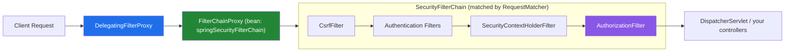

# Spring Security: Authentication & Authorization in Depth

Almost every Spring Boot service eventually needs to answer two questions: *who is this?* (authentication) and *what are they allowed to do?* (authorization). [**Spring Security**](https://spring.io/projects/spring-security) is the de-facto standard answer for the JVM — it covers form login, HTTP Basic, OAuth2/OIDC, SAML 2.0, LDAP, CAS, X.509, passkeys, and plain JWT bearer tokens behind one consistent model, plus baked-in protection against CSRF and common HTTP attacks.

This post walks the architecture from the ground up — the part most tutorials skip — and then builds up runnable examples with **Maven and Java 21**: in-memory login, request- and method-level authorization, password storage, CSRF, and a stateless JWT resource server. If you're new to the framework, the first two sections and Example 1 will get you a working login. If you already ship Spring Security, the "gotchas" callouts throughout are where the real bugs live.

---

## The Architecture: It's Just Servlet Filters

Spring Security doesn't hook into Spring MVC — it sits *in front of* it, as a chain of ordinary `javax.servlet.Filter` instances that run before your `DispatcherServlet` ever sees the request.



- **`DelegatingFilterProxy`** — a plain servlet filter registered with the container that delegates to a Spring bean, bridging the servlet container's lifecycle to the `ApplicationContext`.
- **`FilterChainProxy`** — the actual Spring Security bean the proxy delegates to. It holds a *list* of `SecurityFilterChain`s and picks the first whose `RequestMatcher` matches the incoming request — this is how one app can apply session-based login to `/app/**` and stateless JWT auth to `/api/**` at the same time.
- **`SecurityFilterChain`** — an ordered list of security filters for a matched request. Order matters: exploit-protection filters (CSRF, headers) run first, then authentication filters populate who the user is, then `AuthorizationFilter` decides if they're allowed through.

Two objects carry state through this pipeline:

- **`Authentication`** — holds the principal, credentials, and granted authorities for the current request (or `null` before login).
- **`SecurityContextHolder`** — a holder (thread-local by default) exposing the `SecurityContext`, which wraps the current `Authentication`. Anywhere in your code, `SecurityContextHolder.getContext().getAuthentication()` gets you the logged-in user — no need to thread it through method signatures.

**Gotcha:** because the default `SecurityContextHolder` strategy is thread-local, the context does *not* automatically propagate to `@Async` methods or manually spawned threads — you'd need `SecurityContextHolder.setStrategyName(MODE_INHERITABLETHREADLOCAL)` or to pass the context explicitly.

If a filter throws `AuthenticationException` or `AccessDeniedException`, `ExceptionTranslationFilter` catches it: unauthenticated users get redirected to login (or a 401), authenticated-but-forbidden users get a 403 via `AccessDeniedHandler`.

To see exactly which filters are active in your app, turn on:

```properties
logging.level.org.springframework.security=DEBUG
```

Spring Security prints the full ordered filter list at startup — invaluable when a custom filter behaves unexpectedly, because placement relative to the standard filters (`addFilterBefore`/`addFilterAfter`) is what determines whether it sees an authenticated user yet.

---

## Example 1: A Minimal Login-Protected App

Four pieces: `pom.xml`, a security config, an in-memory user store, and a controller.

### `pom.xml`

```xml
<project xmlns="http://maven.apache.org/POM/4.0.0"
         xmlns:xsi="http://www.w3.org/2001/XMLSchema-instance"
         xsi:schemaLocation="http://maven.apache.org/POM/4.0.0
                             https://maven.apache.org/xsd/maven-4.0.0.xsd">
    <modelVersion>4.0.0</modelVersion>

    <parent>
        <groupId>org.springframework.boot</groupId>
        <artifactId>spring-boot-starter-parent</artifactId>
        <version>3.4.5</version>
        <relativePath/>
    </parent>

    <groupId>com.example</groupId>
    <artifactId>spring-security-demo</artifactId>
    <version>0.0.1-SNAPSHOT</version>

    <properties>
        <java.version>21</java.version>
    </properties>

    <dependencies>
        <dependency>
            <groupId>org.springframework.boot</groupId>
            <artifactId>spring-boot-starter-web</artifactId>
        </dependency>
        <dependency>
            <groupId>org.springframework.boot</groupId>
            <artifactId>spring-boot-starter-security</artifactId>
        </dependency>
    </dependencies>

    <build>
        <plugins>
            <plugin>
                <groupId>org.springframework.boot</groupId>
                <artifactId>spring-boot-maven-plugin</artifactId>
            </plugin>
        </plugins>
    </build>
</project>
```

Adding `spring-boot-starter-security` to the classpath is enough by itself to lock down every endpoint behind a generated login form with a random password printed to the console — that's Spring Boot's auto-configuration giving you a safe default rather than an open-by-accident app. The config below replaces that default with explicit, intentional rules.

### `SecurityConfig.java`

```java
package com.example.config;

import org.springframework.context.annotation.Bean;
import org.springframework.context.annotation.Configuration;
import org.springframework.security.config.annotation.web.builders.HttpSecurity;
import org.springframework.security.config.annotation.web.configuration.EnableWebSecurity;
import org.springframework.security.core.userdetails.User;
import org.springframework.security.core.userdetails.UserDetails;
import org.springframework.security.crypto.bcrypt.BCryptPasswordEncoder;
import org.springframework.security.crypto.password.PasswordEncoder;
import org.springframework.security.provisioning.InMemoryUserDetailsManager;
import org.springframework.security.web.SecurityFilterChain;

@Configuration
@EnableWebSecurity
public class SecurityConfig {

    @Bean
    PasswordEncoder passwordEncoder() {
        return new BCryptPasswordEncoder();
    }

    @Bean
    InMemoryUserDetailsManager userDetailsService(PasswordEncoder encoder) {
        UserDetails user = User.builder()
                .username("user")
                .password(encoder.encode("password"))
                .roles("USER")
                .build();
        UserDetails admin = User.builder()
                .username("admin")
                .password(encoder.encode("admin123"))
                .roles("USER", "ADMIN")
                .build();
        return new InMemoryUserDetailsManager(user, admin);
    }

    @Bean
    SecurityFilterChain filterChain(HttpSecurity http) throws Exception {
        http
            .authorizeHttpRequests(authorize -> authorize
                .requestMatchers("/", "/public/**").permitAll()
                .requestMatchers("/admin/**").hasRole("ADMIN")
                .anyRequest().authenticated()
            )
            .formLogin(form -> form.permitAll())
            .logout(logout -> logout.permitAll());

        return http.build();
    }
}
```

`InMemoryUserDetailsManager` is a `UserDetailsService` that `DaoAuthenticationProvider` calls during login to load a user and compare the submitted password (via the `PasswordEncoder`) against the stored hash. It's fine for demos — swap it for a JDBC- or JPA-backed `UserDetailsService` in production, the rest of the config is unchanged.

**Gotcha — rule ordering:** `authorizeHttpRequests` uses **first-match-wins**, top to bottom. `.anyRequest()` must always be last; putting a specific `requestMatchers("/admin/**")` *after* a catch-all `anyRequest().authenticated()` makes it unreachable. Prefer an explicit allow-list (`anyRequest().denyAll()` at the end) over an implicit `authenticated()` when you want a hard "deny by default" posture.

### A controller to test with

```java
@RestController
class HelloController {

    @GetMapping("/public/hello")
    String hello() {
        return "anyone can see this";
    }

    @GetMapping("/admin/report")
    String report() {
        return "admins only";
    }
}
```

Run it and hit `/admin/report` — Spring Security redirects to `/login`, renders a default login page, and on success redirects back to the originally requested URL (via `RequestCache`, so the user doesn't lose their place).

---

## Method Security: Authorization Closer to the Business Logic

URL-based rules are coarse — great for "is this endpoint public," less great for "can *this* user edit *this* record." `@EnableMethodSecurity` lets you push the decision onto the service method itself, using Spring Expression Language (SpEL):

```java
@Configuration
@EnableMethodSecurity
class MethodSecurityConfig {}
```

```java
@Service
class AccountService {

    // Evaluated BEFORE the method runs — cheapest, fails fast.
    @PreAuthorize("hasRole('ADMIN')")
    public Account close(Long accountId) { ... }

    // Evaluated AFTER the method returns — needed when the decision
    // depends on data you only have once you've loaded it.
    @PostAuthorize("returnObject.owner == authentication.name")
    public Account read(Long accountId) { ... }

    // Filters a collection PARAMETER before the method body runs.
    @PreFilter("filterObject.owner == authentication.name")
    public List<Account> updateAll(List<Account> accounts) { ... }

    // Filters a collection RETURN VALUE after the method runs.
    @PostFilter("filterObject.owner == authentication.name")
    public List<Account> listAll() { ... }
}
```

Four different points in the method's lifecycle, four annotations — worth memorizing the distinction because picking the wrong one has real consequences. **`@PostAuthorize` runs after the method body executes**, including any writes it performed — using it to guard a method that mutates the database means the mutation already happened by the time access is denied. Reserve `@PostAuthorize` for reads where the ownership check genuinely can't happen until data is loaded.

For anything reused across many methods, a role hierarchy avoids repeating boilerplate expressions:

```java
@Bean
static RoleHierarchy roleHierarchy() {
    return RoleHierarchyImpl.fromHierarchy("ROLE_ADMIN > ROLE_USER");
}
```

This makes `hasRole('USER')` checks pass for admins too, without listing both roles everywhere.

Method security and URL security are independent and additive — a request still has to clear `authorizeHttpRequests` to reach the controller at all, and then the service-layer annotation applies a second, finer-grained check. A common pattern is a permissive-looking URL rule (`anyRequest().authenticated()`) with the real business rules expressed entirely as `@PreAuthorize` on services, so authorization logic lives next to the code it protects rather than scattered across a config class.

---

## Password Storage: Never Roll Your Own

If you take one thing from this post: **never store a password as plaintext or with a fast, unsalted hash (MD5/SHA-256 alone).** Those are built for speed, which is exactly the wrong property for password hashing — it makes brute-forcing a leaked database cheap. Spring Security's `PasswordEncoder` abstraction defaults to `BCryptPasswordEncoder`, an adaptive, salted algorithm deliberately slow enough to make offline cracking expensive, with `Argon2PasswordEncoder` as the modern, memory-hard alternative for higher-security needs.

```java
@Bean
PasswordEncoder passwordEncoder() {
    return new BCryptPasswordEncoder(); // work factor 10 by default
}
```

Under the hood, Spring Boot actually wires up a `DelegatingPasswordEncoder`, which prefixes stored hashes with the algorithm used — `{bcrypt}$2a$10$...` — so you can encode new passwords with a stronger algorithm while still validating old hashes stored under a previous one. This is what makes migrating hashing algorithms possible without a forced password reset for every user: old rows keep their `{noop}` or `{sha256}` prefix and still authenticate, while everything freshly encoded gets the current default.

**Gotcha:** `User.withDefaultPasswordEncoder()` and the `{noop}` prefix exist purely for tutorials and quick demos — the former embeds the *encoder*, not a strong hash, into decompiled bytecode, and the latter stores plaintext outright. Neither belongs anywhere near a real user table.

---

## CSRF: Know When You Need It

Cross-Site Request Forgery tricks a browser that's already authenticated (via a session cookie) into submitting a request the user never intended — a malicious page auto-submits a form to `your-bank.com/transfer` and the browser happily attaches the valid session cookie. Spring Security enables CSRF protection by default via `CsrfFilter`, which requires a per-session token to accompany any state-changing request.

```java
// Default — appropriate for server-rendered / session-cookie apps
http.csrf(Customizer.withDefaults());
```

The rule of thumb: **CSRF protection matters exactly when a browser is authenticating you implicitly via a cookie.** A stateless REST API authenticated by a bearer token in the `Authorization` header isn't vulnerable in the same way — there's no ambient credential for a forged cross-origin request to ride along on — so it's standard (and recommended by the docs) to disable it there:

```java
// Appropriate for a stateless JWT/OAuth2 resource server
http.csrf(csrf -> csrf.disable());
```

**Don't disable it reflexively** just because CSRF errors are annoying during development — disabling it on a session-cookie-based app removes real protection. Disable it only once authentication has actually moved to a stateless bearer-token model. For SPAs that still use session cookies, `CookieCsrfTokenRepository.withHttpOnlyFalse()` lets JavaScript read the token and echo it back as a header, which is the supported middle ground.

---

## Stateless APIs: OAuth2 Resource Server with JWT

The stateless equivalent of the login form is validating a bearer token on every request — no server-side session at all. Spring Security's OAuth2 Resource Server support handles JWT verification, signature checking, and expiry for you.

### Dependency

```xml
<dependency>
    <groupId>org.springframework.boot</groupId>
    <artifactId>spring-boot-starter-oauth2-resource-server</artifactId>
</dependency>
```

### `application.yml`

Point at your identity provider's issuer — Spring Security fetches its JWK Set (public keys) automatically and verifies signatures, `exp`/`nbf` timestamps, and the `iss` claim without any of that logic in your code:

```yaml
spring:
  security:
    oauth2:
      resourceserver:
        jwt:
          issuer-uri: https://your-idp.example.com/
```

### Security config

```java
@Bean
SecurityFilterChain apiFilterChain(HttpSecurity http) throws Exception {
    http
        .csrf(csrf -> csrf.disable())            // stateless: no session to forge
        .sessionManagement(sm -> sm
            .sessionCreationPolicy(SessionCreationPolicy.STATELESS))
        .authorizeHttpRequests(authorize -> authorize
            .requestMatchers("/api/public/**").permitAll()
            .anyRequest().authenticated()
        )
        .oauth2ResourceServer(oauth2 -> oauth2.jwt(Customizer.withDefaults()));

    return http.build();
}
```

`SessionCreationPolicy.STATELESS` tells Spring Security never to create or read an `HttpSession` — every request must carry its own proof of identity, which for this filter chain means a valid `Authorization: Bearer <jwt>` header.

By default, JWT scopes become Spring Security authorities prefixed with `SCOPE_`, so you can gate methods on them directly:

```java
@RestController
@RequestMapping("/api/messages")
class MessageController {

    @PreAuthorize("hasAuthority('SCOPE_messages:read')")
    @GetMapping
    List<Message> list(@AuthenticationPrincipal Jwt jwt) {
        return messageService.findFor(jwt.getSubject());
    }
}
```

If your provider puts roles under a custom claim instead of `scope`, remap it once via a `JwtAuthenticationConverter`:

```java
@Bean
JwtAuthenticationConverter jwtAuthenticationConverter() {
    var authorities = new JwtGrantedAuthoritiesConverter();
    authorities.setAuthoritiesClaimName("roles");   // e.g. Keycloak's realm_access.roles
    authorities.setAuthorityPrefix("ROLE_");

    var converter = new JwtAuthenticationConverter();
    converter.setJwtGrantedAuthoritiesConverter(authorities);
    return converter;
}
```

Everything covered above — `authorizeHttpRequests`, `@PreAuthorize`, the filter chain itself — is identical whether the app authenticates via session/form login or via JWT. Only the authentication mechanism and the CSRF/session settings change, which is exactly the separation of concerns the architecture in the first section is designed to give you.

---

## Session-Based vs. Token-Based: Picking a Model

| | Session + Form Login | OAuth2 Resource Server + JWT |
|---|---|---|
| **Server state** | `HttpSession` per user | None — fully stateless |
| **Credential per request** | Session cookie | `Authorization: Bearer <token>` |
| **CSRF exposure** | Yes — enable protection | No ambient credential — typically disabled |
| **Revocation** | Immediate (invalidate session) | Hard — tokens are valid until `exp` unless you add a blocklist |
| **Natural fit** | Server-rendered apps, traditional SPAs on the same domain | Microservices, mobile clients, third-party API access |
| **Horizontal scaling** | Needs sticky sessions or shared session store | Trivial — any instance can verify any token |

Neither is universally "more secure" — they trade off differently, and it's common to run both in the same application via two `SecurityFilterChain` beans matched to different URL patterns, exactly as the `FilterChainProxy` diagram at the top implies.

---

## Where to Go From Here

This post covers the core you'll use in most services. Spring Security's reference docs go considerably further — OAuth2 Login (acting as an OAuth2/OIDC *client*, e.g. "Sign in with Google"), SAML 2.0 for enterprise SSO, LDAP and Active Directory binding, X.509 mutual-TLS authentication, passkeys/WebAuthn, and a full Authorization Server project (Spring Authorization Server) if you need to *issue* tokens rather than just consume them. The architecture stays the same throughout: filters populate an `Authentication`, `SecurityContextHolder` carries it, and `AuthorizationFilter` plus `@PreAuthorize` decide what it's allowed to touch.

---

**References**

- [Spring Security — Project Page](https://spring.io/projects/spring-security)
- [Spring Security Reference Documentation](https://docs.spring.io/spring-security/reference/index.html)
- [Servlet Architecture (Filters, SecurityContextHolder)](https://docs.spring.io/spring-security/reference/servlet/architecture.html)
- [authorizeHttpRequests](https://docs.spring.io/spring-security/reference/servlet/authorization/authorize-http-requests.html)
- [Method Security (@PreAuthorize, @PostAuthorize)](https://docs.spring.io/spring-security/reference/servlet/authorization/method-security.html)
- [Password Storage (PasswordEncoder, DelegatingPasswordEncoder)](https://docs.spring.io/spring-security/reference/servlet/authentication/passwords/password-encoder.html)
- [CSRF Protection](https://docs.spring.io/spring-security/reference/servlet/exploits/csrf.html)
- [OAuth2 Resource Server — JWT](https://docs.spring.io/spring-security/reference/servlet/oauth2/resource-server/jwt.html)
