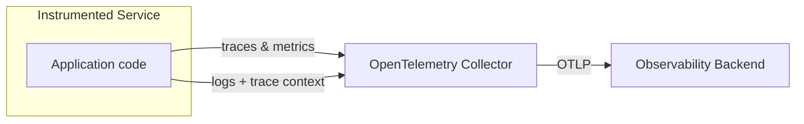
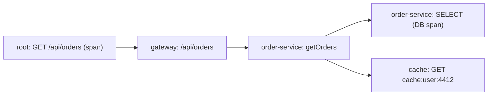
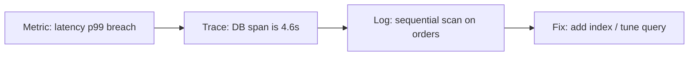

# The Three Pillars of Observability: Logs, Metrics, and Distributed Tracing

Your service just slowed down. Not "a bit" — the 99th percentile response time tripled over twenty minutes, and only a handful of users are affected. If your only tool is a dashboard of CPU averages, you're staring at a wall. If you have logs, you can find *what* happened. If you have metrics, you can see *when* the trend started. If you have distributed tracing, you can follow the exact request from the gateway, through three microservices, to the PostgreSQL query that suddenly got a sequential scan — and know in minutes why the p95 exploded.

That's observability. The OpenTelemetry observability primer defines it precisely: *"Observability lets you understand a system from the outside by letting you ask questions about that system without knowing its inner workings"* — and, crucially, it lets you investigate **unknown unknowns**, not just the failure modes you pre-anticipated.

Observability is conventionally built from three pillars: **logs**, **metrics**, and **distributed traces**. This post walks through each one — its purpose, its strengths and blind spots, its standards — and shows concrete Java/Spring Boot examples for each. We'll also cover the concepts that bind them together (golden signals, SLI/SLO, RED/USE, correlation) and the modern standards that finally make the three pillars interoperate.



---

## The Three Pillars at a Glance

| | **Logs** | **Metrics** | **Traces** |
|---|---|---|---|
| **Primary question** | What happened? | Was the system healthy over time? | Where did one request spend its time? |
| **Granularity** | One record per event | Aggregated numbers over time | One span per operation, tree per request |
| **Volume** | Highest (can be TB/day) | Low, fixed cost | Medium; bounded by sampling |
| **Cost to store** | Expensive per event | Cheap, pre-aggregated | Moderate |
| **Best for** | Debugging, forensics, audit trails | Alerting, dashboards, capacity, trends | Root-causing latency across services |
| **Blind spot** | No structure, hard to aggregate | No per-request detail | Only works if propagated |
| **Standards** | OTel Logs Data Model, RFC 5424 (Syslog), JSON | Prometheus/OpenMetrics, OTel Metrics | W3C Trace Context, OTel, B3 |

Google SRE famously observed that for alerting, "monitoring" is about symptoms, not causes — and each pillar answers a different half of that equation. Metrics and traces tell you *what's broken and why*; logs tell you the *specific detail* of what broke.

---

## Pillar 1 — Logs: The Forensic Record

### What they are

A **log** is a timestamped record of an event emitted by a service. Logs are the oldest and most voluminous form of telemetry — present in essentially every runtime since the beginning of computing. They are *records of what happened*, and they don't need to be tied to a specific user request or transaction.

### The core problem: structure and volume

Historically, logs were free-form text — grep-able, but impossible to aggregate reliably. The modern shift, codified in the **OpenTelemetry Logs Data Model**, is toward **structured logs**: every record is a `LogRecord` with defined fields — `timestamp`, `severity`, `body`, `attributes` (typed key/value metadata), and a `Resource` describing where it came from (host, container, pod, service, version).

OpenTelemetry is explicit that logs have "the biggest legacy" of all three signals, so unlike traces and metrics (clean-sheet designs), OTel's philosophy for logs is to *embrace* existing logging libraries (Logback, Log4j 2, java.util.logging in the Java world) and bridge them into the unified data model via **log appenders**, rather than replacing them.

### Structured logging in Spring Boot

Spring Boot 3.x ships with Logback by default. A structured (JSON) log line for a sensible "order placed" event looks like this:

```json
{
  "timestamp": "2026-08-21T10:15:30.123Z",
  "level": "INFO",
  "logger": "com.example.orders.service.OrderService",
  "message": "Order placed",
  "traceId": "4bf92f3577b34da6a3ce929d0e0e4736",
  "spanId": "00f067aa0ba902b7",
  "attributes": {
    "order.id": "ORD-7391",
    "customer.id": "CUST-4412",
    "items.count": 3,
    "total.cents": 12999
  }
}
```

The critical fields are `traceId` and `spanId`. OpenTelemetry calls this **log correlation by execution context** — if logs carry the same trace context as traces, you can jump from a suspicious log line straight into the full trace, and vice versa.

In Spring Boot, you enrich logs with trace context by adding the Micrometer Tracing bridge:

```xml
<dependency>
  <groupId>io.micrometer</groupId>
  <artifactId>micrometer-tracing-bridge-otel</artifactId>
</dependency>
<dependency>
  <groupId>io.opentelemetry</groupId>
  <artifactId>opentelemetry-exporter-otlp</artifactId>
</dependency>
```

and configuring a pattern that includes trace/span IDs in your `logback-spring.xml`:

```xml
<appender name="JSON" class="ch.qos.logback.core.ConsoleAppender">
  <encoder class="net.logstash.logback.encoder.LogstashEncoder">
    <includeMdc>true</includeMdc>
    <customFields>{"service":"order-service"}</customFields>
  </encoder>
</appender>
```

The `micrometer-tracing` auto-configuration puts `traceId` and `spanId` into the MDC (Mapped Diagnostic Context), so every log line emitted *inside* an active trace automatically inherits the IDs.

### When logs save you

Logs are your only pillar that tells you the *specifics* — the exact error message, the malformed payload, the stack trace, the request parameters, the PCI-relevant audit event. When a customer reports "I couldn't check out at 14:32", logs are the pillar that shows you *their* order attempt, not just aggregate counts.

### Deep cut: Log4j severity vs. OTel severity

The Java logging world uses **severity levels** (TRACE, DEBUG, INFO, WARN, ERROR, FATAL) as *emission* levels chosen at development time. OpenTelemetry defines a numeric **SeverityNumber** (1–24) precisely so that different conventions can be mapped into one canonical scale — e.g. Logback's WARN maps to OTel's WARN (13), and vendor filters can slice by numeric range instead of matching string names. This is the "language of the backend" that makes multi-language fleets coherent.

**Pitfall:** logs without correlation context are nearly useless in a distributed system. A million "Connection refused" lines from 40 replicas tell you nothing about which user-facing request suffered. Always correlate — by trace context, then by resource context.

---

## Pillar 2 — Metrics: The Aggregated Health Check

### What they are

**Metrics** are numbers aggregated over a time window — request rates, error ratios, latency distributions, CPU saturation, queue depths. Their defining trait is that they're **cheap**: you store the aggregation, not every event. A histogram of request latencies with a handful of buckets replaces millions of individual measurements.

OpenTelemetry's primer: *"Metrics are aggregations over a period of time of numeric data about your infrastructure or application."* Their job is **reliability** — answering "is the service doing what users expect, on time, without errors?"

### The exposition standards

Three related standards dominate:

- **Prometheus** (CNCF, from SoundCloud's monitoring system) defined the pull-based exposition format (`/metrics` endpoint scraped by a server) and a text format with four metric types: **Counter** (only increases), **Gauge** (can go up and down), **Histogram** (bucketed counts), and **Summary** (client-side quantiles).
- **OpenMetrics** (also CNCF) evolved the Prometheus text format into a proper standard, adding features like exemplars, typed units, and a stable contract.
- **OpenTelemetry Metrics** defines a vendor-neutral API/data model and the **OTLP** protocol, with the OpenTelemetry Collector able to translate between Prometheus exposition and OTLP.

### Golden signals, RED, and USE

Three mental models organize which metrics matter (all estimates; naming per their creators):

**The Four Golden Signals** (Google SRE — *Monitoring Distributed Systems*):
1. **Latency** — time to serve a request. Crucially, track *error* latency separately from *success* latency; a fast 500 is still a failure.
2. **Traffic** — demand on the system (requests/sec, concurrent sessions).
3. **Errors** — rate of requests that fail explicitly (HTTP 5xx), implicitly (200 with wrong content), or by policy (over your latency SLO).
4. **Saturation** — how "full" the service is on its most constrained resource; many systems degrade in performance *before* 100% utilization, so track against a target.

**The RED method** (Tom Wilkie) — a service-centric trio for request-driven systems: **R**ate (requests/sec), **E**rrors (error rate), **D**uration (latency). It's essentially the golden signals distilled for services.

**The USE method** (Brendan Gregg) — a resource-centric trio for *resources* (CPU, memory, disk, network): **U**tilization, **S**aturation, **S**aturation, **E**rrors.

The key SRE lesson about percentiles (from the SRE book): *treat the tail, not the mean*. At 1,000 req/s an average latency of 100 ms can hide 1% of requests taking 5 seconds — and one backend's 99th percentile becomes your frontend's median. Collect **bucketed histograms** (approximately exponential buckets: 0–10ms, 10–30ms, 30–100ms, 100–300ms…), not raw averages.

### Metrics in Spring Boot with Micrometer

Spring Boot 3 uses **Micrometer** as its metrics facade, with Micrometer's own Prometheus registry. Add:

```xml
<dependency>
  <groupId>io.micrometer</groupId>
  <artifactId>micrometer-registry-prometheus</artifactId>
</dependency>
```

and expose the endpoint:

```yaml
management:
  endpoints:
    web:
      exposure:
        include: prometheus,health,metrics
```

Now `/actuator/prometheus` serves an OpenMetrics-compatible endpoint with all the auto-instrumented MVC/JPA/HikariCP metrics. But you'll want domain metrics. Here's a counter and a histogram of your own:

```java
import io.micrometer.core.instrument.Counter;
import io.micrometer.core.instrument.Timer;
import io.micrometer.core.instrument.MeterRegistry;

@Service
public class OrderService {

    private final Counter ordersCreated;
    private final Timer checkoutDuration;

    public OrderService(MeterRegistry registry) {
        this.ordersCreated = Counter.builder("orders.created.total")
            .description("Total orders placed")
            .tag("region", "eu-west-1")
            .register(registry);
        this.checkoutDuration = Timer.builder("checkout.duration")
            .publishPercentiles(0.5, 0.95, 0.99)   // client-side quantiles for Summary-style
            .publishPercentileHistogram()           // server-side bucketed histogram
            .register(registry);
    }

    public Order checkout(CheckoutRequest request) {
        return checkoutDuration.record(() -> {
            Order order = orderRepository.save(new Order(request));
            ordersCreated.increment();
            return order;
        });
    }
}
```

`.publishPercentileHistogram()` switches Micrometer into producing a bucketed histogram suitable for Prometheus `histogram_quantile()` server-side calculations — precisely the approach the SRE book recommends over storing raw values.

### The golden-signals histogram you should ship first

A good first custom metric is an **HTTP endpoint latency histogram** with the golden-signal labels:

```java
@Configuration
public class ObservabilityConfig {
    @Bean
    public MeterRegistryCustomizer<MeterRegistry> coreMetrics() {
        return registry -> registry.config().commonTags(
            "application", "order-service",
            "env", "${ENVIRONMENT:dev}"
        );
    }
}
```

Then in your SLO query for "99% of GETs on /api/orders under 300ms", the value is computed server-side in Prometheus:

```promql
histogram_quantile(
  0.99,
  sum by (le) (rate(http_server_requests_seconds_bucket{
    uri="/api/orders", method="GET"
  }[5m]))
)
```

### When metrics save you

Metrics are your **alerting and trend** pillar. They fire the page the moment the golden signal degrades, catch a slow tail users haven't noticed yet, and reveal growth trends (request volume, DB size, queue depth) hours or days before capacity fails. They're the cheapest thing to keep at high resolution and the first place a good on-call rotation looks.

---

## Pillar 3 — Distributed Tracing: The Request's Life Story

### What it is

**Distributed tracing** records the path of a *single request* as it propagates across services. OpenTelemetry's primer: a **trace** is a tree of **spans**; the first is the *root span* representing the request from start to finish, and children represent each downstream operation (an HTTP call, a DB query, a Redis hop). Each span has a name, start/end times, **attributes** (metadata), and events.



### The standards problem W3C solved

Before 2021, every tracing vendor had its own headers — traces couldn't cross vendor boundaries, and even multi-vendor environments couldn't correlate. The **W3C Trace Context Recommendation** (November 2021) fixed this with two HTTP headers:

- **`traceparent`** — a fixed-format, fast-parseable field carrying:
  ```
  traceparent: 00-0af7651916cd43dd8448eb211c80319c-b7ad6b7169203331-01
  ```
  - `version` (`00`) — 1 byte; `ff` is forbidden
  - `trace-id` — 16 bytes (32 lowercase hex chars), globally unique, random, all-zeros forbidden
  - `parent-id` — 8 bytes (16 hex), the current span
  - `trace-flags` — one defined bit today: the **sampled** flag (right-most bit), a *recommendation* from the caller, not an instruction

- **`tracestate`** — vendor-specific key/value pairs that travel alongside:
  ```
  tracestate: congo=t61rcWkgMzE,rojo=00f067aa0ba902b7
  ```
  (max 32 list members, keys ≤ 256 chars, values ≤ 256 chars)

A deep, W3C-mandated subtlety is the **sampled flag is advisory**. The spec explicitly says the trailer "has no restriction on its mutations" and lists trust/abuse, caller bugs, and load differences as reasons a callee may decide *not* to record even when told to sample. And note the security consideration — a malicious caller setting `sampled` on every request can run up your tracing bill or forge trace-id collisions (a **denial-of-monitoring** attack). This is why you rate-limit recording and restart traces at trust boundaries.

### Instrumenting Spring Boot with Micrometer Tracing

Spring Boot 3.2+ has tracing built in via `micrometer-tracing` + `micrometer-tracing-bridge-otel`. Add the OTLP exporter and it auto-propagates W3C Trace Context on all HTTP and DB (via the JPA/rest client instrumentation) hops:

```xml
<dependency>
  <groupId>io.micrometer</groupId>
  <artifactId>micrometer-tracing-bridge-otel</artifactId>
</dependency>
<dependency>
  <groupId>io.opentelemetry</groupId>
  <artifactId>opentelemetry-exporter-otlp</artifactId>
</dependency>
```

```yaml
management:
  tracing:
    sampling:
      probability: 0.1        # keep 10% of traces by default
  otlp:
    tracing:
      endpoint: http://otel-collector:4318/v1/traces
```

To add your own span and attributes:

```java
import io.micrometer.tracing.Span;
import io.micrometer.tracing.Tracer;

@Service
public class PaymentService {

    private final Tracer tracer;

    public PaymentResult charge(Order order) {
        Span span = tracer.nextSpan().name("payment.authorize").start();
        try (Tracer.SpanInScope ws = tracer.withSpan(span)) {
            span.tag("order.id", order.getId());
            span.tag("amount.cents", String.valueOf(order.getTotalCents()));
            // ... call the PSP
            return new PaymentResult(true);
        } finally {
            span.end();
        }
    }
}
```

### Deep cut: sampling strategies

Tracing is where volume control lives, because a full trace at 20k req/s is prohibitive. Common strategies (all acceptable under W3C; OTel supports them in the SDK):

- **Head-based (probability) sampling** — decide at the root span. Simple, but you may drop the one slow trace that matters... and a slow request has a longer duration window, so the tail is systematically under-sampled.
- **Tail sampling** — buffer spans, decide per complete trace at the collector. OTel's `tail_sampling` processor keeps traces that are slow, errored, or "interesting", while dropping the healthy majority. This is the strategy that rescues the "1% of requests take 5s" scenario.

### When traces save you

Traces are your **root-cause for latency across service boundaries** tool. Where metrics tell you *which* service spiked and logs tell you *what* it printed, a trace shows you *the exact waterfall* — "the gateway call spent 4.9s waiting on order-service, which spent 4.6s on a single SELECT that only scans a few rows when it should hit the index." That single fact collapses hours of forensics into minutes.

---

## The Fourth "Pillar": Correlation (and why the three are *insufficient* alone)

Increasingly, practitioners argue the three pillars are a useful *starting taxonomy*, not a complete definition. Two points matter:

1. **Correlation is the real product.** The value of tracing explodes when logs and metrics carry the same trace/resource context. OpenTelemetry's design goal is *exactly* this — a unified data model and one Collector where `k8sattributesprocessor` stamps the *same* pod/host attributes onto all three signals, so you can pivot from a metric spike → its offending trace → the specific log lines inside that span. Without correlation, three pillars are three silos.

2. **Emerging "fourth pillars."** High-cardinality event streams (e.g. ClickHouse-based analytics on individual events, "eBPF" for kernel-level observability, and profiling) are sometimes proposed as a fourth pillar. The core idea stands regardless: you need both *aggregates* (metrics) and *individual records* (logs/traces/events), plus the context to join them.

A strong team's incident workflow looks like this:

| Step | Pillar | Action |
|---|---|---|
| **1. Detect** | Metrics | Golden signal alert fires (latency p99 breach) |
| **2. Locate** | Metrics + traces | p99 histogram identifies `order-service`; trace waterfall shows DB span slow |
| **3. Diagnose** | Traces + logs | Trace links to the slow SQL span; correlated logs show the exact query + row count |
| **4. Confirm/fix** | Logs | Exception illustrates a missing index / changed plan; fix and redeploy |



---

## Standards Quick Reference

| Standard | Body | Applies to | Notes |
|---|---|---|---|
| W3C Trace Context | W3C | Trace propagation | `traceparent`/`tracestate`, REC Nov 2021 |
| OpenTelemetry (OTLP, SDK, SemConv) | CNCF | Traces, metrics, logs | Vendor-neutral standard + Collector |
| Prometheus exposition format | CNCF | Metrics | `Counter/Gauge/Histogram/Summary`, pull-based |
| OpenMetrics | CNCF | Metrics | Standardized, typed evolution of Prometheus text |
| OpenTelemetry Logs Data Model | CNCF | Logs | `LogRecord`, severity numbers, Resource context |
| RFC 5424 | IETF | Logs | Syslog message format (RFC 3164 legacy) |
| Micrometer / Micrometer Tracing | VMware/Spring | Java metrics & traces | Facade over Prometheus/OTel in Spring Boot 3 |
| RFC 2119/8174 | IETF | All specs | `MUST`/`SHOULD` semantics used by W3C/OTel |

---

## Choosing Pragmatically (Spring Boot, Today)

If you're starting from scratch on a Spring Boot 3 service in 2026, the highest-leverage path:

1. **Logs:** structured JSON via LogstashLogbackEncoder, add trace IDs via Micrometer Tracing, ship to a log backend.
2. **Metrics:** add `micrometer-registry-prometheus`, expose `/actuator/prometheus`, ship the **four golden signals** per endpoint (latency histogram + request rate + error rate + saturation), and build a `histogram_quantile`-based SLO like the 300ms example above.
3. **Traces:** add the OTel bridge + OTLP exporter, set head-based sampling at ~10%, and add tail sampling at the collector so slow/errored traces are always kept.
4. **Collect:** point your OTLP metrics/logs/traces at an OpenTelemetry Collector so all three signals get identical resource labels — that shared context is what turns three silos into actual observability.

---

## Takeaway

The three pillars aren't a competition; they're complementary *frequencies* of the same signal. Metrics tell you the system is sick. Tracing tells you which request and which service is responsible. Logs tell you the exact words the code printed in that moment. Built on modern standards — W3C Trace Context for propagation, OpenTelemetry for a unified data model, and Prometheus/OpenMetrics for aggregates — they stop being three backends and become one correlated picture. Ship all three with a shared context, and your on-call's first question after an alert stops being *"where do we even start?"* and becomes *"what did the trace show?"*

That's the difference between monitoring and observability — and it starts with how you instrument, not with which vendor you buy.

## References

- [OpenTelemetry: What is OpenTelemetry?](https://opentelemetry.io/docs/what-is-opentelemetry/)
- [OpenTelemetry Observability Primer](https://opentelemetry.io/docs/concepts/observability-primer/)
- [OpenTelemetry Logs Specification & Data Model](https://opentelemetry.io/docs/specs/otel/logs/data-model/)
- [W3C Trace Context — Recommendation, November 2021](https://www.w3.org/TR/trace-context/)
- [Google SRE Book, Ch. 6: Monitoring Distributed Systems (The Four Golden Signals)](https://sre.google/sre-book/monitoring-distributed-systems/)
- [SRE Workbook, Ch. 2-4: SLIs and SLOs](https://sre.google/workbook/slo-documentation/)
- [Tom Wilkie: The RED Method: How to Instrument Your Services](https://grafana.com/blog/2018/08/02/the-red-method-how-to-instrument-your-services/)
- [Brendan Gregg: The USE Method](https://www.brendangregg.com/usemethod.html)
- [Prometheus: Exposition Formats / Metric Types](https://prometheus.io/docs/concepts/metric_types/)
- [OpenMetrics Specification](https://github.com/OpenObservability/OpenMetrics/blob/main/specification/OpenMetrics.md)
- [Micrometer Documentation](https://micrometer.io/docs)
- [Spring Boot Reference: Metrics & Tracing](https://docs.spring.io/spring-boot/reference/actuator/metrics.html)
- [Spring Boot Reference: Micrometer Tracing](https://docs.spring.io/spring-boot/reference/actuator/tracing.html)
- [OpenTelemetry Collector: Tail Sampling Processor](https://github.com/open-telemetry/opentelemetry-collector-contrib/blob/main/processor/tailsamplingprocessor/README.md)
- [RFC 5424: The Syslog Protocol](https://www.rfc-editor.org/rfc/rfc5424)
