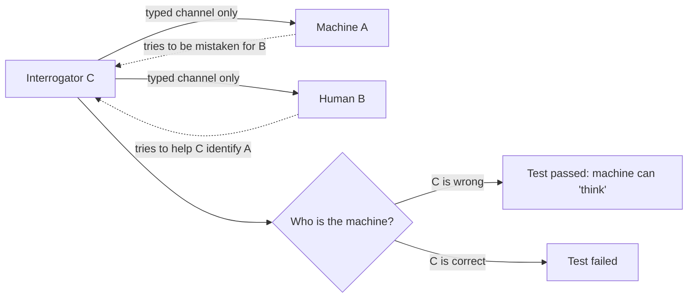

# Fooling the Judge: The Turing Test from 1950 to the Post-Quantum Age

Everyone knows the slogan: put a machine behind a curtain, chat with it, and if you cannot tell it apart from a human it "thinks." The test Alan Turing actually proposed in 1950 is stranger and more consequential — a philosophical argument, a cryptographic-style protocol, a benchmark, and a prediction about a computer with 10⁹ units of storage. In 2026 it has come full circle: LLMs are now judged "human" more often than real humans, the same test runs behind every CAPTCHA you have solved, and AI systems are attacking the lattices on which post-quantum cryptography is built.

This post reconstructs the test from primary sources, then follows it through four disciplines Turing himself straddled: **computation** (the 1936 machinery of decidability), **AI** (ELIZA to GPT-4.5), **cryptography** (Enigma, CAPTCHAs, adversarial ML), and **post-quantum security** (FIPS 203–205, the AI-discovered break of HAWK). Beginner fundamentals and expert detail are interleaved, with primary-source citations throughout.

---

## 1. The Man Who Built the Question

Alan Turing (1912–1954) is one of the very few figures in computing who shaped three of the things this blog keeps returning to — the theory of computation, artificial intelligence, and cryptanalysis. He co-founded the first (with Church and Gödel), pioneered the second, and helped shorten a world war with the third.

### 1.1 The 1936 engine: algorithms and the limits of computation

Before the imitation game there was "On Computable Numbers, with an Application to the *Entscheidungsproblem*" (*Proc. London Math. Soc.*, Series 2, vol. 42, 1936–37, pp. 230–265), in which Turing defined the **Turing machine** — an abstract device reading and writing symbols on an infinite tape according to a finite table of rules. Three results from that paper underwrite everything in this post:

- **Universality.** There exists a single **universal Turing machine** that can simulate any other Turing machine from an encoded description. One fixed piece of hardware can run every algorithm (SEP, *Turing Machines*).
- **The halting problem.** No Turing machine can decide, for every program and input, whether that program will eventually halt. Combined with the universal machine, this shows the *Entscheidungsproblem* — Hilbert's demand for a general decision procedure for mathematics — is unsolvable.
- **The Church–Turing thesis.** A function is "effectively calculable" if and only if it is computable by a Turing machine. This is the philosophical hinge: Turing's machines were intended to capture *every mechanically realizable computation*, and everything a computer — or a brain simulating computation — can do falls inside that boundary.

What matters for the Turing Test is the **universal machine**: Turing's 1950 test is meaningful only because one digital computer can be programmed to imitate *any other discrete-state machine, including a human being's conversational behavior as captured by a finite digital transcript*. Turing leaned on this directly in section 4 of the 1950 paper ("The problem is mainly one of programming").

> Expert note: because the test runs over a finite, discrete channel, anything describable as a function from message history to reply is — by the Church–Turing thesis — implementable on a digital computer. The test is not about typing: it asks whether *any* finite-state process can imitate the behavior.

### 1.2 The cryptanalyst: Hut 8 and the Bombe

Between 1939 and 1943 Turing led Hut 8 at Bletchley Park — the Government Code and Cypher School, forerunner of GCHQ — attacking the German **naval Enigma**. With Gordon Welchman he designed the **Bombe**, which searched rotor settings via known-plaintext cribs, and developed **Banburismus**, an early statistical scoring method. GCHQ records that the Bombe "made a major contribution to the exploitation of Enigma"; the resulting ULTRA intelligence materially shortened the war (IWM, CIA).

Why the cryptography matters — three threads for later:

1. Turing was at home with **statistical inference under adversarial conditions** — exactly the interrogator's mindset.
2. He treats the test as a *protocol*: two parties, one channel, uncertainty about identity — a cryptographic framing fifty years ahead of its time.
3. His 1936 "oracle machines" (Turing 1939) — devices that consult an external black-box oracle — prefigure adversarial access to unverifiable functions, from oracle-based cryptanalysis to the AI-assisted attacks in Section 8.

After the war he designed the ACE at the National Physical Laboratory and worked on the Manchester computers; the ACM's A.M. Turing Award — "the Nobel Prize of Computing" — carries his name.

> **Beginner primer.** The Turing machine is the *definition* of "computable": your Python program, a neural network's forward pass, a robot's control loop — all are Turing machines. The halting problem proves that some well-defined questions have no algorithmic answer. Turing defined the *limits* of computing at its birth.

---

## 2. The Imitation Game: What Turing Actually Proposed

Turing published "Computing Machinery and Intelligence" in *Mind*, Vol. LIX, No. 236, October 1950, pp. 433–460 — the single most cited paper in the philosophy of artificial intelligence (SEP, *Alan Turing*). It opens with a deflation:

> "I propose to consider the question, 'Can machines think?'"

and immediately explains why the question as posed is "too meaningless to deserve discussion" (Turing 1950, p. 442): the words "machine" and "think" are too ambiguous. Rather than argue words, Turing replaces the question with a game — **the imitation game** — which he first introduces as a parlor game between a *man* and a *woman*, then re-construes with the machine replacing the man.

### 2.1 The original three-party game

Per the Stanford Encyclopedia of Philosophy (SEP, *The Turing Test*, §1), the game Turing describes runs like this:

- **Player A** — in the original parlor game, a man; in the machine game, a digital computer.
- **Player B** — originally a woman; in the machine game, a human.
- **Player C** — the **interrogator**, isolated in a separate room, communicating with A and B *only through typed text*.

C's task: determine which of A and B is the man/woman (or, in the machine version, which is the machine). A's task is to be *mistaken for B*; B's task is to *assist C* in correctly identifying A (and to be human convincingly enough that C does not misidentify B as the machine).

The channel is deliberately impoverished — text only, so the machine is not penalized for lacking a voice or body (Turing 1950, §5). The game is **unrestricted**: the interrogator may converse on "almost any subject" (p. 435; OECS).



### 2.2 Turing's prediction — the 10⁹ / 5-minute / 70% spec

The test comes with an explicit, falsifiable forecast (Turing 1950, p. 442):

> "I believe that in about fifty years' time it will be possible to programme computers, with a storage capacity of about 10⁹, to make them play the imitation game so well that an average interrogator will not have more than **70 per cent chance** of making the right identification after **five minutes** of questioning."

Note the careful wording: an *average* interrogator (not a hand-picked skeptic), misidentification at least 30% of the time, and a 10⁹-unit storage bound (a billion units seemed vast in 1950). The SEP notes the prediction was widely regarded as *not* met around 2000. As Section 6 shows, 2024–2026 studies finally approached — and with persona prompting, exceeded — the numeric target, with serious caveats.

### 2.3 What the test claims — and what it deliberately refuses to claim

Three properties are often conflated; keeping them apart is the most expert-level insight here:

- **Operational, not definitional.** Turing never says passing means the machine has a mind — the question of whether a machine "thinks" was, he argued, "too meaningless to deserve discussion." He replaced it with one observable question: can machines play this game *well*? (SEP)
- **Sufficient, not necessary.** If a machine plays well, Turing says we should not withhold the word "thinking" — but a machine that *fails* may still think: it could be too slow, too machine-like in style, or simply unlucky with its judge (OECS).
- **Anti-speciesist by design.** The text-only hidden identity deliberately refuses to privilege human physiology, appearance, or voice — Turing explicitly warned about our "presuppositions and chauvinism" (SEP).

> **Beginner primer.** Think of the test the way QC checks software: we cannot see inside a colleague's head, so we judge by observable behavior. The Turing Test is the same move applied to machines. The catch — every criticism in Section 5 — is that "convincing a judge you are human" and "being intelligent" are not obviously the same property.

---

## 3. The Algorithmic Heart: Discrete State Machines, Learning Machines, and Limits

Turing did not stop at proposing a game — in the same paper he argued *why* a digital computer could in principle play it, and *how* one might be built to do so.

### 3.1 Discrete state machines can imitate continuous processes "as well as we please"

Turing's argument (1950, §4): a human's conversational responses, observed over a finite window through a finite channel, can be modeled as a **discrete state machine** with an enormous but finite state space — and a digital computer can realize *any* discrete state machine. Hence a computer could imitate a human conversation "as well as we please," given enough storage and programming cleverness. That is why the "10⁹" in his prediction is not incidental: state space is the budget out of which imitation is bought.

It is also where the test's most durable *algorithmic* objection comes from: **Ned Block's Blockhead** (1981) — an astronomically large *look-up table* mapping every possible (history, question) pair to a canned answer could pass the test while being "nothing but stored data." Turing's own answer was already in the paper: the learning machine (3.2). A Blockhead is the degenerate endpoint of "just store everything"; Turing's proposal *learns* instead of memorizing.

### 3.2 The "child machine": Turing's blueprint for machine learning

In Section 7 — "Learning machines" — Turing presages modern ML:

> "Instead of trying to produce a programme to simulate the adult mind, why not rather try to produce one which simulates the child's?"

Build a machine trained by **"reward and punishment"** (reinforcement learning), starting child-like and undergoing "education" until it reaches adult competence — with behavior modified by its own past behavior, an early intuition of both weight-updated neural networks and evolutionary algorithms. The radical claim: *intelligence is a program that can be mutated by a program run against the data of its own mistakes*.

That is the bridge from 1950 to the 2020s: **GPT-4.5 is a learning machine in exactly Turing's sense**, and the "persona prompting" tricks in Section 6 are effectively the *reward-and-punishment* channel he described.

### 3.3 What no amount of cleverness buys you: undecidability persists

No matter how much storage or how sophisticated the learning rule, a machine playing the imitation game is still a Turing machine:

- The **halting problem** remains undecidable for it — no diagnostic can decide in general whether a conversational AI will get stuck forever on some input.
- **Gödelian limits** apply to its own formal description. Turing's reply (1950, §5.3): the same limits apply to *any* formal system, including our models of human reasoning (the later Lucas–Penrose argument tries to make the objection stick to humans specifically).
- Even a **quantum Turing machine** does not escape: quantum computation changes *complexity* (Section 8), never *decidability*.

**Takeaway:** the Turing Test lives exactly on the boundary the 1936 paper drew — everything computable is open to imitation *in principle*; everything undecidable stays closed, whatever the substrate (silicon, brain, or qubits).

---

## 4. The Nine Objections: Turing's Trial by Fire

Section 6 of the 1950 paper enumerates **nine objections** with a rebuttal to each. The SEP calls the replies "protracted and complex" — not all decisive — so the table records both sides.

| # | Objection | Turing's reply (1950) | Verdict in 2026 |
|---|---|---|---|
| 1 | **Theological**: "thought is a property of an immortal soul; machines have no soul." | Only "most serious" if you accept the premise; the test is compatible with God giving souls to machines that behave like humans. | Largely abandoned in engineering; still live in philosophy of religion. |
| 2 | **Heads in the sand**: the fear of machines seeing us "humbled." | Predicts "thinking machine" will fade into ordinary usage. | Partially vindicated: we speak of "AI models that think/plan." |
| 3 | **Mathematical**: Gödel's limits mean no machine can answer everything humans can. | The Gödelian argument applies to *any* formal system, machine *or* human; a learning machine might develop abilities its designer did not foresee. | Open (Lucas–Penrose continues); historically a narrow escape. |
| 4 | **Argument from consciousness**: a machine can "only feel/understand if it actually feels" (cf. Jefferson). | By this standard we can never verify any *other person* thinks either; only "solipsism" is consistent with it. | The problem of other minds lives on; LLM "qualia" debates are this objection restated. |
| 5 | **Various disabilities**: a machine can never be kind, fall in love, enjoy strawberries. | Behaviorist retorts — plus, cheekily, a machine would be "given away at once by slowness and inaccuracy in arithmetic," so it must *act* mediocre. | Rediscovered 2024–2026: models deliberately miscompute and type typos to seem human (Section 6). |
| 6 | **Lady Lovelace's**: "The Analytical Engine has no pretensions to originate anything. It can do whatever we know how to order it to perform" (quoted by Turing 1950). | A machine can "never do anything really new" — parried with "There is nothing new under the sun." Surprise is an illusion caused by forgetting the human designer is the source of novelty; the learning machine is the real answer. | The classic "AI just does what it's told" complaint; Turing's learning-machine reply is how modern ML answers it. |
| 7 | **Continuity in the nervous system**: the brain is continuous, not a discrete state machine. | A discrete machine can approximate a continuous one "as well as we please" (Section 3.1). | Supported by simulations of nonlinear differential systems, including neural-net training. |
| 8 | **Informality of behaviour**: humans act on insight, not rule-following; no "laws of behaviour" exist. | Burden-shift: "no such laws exist" is precisely the unproved assumption holding back AI; and even if rules exist, the learning machine discovers them. | Modern position of the field; the "laws" are the learned weights. |
| 9 | **Extra-sensory perception**: telepathy would let a human elicitor cheat. | If ESP exists, make the environment "telepathy-proof." | Nobody took this seriously; kept for completeness. |

Turing's coda — the most-quoted sentence in AI philosophy — frames his method:

> "The reader will have anticipated that I have no very convincing arguments of a positive nature to support my views. If I had I should not have taken such pains to point out the fallacies in contrary views."

---

## 5. The Incompleteness Theses: Chinese Rooms and Winograd Schemas

The two most famous attacks on the Turing Test both concede that a machine could earn the label "human-like" while still failing to *understand*. Together they define the modern fault line between **behavior** and **cognition**.

### 5.1 Searle's Chinese Room (1980)

In "Minds, Brains, and Programs" (*Behavioral and Brain Sciences*, 1980), Searle asks you to imagine a person inside a locked room who knows no Chinese. Slips of paper with Chinese characters come in; the occupant looks them up in rule books and passes correct Chinese answers back out. To an outside observer the room *passes the Turing test for Chinese* — yet the person inside understands nothing. Searle's conclusion: "programming a digital computer may make it appear to understand language but could not produce real understanding. Hence the 'Turing Test' is inadequate" (SEP, *Chinese Room*).

The standard replies (all in the SEP entry):

- **The Systems Reply:** the room as a whole — occupant, rule books, furniture — is the "mind" that understands; the occupant is just one CPU in the system.
- **The Robot Reply:** a system that *interacts with the world* through sensors and actuators could acquire the semantics the sealed room lacks.
- **The behaviorist reply (Churchlands):** mentality arises from parallelism in a particular substrate; Searle's argument "exploits our ignorance of cognitive and semantic phenomena."

Why it matters for *cryptography* and *AI safety*: the Chinese Room is the ancestor of the "it's just predicting the next token" critique of LLMs, and it frames the real risk — a system can *imitate* humanity (phishing, disinformation, social engineering at scale) without understanding anything. Behavioral indistinguishability is what a security adversary needs; it is not what a trustworthy agent needs.

### 5.2 Winograd Schemas: a test that resists imitation (Levesque, Davis, Morgenstern, 2012)

Hector Levesque, Ernest Davis, and Leora Morgenstern proposed in 2011–2012 a concrete alternative: the **Winograd Schema Challenge** (KR-2012; named in tribute to Terry Winograd's 1972 SHRDLU). A Winograd schema is a pair of sentences differing in one or two words whose only ambiguity resolves in *opposite* directions and that demand *commonsense knowledge* to resolve:

> "The trophy would not fit in the brown suitcase because **it** was too **big**." → *it* = the trophy.
> "The trophy would not fit in the brown suitcase because **it** was too **small**." → *it* = the suitcase.

The design goals were set explicitly *against* the Turing test's weaknesses: **binary-choice** (objective grading), **obvious to human adults**, **immune to word-association statistics** ("Google-proof"), and requiring *thinking* rather than deception. Levesque's framing was blunt: the Turing test invites a machine to "assume an identity" and dodge; the schema asks a question that cannot be bluffed through.

The instructive irony is that progress eviscerated the challenge as a *live* benchmark: by 2019 fine-tuned RoBERTa reached ~90% on the WSC via corpus statistics alone (Sakaguchi et al., 2019/2020), and transformer LLMs now clear most Winograd-style tests. The lesson: **"commonsense reasoning" benchmarks get absorbed by scaling laws** — what needed a *theory* in 2012 became *statistical regularities* by 2023. That is powerful support for Turing's contention (Section 3.1) that behavioral competence, not mechanism, is what the game is about.

### 5.3 Two more tests inspired by the original

- **The Total Turing Test** (Harnad, 1989): adds *visuospatial* and *motor* channels — the machine must perceive and manipulate the world like a robot.
- **The Inverted Turing Test** (Watt, 1996): a machine *judges* whether something is human. Rathi, Taylor, Bergen & Jones (2024) found AI adjudicators are *worse* at this (~31–36% accuracy) than human interrogators (~65%), and that "displaced" transcripts saw GPT-4 witnesses "pass" 78% of the time versus 58% for humans. When machines grade the test, it is not humans who fail it.

---

## 6. The Test in the Age of LLMs: The Numbers, the Prompts, the Caveats

From ELIZA to GPT-4.5, the empirical record — the rigorous studies and the embarrassments.

### 6.1 The curios: ELIZA, the Loebner Prize, and Eugene Goostman

- **ELIZA (Weizenbaum, 1966)** — the first famous imitation program: pattern-matching rules that rephrased the user's own sentences to simulate a Rogerian therapist. Weizenbaum was shocked that people confided in it — the first proof that *judge credulity*, not machine intelligence, drives fooling rates. In modern two-player tests ELIZA still fools ~22–23% of judges (Jones & Bergen, 2024), a useful baseline that proves the test has signal.
- **The Loebner Prize (1991–2019/20)** — public contest offering $100,000 for passing an unrestricted test; the grand prize was never claimed. Shieber's post-mortem (*Lessons from a Restricted Turing Test*, 1994) showed that restriction and judge selection turn the contest into a "show," not a measurement. In the 1991 first round a human confederate — a Shakespeare expert — was misclassified *as a machine*, since "no human would have that amount of knowledge."
- **Eugene Goostman (2014)** — a chatbot posing as a 13-year-old Ukrainian boy with "English as a second language," announced by the University of Reading as "passing" after 33% of judges were fooled in five-minute chats at the Royal Society. Criticisms were immediate and fair: no blind control, the persona excused every grammar error, and the strategy was evasion. A 33% result on a self-selected panel is not Turing's 70%-of-an-average-interrogator criterion.

### 6.2 A note on test architecture: two-player vs. three-party

Turing's original is **three-party** (interrogator + machine + human witness). Most modern replications use a simpler **two-player** variant — one interrogator versus a single hidden human-or-machine. Legitimate and standard (Saygin et al., 2000), but strictly *easier* for the machine: no human confederate assists the interrogator, and the implied 50% baseline is not Turing's game. Several results below therefore understate the original's difficulty.

### 6.3 "Human or Not?" — the largest Turing-style experiment ever run (2023)

AI21 Labs ran the largest Turing-style experiment to date (Jannai et al., arXiv 2305.20010): **1.5M+ users** in two-minute anonymous chats with either a human or an LLM (GPT-4, Jurassic-2, Cohere) prompted to act human.

- Overall correct identification: **68%** — eerily close to Turing's 70% target, though he specified five minutes and unrestricted chat.
- **Machine** partners fooled judges **60%** of the time — "not much higher than chance" (arXiv abstract); **human** partners were correctly identified **73%** of the time.

Judges leaned on honest signals the bots faked: humans typed typos, used slang, were rude, refused questions; "politeness and perfect spelling" was a *bot tell*. That is the deception arms race Turing foreshadowed in 1950 with his advice to "give the wrong arithmetic answers."

### 6.4 Rigorous preregistered studies: GPT-4, GPT-4.5, LLaMa (2024–2026)

Cameron Jones and Benjamin Bergen (UC San Diego) ran the first randomized, controlled, preregistered two-player Turing tests:

- **2024** (NAACL / arXiv 2405.08007): GPT-4 passed **~50–54%** of games (best prompt; 95% credible interval spanning chance) versus a **67%** human baseline; ELIZA scored ~22%. The pre-registered criterion — indistinguishable from chance *given the test reliably catches ELIZA* — was met: **GPT-4 passed this version of the test**, yet remained short of human parity. Judges decided mainly on *linguistic style* (~35%) and *socio-emotional traits* (~27%): per the authors, "intelligence, narrowly conceived, is not sufficient to pass the Turing test."
- **2026** (PNAS; UCSD press release): testing **GPT-4.5** and **LLaMa-3.1-405B** with explicit "persona" prompting — be direct, humorous, fallible, slangy; Turing's *wrong-answer* strategy:
  - GPT-4.5 was judged *human* **73%** of the time **with** persona prompting — *above the human baseline* — versus **56%** for LLaMa-3.1.
  - **Without** persona prompting, both collapsed to ~36% (GPT-4.5) and ~38% (LLaMa-3.1) — near ELIZA (~23%) and GPT-4o (~21%) under the same protocol.

The 2026 result is the first *controlled* demonstration of a system passing at above human rates — consistent with Turing's end-of-century prediction, reframed as "machines behave like us when we coach them to."

### 6.5 Homework for the reader: what the numbers do not mean

| System / study | Pass rate | Human baseline | Caveats |
|---|---|---|---|
| ELIZA (1966-style bot) | ~22–23% | 66–67% | Baseline; proof test has signal |
| Eugene Goostman (2014, claimed) | ~33% | n/a | Not blind; persona-driven evasion |
| "Human or Not?" aggregate (2023) | bots fool 60% of judges | 73% on humans | 2-minute chats; gamified |
| GPT-4, Jones & Bergen 2024 | ~50–54% | ~67% | Preregistered, two-player |
| GPT-4.5 + persona, 2026 PNAS | **73%** | human witnesses also ran; GPT-4.5 exceeded them | Persona prompting is required; without it → ~36% |

The blunt conclusion from Section 6.4: **modern LLMs pass the numeric Turing test — but only when the machine is explicitly instructed to imitate human fallibility.** Presented as "just answer honestly," a GPT-class model is far *easier* to catch than a human. This is the single most important practical insight for anyone deploying AI-facing systems in 2026: **the human-likeness of an LLM is a prompt parameter, not an emergent invariant.**

---

## 7. The Reverse Turing Test: CAPTCHA — Where the Test Became Cryptography

The test's most successful practical deployment is invisible to almost everyone who uses it: the **CAPTCHA** (Completely Automated Public Turing test to tell Computers and Humans Apart), coined in 2000 by von Ahn, Blum, Hopper, and Langford at Carnegie Mellon. The framing from the Eurocrypt 2003 paper (LNCS 2656) is worth quoting, because it is a *formal* Turing test:

> "A CAPTCHA is a program that can generate and grade tests that: (A) most humans can pass, but (B) current computer programs can't pass."

### 7.1 Why it is, and is not, a Turing test

- **It is one:** a machine (the server) administers the test; the "witnesses" are humans and bots. The direction is *reversed* — here the humans are on trial. Blum and von Ahn explicitly called it the *reverse* Turing test.
- **It is cryptographic in spirit:** security rests on a **reduction**. Formally, any program with "high success" over the CAPTCHA can be used to *solve the underlying hard AI problem* (distorted-text reading, image segmentation) — the classic crypto move of reducing security to a hardness assumption. The honest caveat, acknowledged by the authors: that "hard AI problem" is an empirical moving target, not a proven one-way function.

### 7.2 From human-computation to a commercialized evacuation

Von Ahn's follow-up — **reCAPTCHA** (acquired by Google, 2009) — recycled the effort instead of discarding it: words that OCR had already failed on became the challenges, and each human solve was a vote toward digitizing scanned books and newspapers. By 2009 the system was digitizing roughly **2 million books/year** and **13+ million NYT archive articles** through word-by-word human votes (Lemelson–MIT case study).

### 7.3 The 2020s problem: the hard AI problems stopped being hard

The CAPTCHA story is also the story of the Turing test's self-destruction. Every CAPTCHA is a bet that some task is easy for humans and hard for machines. Modern deep learning has collected on virtually every one of those bets:

- **OCR and segmentation** (reading distorted text) — solved by CNNs around 2012–2016; Google retired the classic text CAPTCHAs.
- **Image recognition** ("select all traffic lights") — handled by object detectors and multimodal models.
- The arms-race endpoint is **behavioral/risk-based checks** (reCAPTCHA v3's invisible scoring): no longer adversarial tests at all, but *behavioral biometrics* — mouse-movement, browsing, and IP reputation. Closer to intrusion detection than to the imitation game.

The deeper point: **CAPTCHAs packaged the Turing test as a crypto protocol whose security assumption — an AI-hardness gap — had a shelf life of roughly a decade.** Any scheme whose security rests on "AI cannot do X" is now radioactive, because AI capability moves on hardware-rental schedules, not standards cycles. That is the bridge to Section 9.

---

## 8. Adversarial ML: When the Test's Interrogator Becomes the Adversary

Section 7 showed machines administering the test to humans. Section 8 shows the mirror: **machines being tested by adversaries.** The field of adversarial machine learning exists precisely because "human-like on average" is not "robust against a worst-case input" — the exact gap the imitation game papers over.

### 8.1 Adversarial examples: a machine that "talks human" and still sees what isn't there

In 2014, Szegedy et al. found that deep networks misclassify images modified by *imperceptible* perturbations (arXiv:1412.6572). Goodfellow, Shlens & Szegedy (ICLR 2015) explained it and gave the canonical construction, the **Fast Gradient Sign Method (FGSM)**:

```python
import numpy as np

def fgsm(x: np.ndarray, y_true: int, model,
         eps: float = 0.01) -> np.ndarray:
    """Craft an adversarial example in one gradient step toward y_true."""
    x = (x / 255.0).astype(np.float32)
    grad = model.gradient_of_loss_wrt_input(x, y_true)
    return np.clip(x + eps * np.sign(grad), 0, 1)
```

The crucial properties the original papers established:

- **Transferability** — adversarial examples fool *other* models, enabling **black-box attacks**: build a substitute model, craft inputs against it, deploy against the victim.
- **The linearity explanation** — in high-dimensional models, a perturbation tiny *per dimension* accumulates a large *signed sum*; robustness is a curse of dimensionality.
- **Defenses** — adversarial training, certification, input filtering; each claim is fragile against a better adversary — a textbook arms race (cf. Papernot et al.).

### 8.2 Why this is a Turing-test problem

The imitation game is fundamentally a **deception game played by someone who controls the channel**. Its "security property" is that indistinguishable-on-average behavior suffices. Adversarial ML shows that:

1. **Indistinguishability under a benign query distribution** (Turing's *average* interrogator) is not the same as under a *malicious* one that asks exactly the exposing questions. Turing's word *average* is doing security-critical work: restrict the adversary and the criterion becomes achievable; lift the restriction and it becomes untestable.
2. The crypto mindset — *assume worst-case adversarial input* — is exactly what the imitation game lacks. Robust AI identity checks (authentication, anti-fraud) therefore include **prompt-injection and jailbreak testing** as first-class verification: interrogators who are themselves adversarial AI.

The upshot: **a Turing test used as a security assertion must state an adversary model, a pass criterion, and a channel** — specified like a crypto protocol or unspecified. Turing's looseness ('average interrogator', 'five minutes') is both his gift to science and the reason CAPTCHAs and AI-detectors keep re-specifying it.

---

## 9. Post-Quantum Cryptography: The New Turing Problems

Turing straddled computability and cryptanalysis when both were newborn; the 2020s do the same to us: quantum computing threatens the public-key foundations of the internet, and AI is now both *attacker* and *reviewer* of the cryptography being built to replace it.

### 9.1 The quantum threat in one paragraph

A classical Turing machine is a single computational thread; a **quantum computer** is a genuinely different physical substrate that implements quantum superpositions and interference:

- **Shor's algorithm** factors integers and computes discrete logs in *polynomial* time — directly breaking RSA, Diffie–Hellman, ECDSA, and EdDSA.
- **Grover's algorithm** gives a quadratic speedup on unstructured search — an AES-128 key that classically costs 2¹²⁸ now costs roughly 2⁶⁴ against a large enough quantum machine: *not broken*, but weakened by half.
- Quantum computation changes **complexity**, never **decidability**: a quantum machine is still a Turing machine, so the halting problem and the Gödelian limits of Section 3.3 survive unchanged.

### 9.2 NIST's answer: FIPS 203, 204, 205

After an eight-year international competition, in **August 2024 NIST finalized its first three post-quantum standards** (NIST, PQC project page):

| Standard | Scheme | Family | Purpose |
|---|---|---|---|
| FIPS 203 | **ML-KEM** | Module-LWE lattices | Key establishment (KEM) |
| FIPS 204 | **ML-DSA** | Module-LWE lattices | Digital signatures |
| FIPS 205 | **SLH-DSA** | Hash-based (SPHINCS+) | Signatures (conservative backup) |

Under **NIST IR 8547** the agency will *deprecate and ultimately remove quantum-vulnerable algorithms* (RSA, (EC)DH, ECDSA, EdDSA) from its standards **by 2035**, with high-risk systems transitioning much earlier. Follow-on candidates (FALCON → draft FIPS 206 FN-DSA, and HQC → draft FIPS 207) continue toward standardization.

### 9.3 The 2026 bombshell: AI broke a PQC candidate

On **July 28, 2026**, Anthropic reported that **Claude Mythos Preview** — a multi-agent harness running ~60 hours on ~$100K of compute, directed by a researcher with no lattice-cryptography expertise — had improved the best-known attack on **HAWK**, a lattice signature candidate that had survived two years and two rounds of NIST review:

- It discovered a previously unused **symmetry (a nontrivial automorphism)** in the lattice family, enabling a faster enumeration attack.
- Effective security roughly **halved**: HAWK-256's key-recovery work fell from ~2⁶⁴ to ~2³⁸; HAWK-512's estimated gate count from ~2¹⁵⁰ to ~2¹⁰⁸.
- The next day (**July 29, 2026**) HAWK was **withdrawn** from NIST's standardization process (NIST "Nine Candidates" news; CWI/Leiden).
- NIST was explicit that the finding **does not affect the finalized standards ML-KEM and ML-DSA**, which rest on different mathematical foundations. Anthropic also reported a 200–800× speedup attacking reduced-round (7-round) AES-128 — research, not a practical break. (Context: SIKE was broken on a laptop in about an hour in 2022.)

### 9.4 What the HAWK episode means for the Turing test — three readings

1. **AI is now a cryptanalytic participant.** The game has broadened from human-vs-machine conversation to **machine-vs-machine cryptanalysis**; NIST's stated response — that reviewing proposals like HAWK with AI "will be a powerful tool" for future standards — formalizes AI as a new class of verifier.
2. **Security assumptions are Turing-style bets.** A CAPTCHA bets "AI cannot solve X"; a PQC scheme bets "no efficient adversary can solve Y." Both have a shelf life. HAWK 2026 shows that shelf life is now measured in *years*, not decades — and that the adversary can be an untrained LLM.
3. **The layers interact.** A cryptanalytic AI passing its per-task tests says nothing, per Section 8, about *worst-case* adversaries. The same epistemic discipline that guards identities in the imitation game guards the lattices protecting our handshake.

---

## 10. Where the Test Stands in 2026: A Practical Toolkit

### 10.1 A compact scorecard

| Dimension | Turing Test (1950) | Verdict in 2026 |
|---|---|---|
| What it measures | Behavioral indistinguishability in conversation | Now empirically achievable (Section 6) |
| What it does *not* measure | Understanding, consciousness, grounding, factuality | Confirmed by Section 5 |
| Adversary model | Unspecified ("average interrogator", 5 min) | Must be declared explicitly (Sections 7–8) |
| Relevance to security | Reverse form = CAPTCHA; forward form = bot detection | Still the folk model behind AI-detectors, but overtaken by behavioral biometrics |
| Relevance to algorithms | Lives at the computability boundary (1936) | Undecidability and Gödel limits persist even on quantum substrates |
| Relevance to PQC | N/A in 1950 | Its epistemology now governs how we certify crypto assumptions |
| Weakest link | Fooling rate is judge-dependent; measures deception, not thought | Eugene Goostman, 2014; persona-prompting of GPT-4.5 |
| Strongest use | A controlled, reproducible *communication* and *deception* benchmark | Impersonation risk, social-engineering defense, auditor calibration |

### 10.2 A reproducible evaluator: measuring a pass with statistics, not vibes

A Turing-test "pass" is a **statistical statement about a specific protocol**. Here is a dependency-free evaluator implementing the Wilson score interval, so a "73%" claim comes with an honest confidence interval — the discipline Jones & Bergen subjected GPT-4 to:

```python
from math import sqrt

def wilson_interval(k: int, n: int, z: float = 1.96) -> tuple[float, float]:
    """Two-sided Wilson score interval for a binomial proportion."""
    if n == 0:
        return (0.0, 1.0)
    p = k / n
    denom = 1 + z * z / n
    centre = (p + z * z / (2 * n)) / denom
    half = (z * sqrt(p * (1 - p) / n + z * z / (4 * n * n))) / denom
    return (centre - half, centre + half)


def turing_test_report(pass_results: list[bool],
                       human_baseline: float = 0.67,
                       turing_target: float = 0.70) -> None:
    """Given per-game verdicts (True = interrogator thought machine was human),
    report the pass rate with a confidence interval and decision logic.
    human_baseline: measured human 'pass' rate under the SAME protocol.
    """
    n = len(pass_results)
    k = sum(1 for v in pass_results if v)
    rate = k / n
    lo, hi = wilson_interval(k, n)

    print(f"games            : {n}")
    print(f"machine pass rate: {rate:.1%}  (95% CI {lo:.1%} – {hi:.1%})")

    contains_chance = lo <= 0.5 <= hi
    meets_turing_numeric = rate >= turing_target
    at_human_parity = rate >= human_baseline
    within_ci_of_parity = not (hi < human_baseline)

    verdict = (
        "Indistinguishable from chance (passes a lenient reading of the test), "
        if contains_chance else "Distinguishable from the human witness, "
    )
    if at_human_parity:
        verdict += "and at or above human parity — Turing's challenge exceeded."
    elif within_ci_of_parity:
        verdict += "within statistical reach of human parity."
    else:
        verdict += "clearly below human parity."
    print("verdict:", verdict)
    if not meets_turing_numeric:
        print("note   : numeric result below Turing's 70%/5-min raw target —")
        print("         report the protocol (prompt, duration, channels) with the number.")


# Illustrative: 100 games, machine fooled interrogator 73 times. (2026 GPT-4.5 + persona.)
turing_test_report([True] * 0 + [True] * 73 + [False] * 27)
```

### 10.3 The three rules for anyone building around "human-likeness"

1. **Always report the protocol.** Prompt, duration, channel, judge population, and human baseline are part of the measurement. A pass rate without them is marketing, not science (cf. the 2014 Goostman affair).
2. **Treat human-likeness as a security-relevant property.** If your system authenticates a customer or admits a user, the relevant question is *adversarial robustness of the identity check*, not "can it talk like us" — see Sections 7.3 and 8.2.
3. **Keep the 1936 boundary in mind.** Behavioral imitation can always be pushed further with more compute; undecidability and Gödel limits cannot be pushed at all. Knowing which is which is the whole discipline.

---

## 11. References (primary and authoritative sources)

**Primary papers**
- Turing, A. M. (1950). *Computing Machinery and Intelligence*, Mind, LIX(236), 433–460. [Oxford Academic](https://academic.oup.com/mind/article/LIX/236/433/986238)
- Turing, A. M. (1936–37). *On Computable Numbers, with an Application to the Entscheidungsproblem*, Proc. London Math. Soc., s2-42, 230–265. See [NIST DADS halting-problem entry](https://xlinux.nist.gov/dads/HTML/haltingProblem.html)
- Searle, J. (1980). *Minds, Brains, and Programs*, Behavioral and Brain Sciences 3(3): 417–457. ([SEP: Chinese Room](https://plato.stanford.edu/entries/chinese-room/))
- Levesque, Davis, Morgenstern (2012). *The Winograd Schema Challenge*, KR-2012. ([AAAI/KR PDF](https://cdn.aaai.org/ocs/4492/4492-21843-1-PB.pdf), [NYU archive](https://cs.nyu.edu/~davise/papers/WinogradSchemas/WS.html))
- von Ahn, Blum, Hopper, Langford (2003). *CAPTCHA: Using Hard AI Problems for Security*, EUROCRYPT 2003, LNCS 2656. ([IACR PDF](https://iacr.org/archive/eurocrypt2003/26560294/26560294.pdf))
- Szegedy et al. (2014); Goodfellow, Shlens, Szegedy (2015). *Explaining and Harnessing Adversarial Examples*, ICLR 2015. ([arXiv:1412.6572](https://arxiv.org/abs/1412.6572))
- Weizenbaum, J. (1966). *ELIZA — A Computer Program for the Study of Natural Language Communication*, CACM 9(1).
- Shieber, S. (1994). *Lessons from a Restricted Turing Test*, CACM 37(6).
- Block, N. (1981). *Psychologism and Behaviorism*, The Philosophical Review 90(1) (the "Blockhead" objection).
- Harnad, S. (1989). *Minds, Machines and Searle*, Journal of Experimental & Theoretical AI 1(1) (introduces the Total Turing Test).

**Modern empirical studies**
- Jones, C. R., Bergen, B. K. (2024). *Does GPT-4 pass the Turing test?*, NAACL 2024. ([ACL Anthology](https://aclanthology.org/2024.naacl-long.290/), [arXiv:2405.08007](https://arxiv.org/abs/2405.08007))
- UCSD (2026). *AI Can Seem More Human Than Real Humans in a Classic Turing Test* (PNAS study on GPT-4.5 / LLaMa-3.1). ([UCSD Today](https://today.ucsd.edu/story/ai-can-seem-more-human-than-real-humans-in-a-classic-turing-test-study-finds))
- Rathi, Taylor, Bergen, Jones (2024). *GPT-4 is judged more human than humans in displaced and inverted Turing tests*. ([arXiv:2407.08853](https://arxiv.org/abs/2407.08853))
- Jannai et al., AI21 Labs (2023). *Human or Not? A Gamified Approach to the Turing Test*. ([arXiv:2305.20010](https://arxiv.org/abs/2305.20010), [AI21 results blog](https://www.ai21.com/blog/human-or-not-results))
- Biever, C. (2023). *ChatGPT broke the Turing test — the race is on for new ways to assess AI*, Nature. ([Nature](https://www.nature.com/articles/d41586-023-02361-7))

**Philosophy and reference encyclopedias**
- Stanford Encyclopedia of Philosophy: *The Turing Test* (Oppy & Dowe). ([SEP](https://plato.stanford.edu/entries/turing-test/))
- SEP: *Turing Machines* ([SEP](https://plato.stanford.edu/entries/turing-machine/)); *Alan Turing* ([SEP](https://plato.stanford.edu/entries/turing/)); *The Chinese Room Argument* ([SEP](https://plato.stanford.edu/entries/chinese-room/)).
- MIT Open Encyclopedia of Cognitive Science: *The Turing Test*. ([OECS](https://oecs.mit.edu/pub/uli3iiu9))

**Bletchley Park / cryptography history**
- GCHQ. *Alan Turing* (official profile; Bombe/Hut 8 account). ([GCHQ PDF](https://www.gchq.gov.uk/sites/default/files/2026-08/Alan-Turing.pdf))
- CIA. *The Enigma of Alan Turing*. ([CIA Stories](https://www.cia.gov/stories/story/the-enigma-of-alan-turing))
- Imperial War Museums. *How Alan Turing Cracked the Enigma Code*. ([IWM](https://www.iwm.org.uk/history/second-world-war/intelligence/how-alan-turing-cracked-the-enigma-code))

**Post-quantum & 2026 AI cryptanalysis**
- NIST. *Post-Quantum Cryptography* (FIPS 203/204/205, NIST IR 8547 transition). ([NIST PQC](https://csrc.nist.gov/projects/post-quantum-cryptography), [nist.gov/pqc](https://www.nist.gov/pqc))
- NIST (2026). *Nine Candidates Advance to the Third Round of the Additional Digital Signatures for the PQC Standardization Process* (records HAWK withdrawal, July 29, 2026). ([NIST news](https://www.nist.gov/news-events/news/2026/07/nine-candidates-advance-third-round-additional-digital-signatures-pqc))
- Anthropic (2026). *Discovering cryptographic weaknesses with Claude*. ([Anthropic](https://www.anthropic.com/news/discovering-cryptographic-weaknesses))
- CWI / Leiden University (2026). *AI helps uncover weakness in cryptographic method*. ([CWI news](https://www.cwi.nl/en/news/ai-helps-uncover-weakness-in-cryptographic-method-of-amsterdamleiden-researchers))

**Postscript.** The Turing test survives because it is not one thing: a computability argument, a behavioral-epistemology criterion, a cryptographic protocol, and a prediction — all from a single 1950 paper by a man who had already helped found the theory of computation and just broken the era's most important cipher. It is the history of asking machines a question the questioner could not define. As long as it stays undefined, the test will keep being beaten — and keep being worth taking.