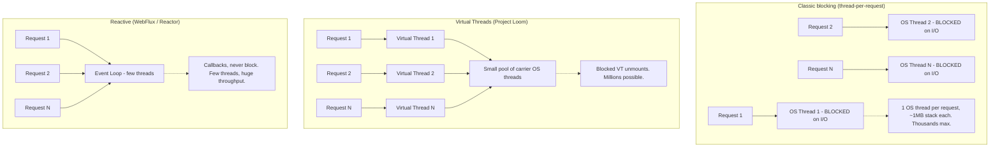
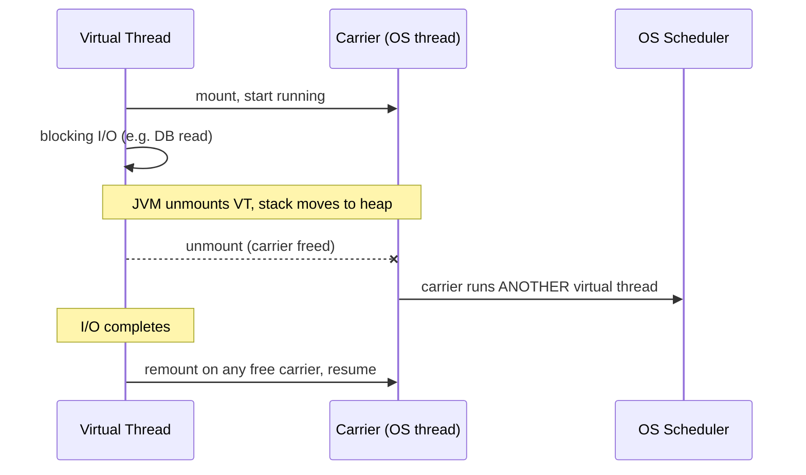
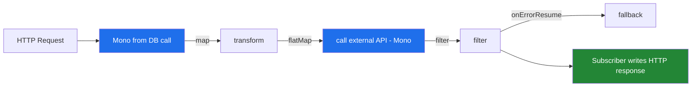
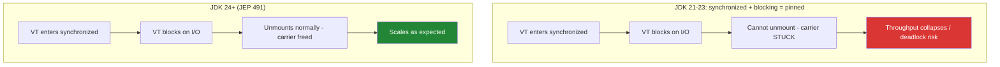
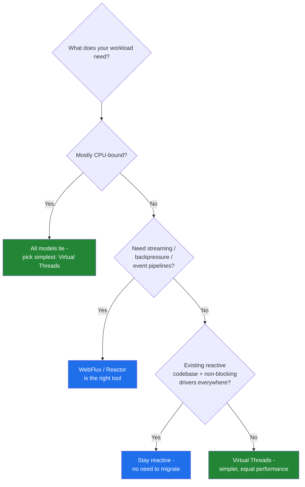

# Virtual Threads vs WebFlux / Reactor

For more than a decade, the way to make a JVM service handle tens of thousands of concurrent connections without drowning in operating-system threads was to go **reactive**: Spring WebFlux on top of Project Reactor, non-blocking I/O, and the `Mono`/`Flux` programming model. The price was steep — your code stopped reading top-to-bottom, stack traces became archaeology, and every library in the call chain had to be non-blocking too.

Then Java 21 finalized **virtual threads** (Project Loom, [JEP 444](https://openjdk.org/jeps/444)). Suddenly you could write plain, blocking, imperative code — `var user = userRepo.findById(id)` — and still scale to hundreds of thousands of concurrent in-flight requests, because a blocked virtual thread costs almost nothing.

This post is a side-by-side, expert-level comparison: how each model actually works under the hood, where each one wins and breaks down, what the benchmarks really say, and runnable Java examples you can paste into a fresh project and execute today.

---

## The Core Idea in One Diagram

Both models solve the same problem — *don't let a slow I/O operation tie up an expensive OS thread* — but they solve it at completely different layers of the stack.



- **Thread-per-request (classic):** simple to write, but one OS thread per in-flight request. An idle thread blocked on a database call still consumes its ~1 MB stack and a scheduler slot. You run out of memory long before you run out of CPU.
- **Virtual threads:** you *still* write thread-per-request code, but the JDK multiplexes millions of virtual threads onto a tiny pool of OS "carrier" threads. When a virtual thread blocks on I/O, it **unmounts** and frees its carrier.
- **Reactive:** you never block. A handful of event-loop threads process callbacks. Maximum efficiency, maximum cognitive cost.

---

## 1. How Virtual Threads Work

A virtual thread is a `java.lang.Thread` that is **not** tied 1:1 to an OS thread. Instead, the JDK scheduler (a dedicated `ForkJoinPool`) mounts a virtual thread onto a **carrier** (a platform thread) to run it. When the virtual thread hits a blocking operation that Loom understands — socket reads, `Thread.sleep`, most `java.util.concurrent` locks — the JVM **unmounts** it, parks its tiny heap-allocated stack, and the carrier is immediately free to run another virtual thread ([JEP 444](https://openjdk.org/jeps/444)).



The result: the **mental model is blocking, the runtime behaviour is non-blocking**. You get the throughput of async with the readability of synchronous code.

### Runnable Example: Launching a Million Virtual Threads

This is the canonical demo. On any machine, the platform-thread version dies; the virtual-thread version finishes in well under a second. Requires **JDK 21+**.

```java
import java.time.Duration;
import java.util.concurrent.Executors;
import java.util.concurrent.atomic.AtomicLong;

public class MillionThreads {
    public static void main(String[] args) throws InterruptedException {
        AtomicLong counter = new AtomicLong();

        // One virtual thread per task. Each "blocks" for a second.
        try (var executor = Executors.newVirtualThreadPerTaskExecutor()) {
            for (int i = 0; i < 1_000_000; i++) {
                executor.submit(() -> {
                    try {
                        Thread.sleep(Duration.ofSeconds(1));
                        counter.incrementAndGet();
                    } catch (InterruptedException e) {
                        Thread.currentThread().interrupt();
                    }
                });
            }
        } // close() waits for all tasks

        System.out.println("Completed tasks: " + counter.get());
    }
}
```

Run it:

```bash
java MillionThreads.java
```

Now try the same with `Executors.newFixedThreadPool(1_000_000)` — you will hit `OutOfMemoryError: unable to create native thread` long before a million. That is the whole point.

### Creating Virtual Threads Directly

```java
// Three equivalent ways to start a virtual thread

// 1. The Thread.Builder API
Thread vt = Thread.ofVirtual().name("worker-", 0).start(() ->
    System.out.println("Running on " + Thread.currentThread()));
vt.join();

// 2. One-liner
Thread.startVirtualThread(() -> System.out.println("hello from a VT"));

// 3. Via an executor (best for fan-out workloads)
try (var exec = Executors.newVirtualThreadPerTaskExecutor()) {
    exec.submit(() -> "result");
}
```

---

## 2. How Reactive (WebFlux / Reactor) Works

WebFlux is built on **Project Reactor**, an implementation of the [Reactive Streams](https://www.reactive-streams.org/) specification. Instead of returning a value, methods return a **publisher**: `Mono<T>` (0–1 elements) or `Flux<T>` (0–N elements). Nothing executes until something **subscribes**. Work is composed as a pipeline of operators, and a small **event loop** (Reactor Netty, typically one thread per CPU core) drives everything via non-blocking callbacks.



The golden rule of reactive: **never block the event loop**. If even one operator does blocking I/O on an event-loop thread, you stall every other request that thread is serving. Backpressure — the consumer signalling how much it can handle — is built into the protocol.

### Runnable Example: Reactor Core (no Spring needed)

Add one dependency and you can run Reactor standalone. With Maven:

```xml
<dependency>
    <groupId>io.projectreactor</groupId>
    <artifactId>reactor-core</artifactId>
    <version>3.7.0</version>
</dependency>
```

```java
import reactor.core.publisher.Flux;
import reactor.core.publisher.Mono;
import java.time.Duration;

public class ReactorDemo {
    public static void main(String[] args) throws InterruptedException {
        // A pipeline: emit 1..10, keep evens, square them, sum them.
        Mono<Integer> sumOfSquares = Flux.range(1, 10)
                .filter(n -> n % 2 == 0)
                .map(n -> n * n)
                .reduce(0, Integer::sum);

        sumOfSquares.subscribe(result -> System.out.println("Sum: " + result)); // 220

        // Asynchronous stream with backpressure-aware delay
        Flux.interval(Duration.ofMillis(200))
                .take(5)
                .map(tick -> "tick " + tick)
                .subscribe(System.out::println);

        Thread.sleep(1500); // keep JVM alive for the async stream
    }
}
```

### The Same HTTP Endpoint, Both Ways

This is the comparison developers feel most. Here is a Spring controller that fetches a user and then calls a downstream service.

**Virtual threads (Spring MVC, blocking style):**

```java
// application.properties:  spring.threads.virtual.enabled=true   (Spring Boot 3.2+, JDK 21+)
@RestController
class OrderController {

    private final RestClient restClient;          // blocking, but cheap on a VT
    private final OrderRepository orderRepository;  // blocking JDBC

    OrderController(RestClient.Builder builder, OrderRepository repo) {
        this.restClient = builder.baseUrl("https://api.example.com").build();
        this.orderRepository = repo;
    }

    @GetMapping("/orders/{id}")
    public OrderView getOrder(@PathVariable Long id) {
        Order order = orderRepository.findById(id)         // blocks -> VT unmounts
                .orElseThrow();
        Shipping shipping = restClient.get()               // blocks -> VT unmounts
                .uri("/shipping/{id}", id)
                .retrieve()
                .body(Shipping.class);
        return new OrderView(order, shipping);             // plain, debuggable, top-to-bottom
    }
}
```

**Reactive (Spring WebFlux):**

```java
@RestController
class OrderController {

    private final WebClient webClient;
    private final ReactiveOrderRepository orderRepository;

    OrderController(WebClient.Builder builder, ReactiveOrderRepository repo) {
        this.webClient = builder.baseUrl("https://api.example.com").build();
        this.orderRepository = repo;
    }

    @GetMapping("/orders/{id}")
    public Mono<OrderView> getOrder(@PathVariable Long id) {
        Mono<Order> order = orderRepository.findById(id);          // never blocks
        Mono<Shipping> shipping = webClient.get()
                .uri("/shipping/{id}", id)
                .retrieve()
                .bodyToMono(Shipping.class);                       // never blocks
        return Mono.zip(order, shipping, OrderView::new);          // composed, concurrent
    }
}
```

Note that the reactive version runs the two calls **concurrently for free** via `Mono.zip`. The virtual-thread version above runs them sequentially — to parallelize you'd use structured concurrency (next section). This is a real ergonomic difference, not just style.

---

## 3. Concurrency Within a Single Request

Reactive operators (`zip`, `flatMap`, `merge`) make fan-out concurrency trivial. Loom's answer is **Structured Concurrency** ([JEP 505](https://openjdk.org/jeps/505), still a preview through recent JDKs) plus **Scoped Values**, which give you a disciplined way to fork sub-tasks and join them with proper error/cancellation propagation.

```java
// Preview API — run with: java --enable-preview --release 25 Fetch.java
import java.util.concurrent.StructuredTaskScope;

OrderView fetchOrder(Long id) throws Exception {
    try (var scope = new StructuredTaskScope.ShutdownOnFailure()) {
        var order    = scope.fork(() -> orderRepository.findById(id).orElseThrow());
        var shipping = scope.fork(() -> shippingClient.fetch(id));

        scope.join();             // wait for both
        scope.throwIfFailed();    // propagate the first failure, cancel the rest

        return new OrderView(order.get(), shipping.get()); // both ran concurrently
    }
}
```

This reads like sequential code, runs concurrently, and — crucially — if `order` fails, `shipping` is **automatically cancelled**. That cancellation correctness is something hand-rolled `CompletableFuture` graphs routinely get wrong, and it's the structural answer to Reactor's `zip`.

---

## 4. The Pinning Problem (and Why JDK 24 Changed Everything)

The biggest historical caveat for virtual threads was **pinning**. If a virtual thread blocked while inside a `synchronized` block/method, it could *not* unmount — its carrier was stuck too, because the JVM tracked the monitor by **carrier** thread identity, not virtual-thread identity ([JEP 491](https://openjdk.org/jeps/491)). Under load, a pool of pinned carriers could even **deadlock**. The standard advice through JDK 21–23 was: replace `synchronized` with `ReentrantLock` on any hot path that blocks.

**[JEP 491](https://openjdk.org/jeps/491), shipped in JDK 24, fixed this.** Monitors are now tracked by virtual-thread identity, so a virtual thread can hold a `synchronized` monitor, block, and still unmount its carrier. As the JEP states, this "allow[s] virtual threads to […] block within synchronized methods and blocks without pinning."



A few rare cases still pin even after JEP 491 — blocking inside a class initializer, or while waiting on class loading — but the common `synchronized`-around-I/O footgun is gone. **If you adopt virtual threads in 2026, run JDK 24+ (ideally the JDK 25 LTS).** To catch any remaining pinning, run with `-Djdk.tracePinnedThreads=full` or the JDK Flight Recorder `jdk.VirtualThreadPinned` event.

---

## 5. Performance: What the Benchmarks Actually Say

The headline finding from independent benchmarks is consistent and perhaps surprising: **for typical I/O-bound microservice workloads, virtual threads match or beat WebFlux on throughput and tail latency**, while being dramatically simpler.

The most thorough public study is Chris Gleißner's [loom-webflux-benchmarks](https://github.com/chrisgleissner/loom-webflux-benchmarks), which compares a Spring Boot REST service across three configurations — Virtual Threads on Tomcat, Virtual Threads on Netty, and WebFlux (Reactor) on Netty — scaling up to **60,000 concurrent users** on bare-metal hardware:

| Finding | Result |
|---|---|
| **Best overall** | **Virtual Threads on Netty won ~45% of scenarios** vs ~30% for WebFlux on Netty |
| **High-load tail latency** | VT-on-Netty had **lower P90 and P99** than WebFlux-on-Netty in high-user-count runs |
| **Throughput at scale** | VT-on-Netty sustained the **largest request count** for the full duration of high-load runs |
| **Errors under 100% CPU** | Neither Netty approach errored even at full CPU saturation |
| **VT on Tomcat** | **Not recommended** — higher resource use, timeout errors well below max CPU |

Other independent analyses converge on the same shape of result:

- **I/O-bound (DB / HTTP) workloads:** virtual threads and WebFlux deliver **statistically equivalent throughput**, typically within a single-digit percentage of each other. Virtual threads win decisively on code simplicity and debuggability.
- **CPU-bound workloads:** all three models perform **the same** — the bottleneck is CPU cores, not the concurrency model. Neither virtual threads nor reactive can manufacture more compute.
- **WebFlux's residual edge:** where reactive still squeezes out a marginal advantage, it comes from **zero per-request heap allocation** for thread bookkeeping and no JDK-scheduler mount/unmount overhead. At extreme connection counts with tiny payloads, that constant factor can matter.

The practical takeaway: the throughput gap that historically justified going reactive has **largely closed** for mainstream services. You now pay the reactive complexity tax only when you genuinely need streaming semantics or backpressure — not merely to scale concurrent connections.



---

## 6. Head-to-Head Summary

| Dimension | Virtual Threads (Loom) | WebFlux / Reactor |
|---|---|---|
| **Programming model** | Blocking, imperative, top-to-bottom | Declarative, callback/operator pipelines |
| **Readability** | High — reads like normal code | Lower — operator chains, steeper curve |
| **Stack traces & debugging** | Normal, complete, step-through works | Fragmented; needs `checkpoint()`/reactor-tools |
| **Throughput (I/O-bound)** | Equal to reactive (±single digits) | Equal to virtual threads |
| **Throughput (CPU-bound)** | Same as reactive | Same as virtual threads |
| **Tail latency at high load** | Often **lower** (VT on Netty) | Competitive; marginal edge in some niches |
| **Memory per in-flight request** | Tiny heap stack; scales to millions | Lowest — no per-request thread object |
| **Backpressure** | Manual (e.g. semaphores, queues) | **Built in** to Reactive Streams |
| **Streaming / SSE / WebSockets** | Workable but not the sweet spot | **Native strength** |
| **Ecosystem requirement** | Works with blocking JDBC/JPA/RestClient | Requires non-blocking drivers (R2DBC, WebClient) |
| **`synchronized` + blocking** | Safe on **JDK 24+** ([JEP 491](https://openjdk.org/jeps/491)) | N/A (never blocks) |
| **Best fit** | Mainstream request/response microservices | Streaming, high-fan-out, existing reactive stacks |

---

## 7. Practical Recommendations

1. **Greenfield request/response service?** Use **virtual threads** with Spring MVC (`spring.threads.virtual.enabled=true`). You get reactive-class scalability with code your whole team can read and debug. Run on **JDK 24+** to avoid pinning surprises.
2. **Need streaming, server-sent events, WebSockets, or real backpressure across stages?** Reach for **WebFlux/Reactor** — this is what it was built for, and virtual threads don't replace backpressure.
3. **Already all-in on reactive with non-blocking drivers and it works?** Don't migrate for its own sake. The performance argument to switch is weak; migrate only if maintenance cost is hurting you.
4. **Mixing models?** You can call blocking code from a reactive app via `Schedulers.boundedElastic()` (now itself often backed by virtual threads), and you can use Reactor's operators inside a virtual-thread app for a single complex pipeline. They are not mutually exclusive.
5. **Always measure your own workload.** Synthetic benchmarks set expectations; your DB, payload sizes, and fan-out shape decide the outcome.

The arc is clear: virtual threads have turned "go reactive to scale" from a near-universal mandate into a **deliberate, narrow choice**. Reactive programming remains the right tool for streaming and backpressure — but for the vast middle of CRUD-and-call-a-service microservices, simple blocking code on virtual threads is now both fast enough and far easier to live with.

---

**References**

- [JEP 444: Virtual Threads (OpenJDK)](https://openjdk.org/jeps/444)
- [JEP 491: Synchronize Virtual Threads without Pinning (OpenJDK)](https://openjdk.org/jeps/491)
- [JEP 505: Structured Concurrency (OpenJDK)](https://openjdk.org/jeps/505)
- [JEP 425: Virtual Threads (Preview) (OpenJDK)](https://openjdk.org/jeps/425)
- [Reactive Streams Specification](https://www.reactive-streams.org/)
- [Project Reactor Reference Documentation](https://projectreactor.io/docs/core/release/reference/)
- [Spring WebFlux Reference (Spring Framework)](https://docs.spring.io/spring-framework/reference/web/webflux.html)
- [chrisgleissner/loom-webflux-benchmarks — Spring Boot Virtual Threads vs WebFlux benchmarks (GitHub)](https://github.com/chrisgleissner/loom-webflux-benchmarks)
- [Reactor WebFlux vs Virtual Threads (Baeldung)](https://www.baeldung.com/java-reactor-webflux-vs-virtual-threads)
- [Java Evolves to Tackle Virtual Threads Pinning with JEP 491 (InfoQ)](https://www.infoq.com/news/2024/11/java-evolves-tackle-pinning/)
- [JDK 24's Major Improvement: Virtual Threads Without Pinning (Dan Vega)](https://www.danvega.dev/blog/jdk-24-virtual-threads-without-pinning)
- [Virtual Threads vs Reactive vs Platform Threads in Spring Boot 3.4: Benchmarks and a Decision Framework (ankurm.com)](https://ankurm.com/virtual-threads-vs-webflux-vs-platform-threads-spring-boot-benchmarks/)
- [Comparing Virtual Threads and Reactive WebFlux in Spring (DiVA, academic thesis)](https://www.diva-portal.org/smash/get/diva2:1763111/FULLTEXT01.pdf)
